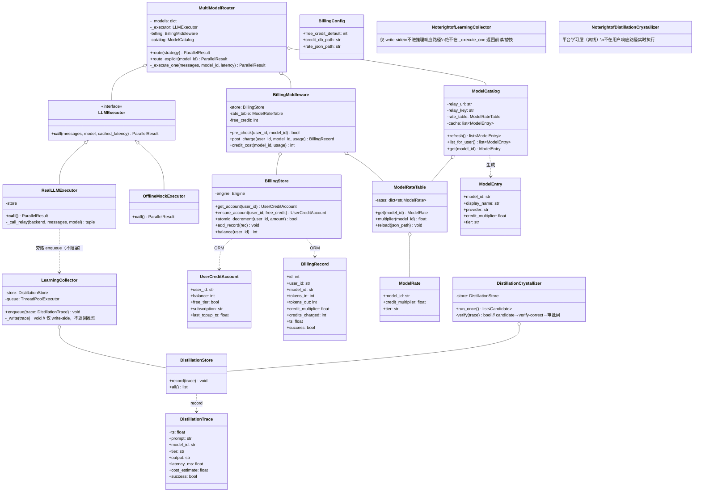
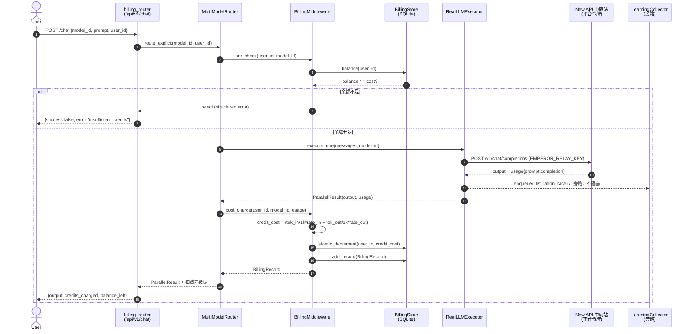
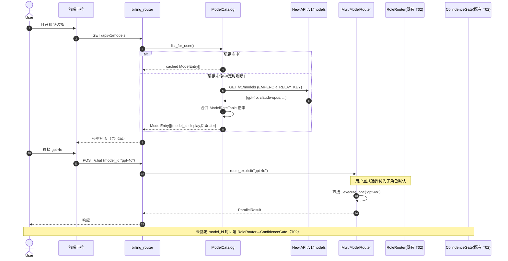
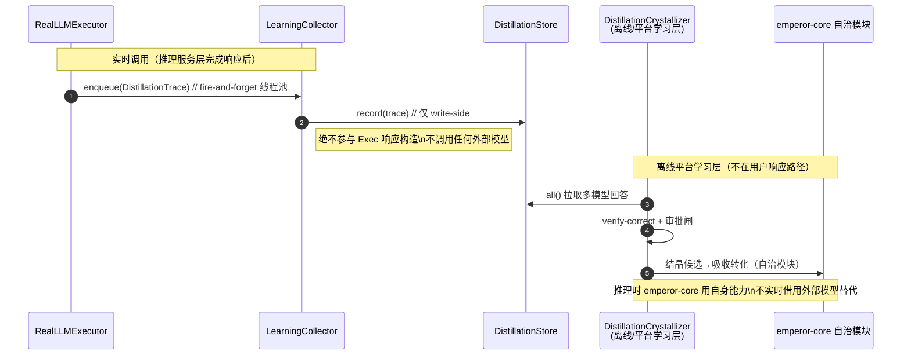

# emperor-core 中转站（平台级中枢）架构升级设计 + 任务分解

> 架构师：高见远（software-architect）
> 日期：2026-08-23
> 上游：用户重新定义的「API 中转站」语义 + 产品经理许清楚既有基础
> 范围：积分计费中间件、全模型接入+用户自由选择、使用中学习蒸馏中枢、云部署编排

---

## 〇、设计总纲（贯彻用户重新定义的中转站语义）

用户重新定义的中转站不再是「自用中转」，而是 **平台级中枢**，四条硬约束：

1. **平台统一兜底账单**：所有 API 费用由本 AI 模型（平台）统一支付，用户无需各自 API key。
2. **积分倍率转化**：不同模型消耗按**倍率**折算成用户积分扣除（GPT-4o 倍率 10x、轻量模型 1x；按 token/调用 × 倍率扣积分）。
3. **全模型接入 + 用户自由选择**：中转站接入所有可调用模型，用户在界面自由选择。
4. **使用中学习（蒸馏中枢）**：用户调用多模型时平台后台记录各模型回答，蒸馏内化——**但严格隔离**：学习采集层（蒸馏/学习时）与推理服务层（响应用户时）解耦，推理路径绝不实时借用外部模型替代自身。

**核心边界原则（第一性原则升级）**：
- **独立性 > 借用**：推理服务层在响应落地用户时，只走 emperor-core 自身能力 + 中转站「推理用」模型调用；**绝不**在响应用户的过程中实时调用外部教师模型去替代自身输出。
- **学习中转采集 = 平台学习层**：用户调用各模型产生的「真实回答」在后台异步采集进 `DistillationStore`（诚实：仅真实调用），作为蒸馏/验证式结晶的原材料；该采集是旁路（sidecar），不阻塞、不替换推理响应。
- **New API 复用为「账单执行面」**：中转站（New API）继续承担 provider 接入、格式转换、真实调用与 usage 日志；emperor-core 侧**自建积分层**做用户账户/倍率/扣减，二者通过「中转站返回 usage → emperor-core 计费中间件扣积分」解耦。

---

## 一、实现方案 + 框架选型

### 1.1 积分计费中间件（自建 vs 复用 New API 令牌）— **建议：自建积分层，复用 New API 作为账单执行面**

**关键判断**：
- New API 自身有「令牌(token)/配额/额度」机制，但那是**平台对渠道的配额**（控制中转站能花多少钱），不是**用户对平台的积分**。二者语义不同。
- **不要**让终端用户直接持有 New API 令牌——违反「用户无需各自 API key」与「平台统一兜底」。
- **结论**：emperor-core 侧**自建积分层**（`BillingMiddleware` + `UserCreditAccount` + `ModelRateTable`），负责用户免费额度/增值充值/订阅、模型倍率、调用记账与扣减；New API 持有**平台级单一令牌**（`EMPEROR_RELAY_KEY`），由运维/中转站管理员配置，用户不可见。计费中间件在每次真实调用拿到 usage 后，按 `ModelRateTable` 倍率换算积分并扣减，记录 `BillingRecord` 账单。

**计费公式**：
```
调用积分 = ceil( (tokens_in / 1000) * rate_in + (tokens_out / 1000) * rate_out )
其中 rate_in/out 来自 ModelRateTable[model_id].credit_multiplier（倍率，如 GPT-4o = 10，轻量 = 1）
用户积分扣除 = 调用积分
余额不足 → 拒绝调用（返回 structured error，不抛 5xx）
```

**存储选型**：
- **默认 SQLite**（`sqlalchemy` 已存在于 requirements）：`UserCreditAccount` / `BillingRecord` 落 `credits.db`。零部署依赖、单文件、适合初期。
- **可选 Redis**（`redis` 已在 requirements）：高并发下做账户余额缓存/原子扣减；本期先 SQLite，预留 Redis 适配接口（见 `待明确事项`）。
- **建议**：本期用 SQLite（与 New API 默认 SQLite 对齐，降低云服务器部署复杂度）；若用户量上来再切 Redis，通过 `BillingStore` 抽象隔离。

### 1.2 全模型接入 + 用户自由选择

- **中转站（New API）接入所有可调用模型**：运维在面板添加多 provider 渠道（OpenAI/Anthropic/Google/DeepSeek/本地量化 VLM 等），New API 归一化为 OpenAI 兼容 `/v1`，emperor-core 侧只用一个 `EMPEROR_RELAY_URL` + `EMPEROR_RELAY_KEY`。
- **emperor-core 动态模型目录**：新增 `ModelCatalog` 服务——启动时（及定时）从中转站拉取 `/v1/models` 可用模型列表，合并平台 `ModelRateTable` 倍率配置，向前端暴露 `GET /api/v1/models`（含 model_id / display_name / 倍率 / tier）。
- **用户显式选择优先**：前端下拉自由选择任何接入模型；用户选定 model_id → 透传给 `MultiModelRouter`（`route_explicit(model_id)`），**优先于 RoleRouter/ConfidenceGate 的角色默认**（既设计 T02 的 `override` 机制复用）。未指定时回退角色默认。

### 1.3 「使用中学习」蒸馏中枢（学习中转采集层）

- **采集触发**：每次真实调用（`RealLLMExecutor` 经中转站拿到 usage + output）后，旁路触发 `LearningCollector.enqueue(trace)` —— 异步（线程池/队列）写入 `DistillationStore`（诚实：仅真实调用）。
- **隔离边界（防推理借用外部）**：
  - `LearningCollector` 是**纯采集/落库**，不返回任何内容给推理响应，不调用任何外部模型。
  - 蒸馏「吸收转化」发生在**平台学习层**：定期离线任务 `DistillationCrystallizer`（candidate → verify-correct → 审批闸）将采集到的多模型回答结晶为 emperor-core 自治模块候选，**不在用户响应路径实时执行**。
  - **硬约束**：推理服务层（`MultiModelRouter._execute_one`）在响应落地用户时，只允许「自身 + 中转站推理模型」；`LearningCollector` 仅 write-side，绝不在 `_execute_one` 返回前被读/被调用替代。
- **复用**：`DistillationStore` / `DistillationTrace`（仅真实调用写）；`SocialCollector` 的 `_ingest` 范式（旁路 best-effort）；既有的「验证式结晶 / candidate→verify-correct→审批闸」思路作为 `DistillationCrystallizer` 设计来源。

### 1.4 云部署编排（用户云服务器）

- **架构**：单台云服务器（用户自带）上用 `docker-compose` 多服务编排：
  1. `new-api`（中转站，端口 3000，SQLite）—— 账单执行面。
  2. `emperor-core`（FastAPI 服务，端口 8000）—— 推理服务层 + 积分中间件 + 学习中转采集层。
  3. `ollama` / `vllm`（本地量化 VLM 推理栈，可选）—— 私有化视觉/轻量模型，挂到中转站渠道。
  4. `credits.db` / `jarvis.db` 等数据卷挂载。
- **本沙箱无 Docker/Go**：代码与配置在此写对、单测通过、推 GitHub；实际部署在用户云服务器跑 `docker compose up -d`。
- **EdgeOne Pages / CloudBase 角色**：仅用于**前端托管 / 静态资源 / 文档**（不可变静态），**不替代有状态后端**（emperor-core / New API 必须自有状态服务）。前端通过 HTTPS 调 emperor-core API。

### 1.5 框架/库选型汇总

| 能力 | 选型 | 必需/可选 | 说明 |
|---|---|---|---|
| 积分存储 | `sqlalchemy`（已存在）+ SQLite 默认 | 必需（既有） | `BillingStore` 抽象，预留 Redis |
| 模型目录拉取 | `httpx`（已存在） | 必需（既有） | 从中转站 `/v1/models` 拉 |
| 计费/记账 | 纯 Python + `sqlalchemy` | 必需（新增代码） | `BillingMiddleware`/`UserCreditAccount`/`ModelRateTable` |
| 动态路由 | 复用 `MultiModelRouter` | 必需（既有） | 新增 `route_explicit` + `ModelCatalog` |
| 学习中转采集 | 复用 `DistillationStore` + 线程池 | 必需（新增代码，零外部依赖） | `LearningCollector` 旁路异步 |
| 云编排 | `docker-compose`（既有的 `deploy/relay` 扩展） | 必需（部署侧） | 多服务编排 |
| 本地 VLM | `ollama`/`vllm`（部署侧） | 可选 | 仅私有化模型时 |
| 前端托管 | EdgeOne Pages / CloudBase | 可选 | 仅静态前端/文档 |

---

## 二、文件列表（新增 + 修改，精确到 `jarvis/...`、`deploy/...`）

### 2.1 新增文件

| 相对路径 | 职责 |
|---|---|
| `jarvis/billing/__init__.py` | billing 包初始化 |
| `jarvis/billing/models.py` | `UserCreditAccount`、`BillingRecord`、`ModelRate` 数据类 + SQLAlchemy ORM |
| `jarvis/billing/store.py` | `BillingStore`：账户 CRUD / 余额查询 / 原子扣减（SQLite 默认，预留 Redis 适配）|
| `jarvis/billing/rate_table.py` | `ModelRateTable`：模型→积分倍率配置（内置默认 + JSON 覆盖 + 运行时热更）|
| `jarvis/billing/middleware.py` | `BillingMiddleware`：调用前余额预检 + 调用后按 usage×倍率扣积分 + 记账单 |
| `jarvis/billing/config.py` | `BillingConfig`（pydantic-settings，`EMPEROR_BILLING_*` env）+ 默认免费额度/倍率 |
| `jarvis/relay/catalog.py` | `ModelCatalog`：从中转站 `/v1/models` 拉可用模型 + 合并倍率 → 暴露动态模型列表 |
| `jarvis/relay/learning_collector.py` | `LearningCollector`：旁路异步采集真实调用 output/usage → `DistillationStore`（仅 write-side）|
| `jarvis/relay/crystallizer.py` | `DistillationCrystallizer`：平台学习层离线结晶（candidate→verify→审批闸），**不在推理路径** |
| `jarvis/relay/billing_router.py` | FastAPI 路由：`/api/v1/models`、`/api/v1/credits/balance`、`/api/v1/credits/topup` |
| `tests/test_billing.py` | 积分中间件单测（扣减/余额不足/倍率/账单）|
| `tests/test_catalog.py` | 模型目录拉取/合并单测 |
| `tests/test_learning_collector.py` | 学习中转采集旁路单测（不阻塞推理/不替换响应）|
| `deploy/emperor-core/docker-compose.yml` | 云服务器多服务编排（new-api + emperor-core + ollama 可选 + 数据卷）|
| `deploy/emperor-core/.env.example` | 云部署 env 模板（`EMPEROR_RELAY_URL`/`EMPEROR_BILLING_*` 等）|
| `deploy/emperor-core/RELAY_BILLING_SETUP.md` | 云部署指南（中转站+积分+采集）|

### 2.2 需修改文件（精确到既有 `jarvis/...`）

| 相对路径 | 修改内容 |
|---|---|
| `jarvis/multi_model.py` | `MultiModelRouter` 增加 `route_explicit(model_id)`（用户显式选择优先）；`__init__` 接收可选 `billing: BillingMiddleware` 与 `catalog: ModelCatalog`；`_execute_one` 调用前后接 `billing` 中间件；`register_model` 支持从 `ModelCatalog` 批量注入。 |
| `jarvis/multi_model_executor.py` | `RealLLMExecutor.__call__` 返回 usage 后，**旁路**触发 `LearningCollector.enqueue`（不阻塞、不替换）；保持 `_record_trace` 不变。 |
| `jarvis/core/config.py` | 新增 `BillingConfig` 导入与 `EMPEROR_BILLING_*` 文档；`EMPEROR_RELAY_URL`/`EMPEROR_RELAY_KEY` 已存在复用。 |
| `jarvis/api/server.py` | 挂载 `jarvis/relay/billing_router`（`/api/v1/models`、`/api/v1/credits/*`）；启动时初始化 `BillingStore` + `ModelCatalog`。 |
| `requirements.txt` | 新增 `pydantic-settings`（已在？补确认）；`sqlalchemy`/`redis`/`httpx` 已存在，无需新增硬依赖；本期**零新硬依赖**。 |
| `deploy/relay/docker-compose.yml` | 保留 New API 单服务；新增注释指引与 `deploy/emperor-core/docker-compose.yml` 联合编排。 |

---

## 三、数据结构 / 类图（Mermaid）



> 边界说明：`LearningCollector` 与 `DistillationCrystallizer` 均**不**挂在 `MultiModelRouter` 的返回链上。`LearningCollector` 由 `RealLLMExecutor.__call__` 在拿到结果后**旁路** `enqueue`（fire-and-forget），绝不参与推理响应构造；`DistillationCrystallizer` 是定期离线任务。二者与推理服务层（router/executor）单向解耦。

---

## 四、程序调用流程（时序图，覆盖 3 条核心路径）

### 4.1 用户调用计费扣积分路径（推理服务层 + 积分中间件）



### 4.2 用户选模型 → 路由路径（动态目录 + 显式优先）



### 4.3 使用中学习采集 → 蒸馏入库路径（隔离边界）



---

## 五、任务列表（有序，承接 video-ai-design T01-T05，新增 T06-T09）

> 依赖顺序：T01→{T02,T04}→T03→T05（既有）；新增 T06（计费）独立基础、T07（目录+路由）依赖 T06、T08（学习中转采集）依赖既有 executor、T09（云部署）依赖 T06/T07/T08 代码就绪。

### T06 — 积分计费中间件（UserCreditAccount + ModelRateTable + BillingMiddleware）
- **依赖**：无（基础，可并行于 T01-T05）。
- **涉及文件**：`jarvis/billing/__init__.py`、`jarvis/billing/models.py`、`jarvis/billing/store.py`、`jarvis/billing/rate_table.py`、`jarvis/billing/middleware.py`、`jarvis/billing/config.py`、`tests/test_billing.py`、`requirements.txt`（确认 sqlalchemy 已列）。
- **验收标准**：
  1. `ModelRateTable.multiplier(model_id)` 返回倍率（GPT-4o=10、轻量=1，默认 JSON 可覆盖）；`BillingStore.atomic_decrement` 在 SQLite 下余额不足时返回 False 且不扣减（单测断言）。
  2. `BillingMiddleware.credit_cost(model_id, usage)` 公式正确；`post_charge` 写 `BillingRecord` 并扣余额；`pre_check` 余额不足返回拒绝。
  3. 零新硬依赖（sqlalchemy/redis/httpx 已在 requirements）；`BillingConfig` 用 `EMPEROR_BILLING_*` env。

### T07 — 模型目录 + 动态路由（ModelCatalog + route_explicit）
- **依赖**：T06（路由需接计费 pre_check/post_charge）。
- **涉及文件**：`jarvis/relay/catalog.py`、`jarvis/multi_model.py`（route_explicit + __init__ 接 catalog/billing）、`jarvis/relay/billing_router.py`、`jarvis/api/server.py`（挂载路由 + 初始化 catalog）、`tests/test_catalog.py`。
- **验收标准**：
  1. `ModelCatalog.refresh()` 从中转站 `/v1/models` 拉模型并合并 `ModelRateTable` 倍率；`list_for_user()` 返回 `ModelEntry[]`（含倍率/tier）。
  2. `MultiModelRouter.route_explicit(model_id)` 优先于 RoleRouter/ConfidenceGate 角色默认；未指定时回退既有 `route(strategy)`。
  3. `billing_router` 暴露 `GET /api/v1/models` 与 `GET /api/v1/credits/balance`；`route_explicit` 调用前后正确接 `BillingMiddleware`。

### T08 — 学习中转采集层（LearningCollector 旁路 + 隔离边界）
- **依赖**：既有 `RealLLMExecutor` / `DistillationStore`（T01 后 executor 稳定）。
- **涉及文件**：`jarvis/relay/learning_collector.py`、`jarvis/multi_model_executor.py`（__call__ 后旁路 enqueue）、`jarvis/relay/crystallizer.py`（离线结晶骨架）、`tests/test_learning_collector.py`。
- **验收标准**：
  1. `RealLLMExecutor.__call__` 拿到真实 output/usage 后**旁路** `LearningCollector.enqueue`（线程池 fire-and-forget），**不阻塞**推理响应、`__call__` 返回时序不含采集耗时。
  2. `LearningCollector` **仅 write-side**：单测断言其方法不返回内容给调用方、不调用任何外部模型 API；`DistillationStore` 仅真实调用写（Mock 不写）。
  3. `DistillationCrystallizer` 为离线任务骨架（candidate→verify→审批闸），**不在** `_execute_one` / API 响应路径中被调用；文档明确隔离边界。

### T09 — 云部署编排（docker-compose 多服务 + 前端托管角色）
- **依赖**：T06/T07/T08 代码就绪（本沙箱写对 + 单测通过，实际部署在用户云服务器）。
- **涉及文件**：`deploy/emperor-core/docker-compose.yml`、`deploy/emperor-core/.env.example`、`deploy/emperor-core/RELAY_BILLING_SETUP.md`、`deploy/relay/docker-compose.yml`（保留 + 联合指引）。
- **验收标准**：
  1. `deploy/emperor-core/docker-compose.yml` 编排 `new-api`(3000) + `emperor-core`(8000) + 可选 `ollama`(11434) + 数据卷（`credits.db`/`jarvis.db`/`new-api/data`）；`EMPEROR_RELAY_URL` 指向同网络 new-api。
  2. `.env.example` 含 `EMPEROR_RELAY_URL`/`EMPEROR_RELAY_KEY`/`EMPEROR_BILLING_FREE_CREDIT`/`EMPEROR_BILLING_DB_PATH`/`EMPEROR_RATE_JSON` 等；`RELAY_BILLING_SETUP.md` 写清「先弄线上云服务器」步骤。
  3. 明确 EdgeOne Pages / CloudBase 仅托管前端静态资源，不替代有状态后端（emperor-core/New API）。

> 任务依赖图（Mermaid）：
> ```mermaid
> graph TD
>   T01[T01 视觉自治] --> T02[T02 角色路由+置信]
>   T01 --> T04[T04 视频源采集]
>   T02 --> T03[T03 VerifierAgent]
>   T04 --> T05[T05 视频记忆]
>   T06[T06 积分计费中间件]
>   T06 --> T07[T07 模型目录+动态路由]
>   T01 -.executor稳定.-> T08[T08 学习中转采集]
>   T06 --> T09[T09 云部署编排]
>   T07 --> T09
>   T08 --> T09
> ```

---

## 六、依赖包列表（新增 pip）

| 包 | 必需/可选 | 何时需要 | 备注 |
|---|---|---|---|
| `sqlalchemy`（已存在） | 必需（既有） | 积分存储 `BillingStore` | 本期零新硬依赖 |
| `redis`（已存在） | 可选 | 高并发账户缓存/原子扣减 | 预留适配，本期 SQLite 默认 |
| `httpx`（已存在） | 必需（既有） | `ModelCatalog` 拉 `/v1/models` | 复用 |
| `pydantic-settings`（已存在或补） | 必需（既有） | `BillingConfig` env 解析 | 确认 requirements 已列 |
| （既有）`litellm`/`chromadb`/`sentence-transformers` | 必需（已存在） | 复用 executor / 蒸馏 / 嵌入 | 不在本次新增 |

> 核心原则：**emperor-core 侧零新硬依赖**；积分/目录/采集全部基于既有 `sqlalchemy`/`redis`/`httpx` + 纯 Python。云部署依赖 `docker-compose`（部署侧，非 pip）。

---

## 七、共享知识（跨文件约定）

- **配置项（建议 env，前缀 `EMPEROR_`）**：
  - 计费：`EMPEROR_BILLING_FREE_CREDIT`（默认免费额度，如 1000）、`EMPEROR_BILLING_DB_PATH`（credits.db 路径）、`EMPEROR_RATE_JSON`（倍率配置 JSON 路径）、`EMPEROR_BILLING_REDIS`（可选 Redis URL）。
  - 目录：`EMPEROR_RELAY_URL`、`EMPEROR_RELAY_KEY`（平台级单一令牌，用户不可见）、`EMPEROR_CATALOG_REFRESH_SEC`（刷新间隔，默认 300）。
  - 复用：`EMPEROR_RELAY_URL`/`EMPEROR_RELAY_KEY`（RealLLMExecutor 已用）。
- **日志规范**：logger 命名 `jarvis.billing.*` / `jarvis.relay.*`；扣费/余额不足用 `warning` + 结构化字段（`user_id`/`model_id`/`cost`）；学习中转采集用 `info` 标注 `phase=learning`（**绝不**在推理路径标 `phase=infer` 借用外部）。
- **隔离边界约定（硬约束）**：
  - 推理服务层（`MultiModelRouter._execute_one` / `RealLLMExecutor.__call__`）在响应落地用户时，**只允许自身 + 中转站推理模型**；`LearningCollector` 仅旁路 write，绝不读/替换响应。
  - `DistillationCrystallizer` 是离线平台学习层，不在用户响应路径实时执行；结晶候选经「验证式结晶 / candidate→verify-correct→审批闸」后才吸收为自治模块。
- **诚实语料**：`DistillationStore` 仅真实调用写（`RealLLMExecutor` 旁路采集），`OfflineMockExecutor` 永不写；倍率配置与真实账单分离（倍率是用户积分折算，不是渠道成本）。
- **接口契约**：`BillingMiddleware.pre_check/post_charge` 签名稳定；`ModelCatalog.list_for_user()` 返回 `ModelEntry[]`；所有新增 API 路由返回 `{code, data, message}` 结构（沿用既有 `jarvis.api` 风格）。

---

## 八、待明确事项（需用户/PM 拍板）

1. **积分存储：SQLite 还是 Redis？** 本期默认 SQLite（与 New API 默认对齐、零部署），但高并发/多实例下需 Redis 原子扣减。是否本期就上 Redis，还是预留接口后期切？
2. **免费额度多少？** `EMPEROR_BILLING_FREE_CREDIT` 默认值（建议 1000 积分 ≈ 轻量模型 1000 次 1K-token 调用，或按 GPT-4o 倍率 10x 折算 100 次）。需 PM 结合定价拍板。
3. **倍率谁来定？** `ModelRateTable` 默认倍率（GPT-4o=10、轻量=1）是否由平台运营后台配置，还是代码内置 JSON？是否允许用户/角色差异化倍率？
4. **学习中转采集：实时还是异步？** 本期设计**异步旁路**（fire-and-forget 线程池），不阻塞推理；是否需「采集确认」或「用户同意采集其调用」的合规开关（GDPR/隐私）？需 PM 确认是否加 `EMPEROR_LEARNING_OPT_IN`。
5. **蒸馏结晶频率与审批闸**：`DistillationCrystallizer` 多久跑一次（每日/每周）？结晶候选的「验证式结晶 / 审批闸」由谁审批（自动阈值还是人工）？需结合既有的「验证式结晶」思路拍板触发条件。
6. **云服务器规格**：用户自带云服务器的最低配置（CPU/内存/GPU）？本地 VLM（ollama/vllm）是否必选，还是纯用中转站云端模型？决定 `deploy/emperor-core/docker-compose.yml` 是否默认带 ollama 服务。
7. **用户账户体系**：本期 `user_id` 从哪来（前端传入 / API token / 匿名免费额度）？是否需与既有的 `jarvis.api.token_guard`（`EMPEROR_API_TOKEN`）联动做用户识别？需 PM 明确账户来源以便 `BillingStore.ensure_account` 对接。

---

*本设计严格尊重既有（New API 中转站、DI executor、蒸馏、社交采集、ChromaDB），贯彻「独立性 > 借用」——推理服务层在响应用户时只走自身 + 中转站推理模型，学习中转采集是平台学习层旁路，绝不实时借用外部替代自身。积分层自建、New API 作为账单执行面，用户无需各自 API key。*
