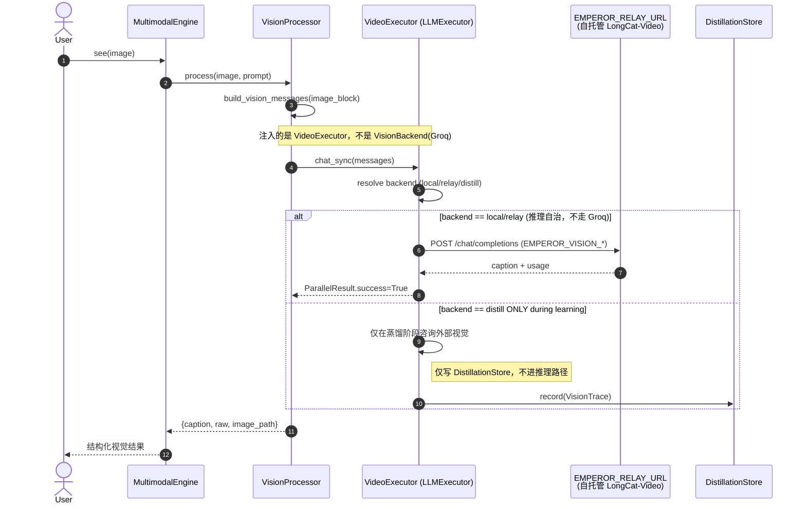
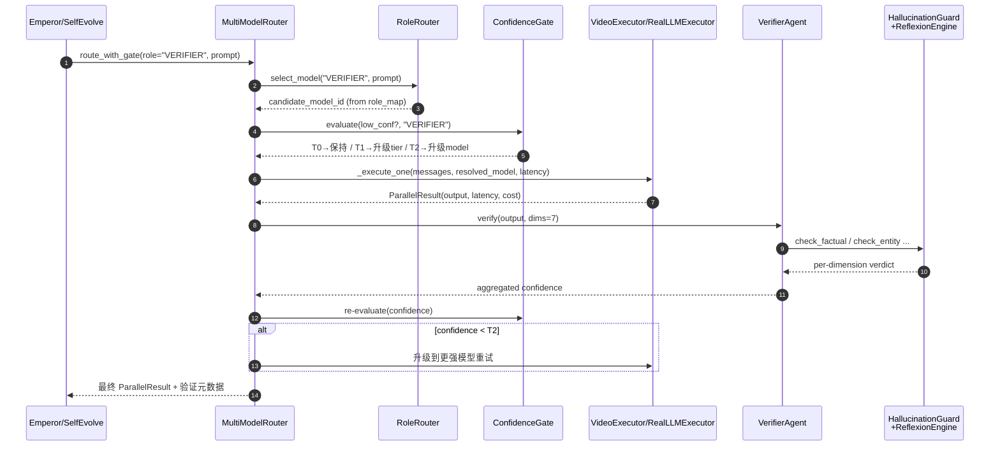
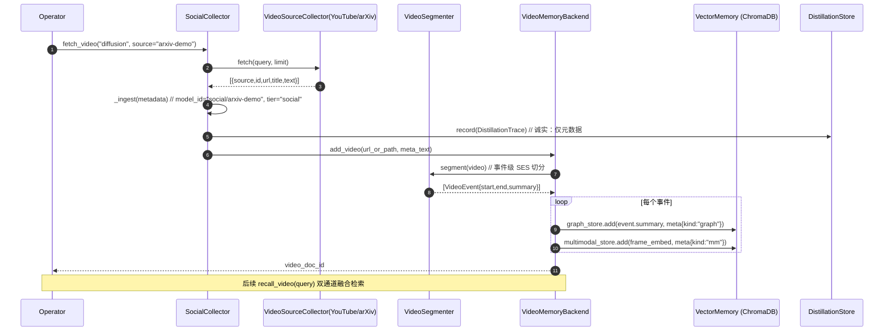

# emperor-core 视频 AI 架构设计 + 任务分解（P0 范围）

> 架构师：高见远（software-architect）
> 日期：2026-08-22
> 上游：产品经理许清楚《视频类 AI 项目优化研究报告》（docs/research/video-ai-optimization-2026-08-22.md）
> 范围：本报告聚焦 P0 三条（视觉自治 / 角色路由+置信分级 / SocialCollector 视频源+视频记忆）。P1（DistillationStore 扩视频+成本维度、输出层 AI 标识合规）仅预留接口，不在本次任务列表详拆。

---

## 一、实现方案 + 框架选型

设计硬约束（第一性原则）——**独立性 > 借用**：
- 教师（外部多模型 / 外部 API）**仅在「学习/蒸馏时」被咨询**；**绝不**在「服务/推理时」被路由调用。
- 每个能力是自治、可热插拔模块；离线 Mock 永不写语料。
- 视觉子系统在推理时**不**路由 Groq / 任何外部视觉 API；外部视觉模型仅在「蒸馏/学习阶段」被咨询。

三条 P0 各自技术路线如下。

### 1.1 视觉自治（P0）——替代 Groq 借用

**现状痛点**：`jarvis/capabilities/vision.py` 的 `resolve_vision_backends()` 默认 `VISION_PROVIDER=groq`，通过 `FREE_PROVIDERS["groq"]` 借用外部 LLaVA；推理时直接调外部 = 违反独立性 + 成本 + 不可控。

**技术路线**：
- 引入 `VideoExecutor`（`LLMExecutor` 子类），作为 `MultiModelRouter` 的一类「执行器」注册进去。它**同时**：
  - **本地推理优先**：当 `EMPEROR_VISION_BACKEND=local` 时，通过 `EMPEROR_RELAY_URL` 挂载的**自托管 LongCat-Video**（或轻量本地 VLM）做推理——中转站托管模型，但**模型权重本地/私有化**，调用方不依赖 Groq。
  - **中转站托管兜底**：`EMPEROR_VISION_BACKEND=relay` 时，走既有 `EMPEROR_RELAY_URL`（`/v1/chat/completions`，OpenAI 兼容）调用中转站上托管的视觉模型（管理员可把 LongCat-Video 挂到中转站）；**复用 `RealLLMExecutor._call_relay` 的协议，但不走 Groq provider**。
  - **蒸馏时借用（合规）**：仅在 `EMPEROR_VISION_BACKEND=distill` 模式（蒸馏/学习阶段）下，才允许 `resolve_vision_backends()` 意义上的「外部视觉 API 被咨询」，且**只写 DistillationStore，不进推理路径**。
- 保留 `OfflineMockExecutor` 离线路径不变（无后端时视觉能力仍可 mock 自治）。
- **关键接线方式（不依赖 Groq 的核心）**：`VideoExecutor` 内部**不引用 `FREE_PROVIDERS["groq"]`**，而是读取独立的 env：`EMPEROR_VISION_BACKEND`、`EMPEROR_VISION_MODEL`、`EMPEROR_VISION_URL`、`EMPEROR_VISION_KEY`。这样本地/中转站视觉与 Groq 在配置与代码层面完全解耦；`VisionBackend`（既有）降级为「仅蒸馏可见」的可选 fallback，不再作为推理主路径。

**复用/新增**：
- 复用：`MultiModelRouter` 的 DI executor 机制、`RealLLMExecutor._call_relay` 协议、`OfflineMockExecutor`。
- 新增：`jarvis/multi_model_executor.py` 增加 `VideoExecutor` 类；`jarvis/capabilities/vision.py` 重构 `build_vision_processor()`（推理用 `VideoExecutor`，蒸馏 fallback 保留 `VisionBackend`）。
- 新依赖（可选）：`longcat-video`（或同等本地 VLM）——**仅在 `backend=local` 且管理员自行部署时必需**；中转站托管模式下 emperor-core 侧**零额外依赖**（走 HTTP）。

### 1.2 角色路由 + 置信分级（P0）

**现状痛点**：`MultiModelRouter` 有 cheapest/fastest/best/consensus 策略，但缺「按角色选模型 + 置信门控」的成本感知策略；验证能力（HallucinationGuard/ReflexionEngine）与选模未联动。

**技术路线**：
- 新增 `RoleRouter`：在 `MultiModelRouter` 内增加「角色→模型」映射（`PLANNER`/`VERIFIER`/`REASONER`/`WORKER`，运行可覆盖），替代「全局 cheapest/best」。
- 新增 `ConfidenceGate`：基于置信阈值分级（T0/T1/T2）。低置信才升级到更强/更贵模型，避免所有请求走旗舰。门控结果作为 `_execute_one` 的「模型选择决策」输入。
- 7 维验证接进既有 `HallucinationGuard` / `ReflexionEngine`：新增 `VerifierAgent`-式验证封装（`jarvis/router/verifier.py`），在 VERIFIER 角色路径上调用；7 维（事实/实体/算术/来源/一致性/时效/归因）映射为 guard 的判定维度。
- **复用**：`MultiModelRouter.__init__` 的 executor DI、`_execute_one` 的记账逻辑不变；`HallucinationGuard`、`ReflexionEngine`（`jarvis/emperor.py` 的 guardrail_chain）不改动，仅被组合调用。

### 1.3 SocialCollector 接视频源 + 视频记忆（P0）

**现状痛点**：`SocialCollector` 仅 HN→语料；`记忆`(ChromaDB VectorMemory) 未专门处理长视频。

**技术路线**：
- **视频源扩展点**：`SocialCollector` 增加 `VideoSourceCollector` 策略族（YouTube / Papers-with-Video / arXiv demo / Bilibili），遵循既有 `parse_<source>_payload` + `fetch_<source>` 约定。先接 1–2 个免 key 源（如 arXiv demo、Papers-with-Video 的免 key 元数据接口），其余留占位接口。
- **视频记忆后端**：新增 `VideoMemoryBackend`（ChromaDB 双通道分支）：
  - 通道 A「视频知识图谱」：`graph_nodes`（事件/实体）+ 文本接地描述 → 仍可走 ChromaDB 文本向量。
  - 通道 B「多模态向量」：关键帧/音频多模态嵌入（可选 `sentence-transformers`+图像嵌入）存入同一 ChromaDB 的独立 collection。
  - **事件级切分（EC-RAG 启示）**：长视频按「事件边界」而非固定片段切分，事件单元 = `State-Event-State (SES)`。新增 `VideoSegmenter` 做事件检测。
- **复用**：`VectorMemory`（ChromaDB）、`MemoryManager`、`RAGEngine.retriever`；`SocialCollector._ingest` 不变（视频元数据以 `model_id="social/<source>"` 入 DistillationStore，保持诚实）。
- 新依赖（可选）：视频解析/帧提取 `opencv-python`（事件切分与关键帧抽取）——**仅在启用视频记忆时必需**；纯文本 metadata 源（arXiv/Papers-with-Video）可零依赖入库。

### 1.4 框架/库选型汇总

| 能力 | 选型 | 必需/可选 | 说明 |
|---|---|---|---|
| 多模型路由 / 执行器 | 复用 emperor-core 现有（`multi_model.py`、`multi_model_executor.py`） | 必需（既有） | DI executor 范式，零新依赖 |
| 视觉推理（不走 Groq） | 中转站托管 LongCat-Video（经 `EMPEROR_RELAY_URL`）+ 本地推理可选 | 依赖侧可选 | emperor-core 侧仅 HTTP，零额外依赖 |
| 元数据嵌入 | `sentence-transformers`（`VectorMemory` 已用） | 必需（既有） | 文本接地走既有 EF |
| 视频帧/多模态嵌入 | `sentence-transformers` + 可选图像嵌入 | 可选 | 仅在启用「多模态向量」通道 |
| 视频解析/事件切分 | `opencv-python` | 可选 | 仅在启用视频记忆事件切分 |
| 角色置信门控 | 纯 Python，复用 `ModelConfig.tier` | 必需（新增代码，零外部依赖） | — |
| 7 维验证 | 复用 `HallucinationGuard`/`ReflexionEngine` | 必需（既有） | 组合调用，不改既有 |

---

## 二、文件列表及相对路径

### 2.1 新增文件

| 相对路径 | 职责 |
|---|---|
| `jarvis/multi_model_video.py` | `VideoExecutor(LLMExecutor)`：自治视觉执行器（local/relay/distill 三模式），不引用 Groq provider；复用 `_call_relay` 协议。 |
| `jarvis/router/role_router.py` | `RoleRouter`：角色→模型映射（PLANNER/VERIFIER/REASONER/WORKER），运行可覆盖配置。 |
| `jarvis/router/confidence_gate.py` | `ConfidenceGate`：T0/T1/T2 置信阈值门控，输出「升级/保持」决策。 |
| `jarvis/router/verifier.py` | `VerifierAgent`：7 维验证封装，组合调用 `HallucinationGuard`/`ReflexionEngine`。 |
| `jarvis/learning/video_source_collector.py` | `VideoSourceCollector` 策略基类 + YouTube/arXiv-demo/Papers-with-Video/Bilibili 扩展点（先接免 key 源）。 |
| `jarvis/memory/video_backend.py` | `VideoMemoryBackend`：ChromaDB 双通道（知识图谱文本 + 多模态向量），事件级切分落库。 |
| `jarvis/memory/video_segmenter.py` | `VideoSegmenter`：长视频事件级（SES）切分，替代固定片段。 |
| `requirements-vision.txt` | 可选依赖清单（`opencv-python`、可选图像嵌入库），明确标注必需 vs 可选。 |

### 2.2 需修改文件（精确到既有 `jarvis/...`）

| 相对路径 | 修改内容 |
|---|---|
| `jarvis/multi_model.py` | `MultiModelRouter` 增加 `role_router: RoleRouter`、`confidence_gate: ConfidenceGate` 字段；新增 `route_by_role(role, ...)` 与 `route_with_gate(...)` 方法；选模决策先经 RoleRouter → ConfidenceGate。 |
| `jarvis/multi_model_executor.py` | 导入/暴露 `VideoExecutor`；更新 executor 默认值（推理视觉默认自治）。 |
| `jarvis/capabilities/vision.py` | `build_vision_processor()`：推理视觉改用 `VideoExecutor`（不依赖 Groq）；`VisionBackend` 降级为「仅 distill 可见」fallback；新增 `EMPEROR_VISION_*` env 解析。 |
| `jarvis/learning/social_collector.py` | `SocialCollector` 组合 `VideoSourceCollector`；新增 `fetch_video(query, source, ...)` 与 `register_video_source()`。 |
| `jarvis/memory/manager.py` | `MemoryManager` 增加 `add_video_memory(...)`/`recall_video(...)` 委托到 `VideoMemoryBackend`。 |
| `jarvis/core/config.py`（或 `.env.example`） | 新增 env 文档：`EMPEROR_VISION_BACKEND`、`EMPEROR_VISION_MODEL`、`EMPEROR_VISION_URL`、`EMPEROR_VISION_KEY`、`EMPEROR_ROLE_MODEL_MAP`、`EMPEROR_CONFIDENCE_T0/T1/T2`、`EMPEROR_VIDEO_SOURCES`、`EMPEROR_VIDEO_MEMORY_DIR`。 |
| `jarvis/mcp/tool_registry.py` | 注册视觉自治 / 角色路由 / 视频采集 / 视频记忆工具（遵循现有 `register` 协议）。 |

---

## 三、数据结构 / 类图（Mermaid）

```mermaid
classDiagram
    %% ── 既有执行器抽象（复用） ──
    class LLMExecutor {
        <<interface>>
        +__call__(messages, model, cached_latency) ParallelResult
    }
    class RealLLMExecutor {
        -store
        -temperature
        -max_tokens
        +__call__() ParallelResult
        -_resolve(model) dict
        -_call_relay(backend, messages, model) tuple
        -_call_litellm(backend, messages, model) tuple
    }
    class OfflineMockExecutor {
        +__call__() ParallelResult
    }

    %% ── 新增：视觉自治执行器（不依赖 Groq） ──
    class VideoExecutor {
        -backend: str  // local | relay | distill
        -vision_url: str
        -vision_key: str
        -model: str
        +__call__(messages, model, cached_latency) ParallelResult
        -_call_local(messages) tuple
        -_call_relay(messages) tuple   // 复用 relay 协议但不走 groq
        -_call_distill(messages) tuple // 仅蒸馏时借用外部视觉
    }

    %% ── 既有路由（扩展） ──
    class MultiModelRouter {
        -_models: dict
        -_executor: LLMExecutor
        -role_router: RoleRouter
        -confidence_gate: ConfidenceGate
        +route_by_cost() ParallelResult
        +route_by_role(role) ParallelResult
        +route_with_gate(role, prompt) ParallelResult
        -_execute_one(messages, model_id, cached_latency) ParallelResult
    }
    class RoleRouter {
        -role_map: dict  // PLANNER/VERIFIER/REASONER/WORKER → model_id
        +select_model(role, prompt) str
        +override(role, model_id) void
    }
    class ConfidenceGate {
        -t0: float
        -t1: float
        -t2: float
        +evaluate(confidence, role) str  // T0/T1/T2 升级决策
    }

    %% ── 验证（组合既有护栏） ──
    class VerifierAgent {
        -hallucination_guard
        -reflexion_engine
        +verify(output, dims) dict  // 7 维验证
    }

    %% ── 社交采集（扩展视频源） ──
    class SocialCollector {
        -_store
        -video_sources: dict
        +fetch(query, limit, tags) list
        +fetch_video(query, source, limit) list
        +register_video_source(name, collector) void
        -_ingest(entries) void
    }
    class VideoSourceCollector {
        <<interface>>
        +parse(payload) list
        +fetch(query, limit) list
    }
    class YouTubeCollector {
    }
    class ArxivDemoCollector {
    }
    class BilibiliCollector {
    }

    %% ── 视频记忆（ChromaDB 双通道） ──
    class VideoMemoryBackend {
        -graph_store: VectorMemory
        -multimodal_store: VectorMemory
        -segmenter: VideoSegmenter
        +add_video(path_or_url, meta) str
        +recall_video(query, top_k) dict
    }
    class VideoSegmenter {
        -mode: str  // event | fixed
        +segment(video) list~VideoEvent~
    }
    class VideoEvent {
        +event_id: str
        +start_s: float
        +end_s: float
        +summary: str
        +frame_ids: list
    }

    %% ── 既有记忆（复用） ──
    class VectorMemory {
        +add(texts, metadatas, ids) list
        +query(query_text, top_k) dict
        +delete(ids) int
    }
    class MemoryManager {
        -_store: VectorMemory
        +add_memory(text, memory_type) str
        +recall(query, top_k) dict
        +add_video_memory(...)
        +recall_video(...)
    }

    %% ── 既有无状态 dataclass（复用） ──
    class DistillationTrace {
        +ts: float
        +prompt: str
        +model_id: str
        +tier: str
        +output: str
        +latency_ms: float
        +cost_estimate: float
        +success: bool
        +error: str
    }
    class DistillationStore {
        +record(trace) void
        +all() list
    }

    %% ── 关系 ──
    LLMExecutor <|-- RealLLMExecutor
    LLMExecutor <|-- OfflineMockExecutor
    LLMExecutor <|-- VideoExecutor
    MultiModelRouter o-- LLMExecutor
    MultiModelRouter o-- RoleRouter
    MultiModelRouter o-- ConfidenceGate
    ConfidenceGate ..> VerifierAgent : 触发验证(VERIFIER)
    VerifierAgent ..> HallucinationGuard : 组合调用
    VerifierAgent ..> ReflexionEngine : 组合调用
    SocialCollector o-- VideoSourceCollector
    VideoSourceCollector <|-- YouTubeCollector
    VideoSourceCollector <|-- ArxivDemoCollector
    VideoSourceCollector <|-- BilibiliCollector
    SocialCollector --> DistillationStore : _ingest → record
    VideoMemoryBackend o-- VectorMemory : 双 channel
    VideoMemoryBackend o-- VideoSegmenter
    MemoryManager --> VideoMemoryBackend : 委托
    MemoryManager o-- VectorMemory
```

> 说明：`VideoExecutor` **继承** `LLMExecutor`（作为 `RealLLMExecutor` 的一种，复用 executor DI 范式），但**不继承也不引用** Groq provider。`SocialCollector` **组合** `VideoSourceCollector`（策略族）。`VideoMemoryBackend` **组合** 两个 `VectorMemory`（双通道）。`RoleRouter`/`ConfidenceGate` 作为字段挂到 `MultiModelRouter`（组合）。`VerifierAgent` **组合** 既有 `HallucinationGuard`/`ReflexionEngine`（不改动既有）。

---

## 四、程序调用流程（时序图，覆盖 3 条核心路径）

### 4.1 视觉自治的「推理时自治」路径（不调 Groq）

### 4.2 角色路由 + 置信分级的选模路径

### 4.3 视频源采集 → 视频记忆落库路径

---

## 五、任务列表（有序，含依赖关系，按实现顺序）

> 验收标准均以「不破坏独立性原则 + 既有 executor DI 范式保持」为前提。

### T01 — 执行器抽象扩展：接入 VideoExecutor（视觉自治，不走 Groq）
- **依赖**：无（基础）。
- **涉及文件**：`jarvis/multi_model_video.py`（新增）、`jarvis/multi_model_executor.py`（暴露）、`jarvis/capabilities/vision.py`（重构 `build_vision_processor`）、`jarvis/core/config.py`/`.env.example`（新增 `EMPEROR_VISION_*`）。
- **验收标准**：
  1. `VideoExecutor` 继承 `LLMExecutor`，`__call__` 在 `backend=local/relay` 时不引用 `FREE_PROVIDERS["groq"]`；单元测试断言「构造与调用路径中无 groq 字符串」。
  2. `backend=distill` 仅在学习/蒸馏阶段把外部视觉结果写入 DistillationStore，**绝不**进入推理主路径。
  3. `OfflineMockExecutor` 行为不变；`select_default_executor` 可注入 `VideoExecutor`。

### T02 — RoleRouter + ConfidenceGate（角色路由 + 置信分级）
- **依赖**：T01（路由基础设施稳定后扩展选模决策）。
- **涉及文件**：`jarvis/router/role_router.py`（新增）、`jarvis/router/confidence_gate.py`（ 新增）、`jarvis/multi_model.py`（挂字段 + `route_by_role` / `route_with_gate`）、`jarvis/core/config.py`（新增 `EMPEROR_ROLE_MODEL_MAP`、`EMPEROR_CONFIDENCE_T0/T1/T2`）。
- **验收标准**：
  1. `RoleRouter.select_model(role, prompt)` 按 `role_map` 返回 model_id；`override` 运行时可覆盖。
  2. `ConfidenceGate.evaluate(conf, role)` 返回 T0/T1/T2 决策；低置信触发升级、非旗舰降级。
  3. `route_with_gate` 路径下，成本记录（cost_tracker）显示「低置信才升级」——benchmark 对比 cheapest/best 平均成本下降。

### T03 — VerifierAgent（7 维验证接护栏）
- **依赖**：T02（VERIFIER 角色路径需要验证触发）。
- **涉及文件**：`jarvis/router/verifier.py`（新增）、`jarvis/multi_model.py`（VERIFIER 角色接 VerifierAgent）、`jarvis/emperor.py`（guardrail_chain 接入，不改既有 guard）。
- **验收标准**：
  1. `VerifierAgent.verify(output, dims)` 输出 7 维（事实/实体/算术/来源/一致性/时效/归因）per-dimension verdict + 聚合置信。
  2. 仅**组合调用**既有 `HallucinationGuard`/`ReflexionEngine`，二者源码零改动；缺失时 ERROR 日志而非静默跳过（遵循 guardrail_chain 既有契约）。

### T04 — VideoSourceCollector（视频源扩展点）
- **依赖**：T01（视频元数据可经蒸馏诚实入库，复用 `_ingest`）。
- **涉及文件**：`jarvis/learning/video_source_collector.py`（新增）、`jarvis/learning/social_collector.py`（组合 + `fetch_video` + `register_video_source`）、`jarvis/core/config.py`（`EMPEROR_VIDEO_SOURCES`）。
- **验收标准**：
  1. `VideoSourceCollector` 策略接口遵循 `parse_<source>_payload` + `fetch_<source>` 约定；先接 1–2 免 key 源（arXiv-demo / Papers-with-Video），其余（YouTube/Bilibili）留占位接口且有清晰「需 key」标注。
  2. `SocialCollector.fetch_video(...)` 元数据以 `model_id="social/<source>"` 经 `_ingest` → DistillationStore，**不伪造视觉输出**。

### T05 — VideoMemoryBackend（视频记忆双通道 + 事件级切分）
- **依赖**：T04（视频元数据/URL 就绪）、T01（可选多模态嵌入复用视觉执行链路）。
- **涉及文件**：`jarvis/memory/video_backend.py`（新增）、`jarvis/memory/video_segmenter.py`（新增）、`jarvis/memory/manager.py`（`add_video_memory`/`recall_video` 委托）、`jarvis/mcp/tool_registry.py`（注册视频记忆工具）、`requirements-vision.txt`（可选依赖）。
- **验收标准**：
  1. `VideoMemoryBackend.add_video` 用 `VideoSegmenter` 做**事件级（SES）**切分（非固定片段），双通道写入（`graph_store` 文本接地 + `multimodal_store` 多模态向量，后者可选启用）。
  2. `recall_video(query)` 融合双通道检索返回 `dict`（ids/documents/metadatas/distances）。
  3. 纯文本 metadata 源（arXiv/Papers-with-Video）可**零额外依赖**入库；`opencv-python` 仅在启用帧抽取时必需（清单明确标注）。
  4. `MemoryManager` 既有 `add_memory`/`recall` 行为不变；新增委托方法向后兼容。

> 依赖顺序：T01 →{T02,T04} → T03 → T05。T02 与 T04 可并行（互不依赖）。工程师落地时建议 T01 先行稳住执行器抽象。

---

## 六、依赖包列表（新增 pip）

| 包 | 必需/可选 | 何时需要 | 备注 |
|---|---|---|---|
| `opencv-python` | 可选 | 启用视频事件切分 / 关键帧抽取 | `requirements-vision.txt` 标注可选；纯文本 metadata 入库可不用 |
| 图像嵌入库（如 `clip`/`open-clip-torch`） | 可选 | 启用「多模态向量」通道 B | 不复用则仅走通道 A（文本接地），零额外依赖 |
| `longcat-video`（或同等本地 VLM） | 可选（部署侧） | `EMPEROR_VISION_BACKEND=local` 且管理员自行部署 | emperor-core 侧无需安装；中转站托管模式下零依赖（HTTP） |
| （既有）`chromadb` / `sentence-transformers` / `httpx` | 必需（已存在） | 复用 VectorMemory、嵌入、中继调用 | 不在本次新增 |

> 核心原则：**emperor-core 推理侧零新硬依赖**；所有视频/多模态能力通过 HTTP 中转站（`EMPEROR_RELAY_URL` / `EMPEROR_VISION_URL`）或可选本地库隔离，保持「独立性 > 借用」。

---

## 七、共享知识（跨文件约定）

- **命名风格**：类名 `PascalCase`，方法/函数 `snake_case`，常量 `UPPER_SNAKE`；新增 env 统一前缀 `EMPEROR_`；视频相关模块置于 `jarvis/router/`、`jarvis/learning/`、`jarvis/memory/` 既有分组下，不另起顶层包。
- **错误码 / 降级文案**：视觉不可用返回结构化 JSON（复用既有 `{"caption":..., "status":"no_vision_available", "error":...}`），**绝不抛 5xx**；视频源失败返回 `status="source_unavailable"` 并记入日志而非伪造。
- **配置项（建议 env）**：
  - 视觉：`EMPEROR_VISION_BACKEND(local|relay|distill)`、`EMPEROR_VISION_MODEL`、`EMPEROR_VISION_URL`、`EMPEROR_VISION_KEY`。
  - 路由：`EMPEROR_ROLE_MODEL_MAP(JSON)`、`EMPEROR_CONFIDENCE_T0/T1/T2(float)`。
  - 视频：`EMPEROR_VIDEO_SOURCES(csv)`、`EMPEROR_VIDEO_MEMORY_DIR`、`EMPEROR_VIDEO_MULTIMODAL(bool)`。
- **日志规范**：logger 命名 `jarvis.<module>`（如 `jarvis.multi_model_video`）；「降级/不可用」用 `warning` + 结构化字段；「蒸馏借用外部」用 `info` 标注 `phase=distill`。
- **语料诚实**：外部/蒸馏来源一律经 `DistillationStore.record`（仅真实调用写），Mock 永不写；视频源仅写入元数据（`tier="social"`），不伪造视觉输出。
- **接口契约**：所有新增执行器实现 `LLMExecutor.__call__` 签名；所有采集器遵循 `parse_*`/`fetch_*` 约定；所有记忆后端透明委托 `MemoryManager`。

---

## 八、待明确事项（需用户/PM 拍板）

1. **LongCat-Video 本地推理的硬件门槛**：13.6B DiT 推理需要何种 GPU（RTX3090 单卡是否可行？是否需要 offload 配置参数范围）？决定 `EMPEROR_VISION_BACKEND=local` 的可用性门槛与默认是否开启。
2. **视觉中转站部署责任**：`EMPEROR_VISION_URL` 挂载的 LongCat-Video 由谁部署（运维/中转站管理员）？emperor-core 侧是否仅消费 `/v1/chat/completions`？需要中转站侧的模型名约定（`EMPEROR_VISION_MODEL`）。
3. **视频源 API key 策略**：YouTube Data API / Bilibili 均需 key；本期是否仅接免 key 源（arXiv-demo、Papers-with-Video）？若后续要 YouTube/Bilibili，key 的存储与安全（是否走 `EMPEROR_RELAY_KEY` 体系）需 PM 确认。
4. **「蒸馏时借用外部视觉」的触发机制**：何时判定「处于学习/蒸馏阶段」？是否新增 `EMPEROR_DISTILL_MODE` 开关，或复用既有 `DistillationStore` 写入路径作为标志？需明确边界以免推理路径泄漏外部调用。
5. **视频记忆存储预算**：ChromaDB 双通道（尤其多模态向量）对长视频（VideoRAG 级别 134h）的磁盘/嵌入成本？是否默认关闭通道 B（`EMPEROR_VIDEO_MULTIMODAL=false`）仅保留通道 A，作为 P0 最小可用？
6. **角色映射默认值**：`EMPEROR_ROLE_MODEL_MAP` 的默认映射（PLANNER/WORKER/VERIFIER/REASONER 各对应哪个既有 model_id）需 PM 结合 emperor-core「皇帝/大臣」语义拍板，避免与现有 cheapest/best 策略冲突。

---

*本设计严格尊重既有模块（DI executor、中转站、蒸馏、社交采集、ChromaDB），贯彻「独立性 > 借用」——视觉在推理时不路由 Groq/外部，外部模型仅在蒸馏/学习时被咨询。*
