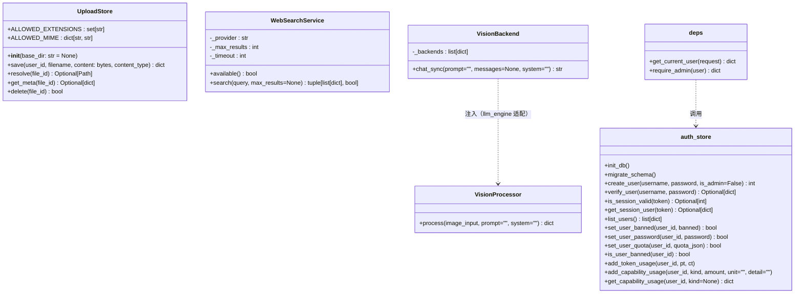
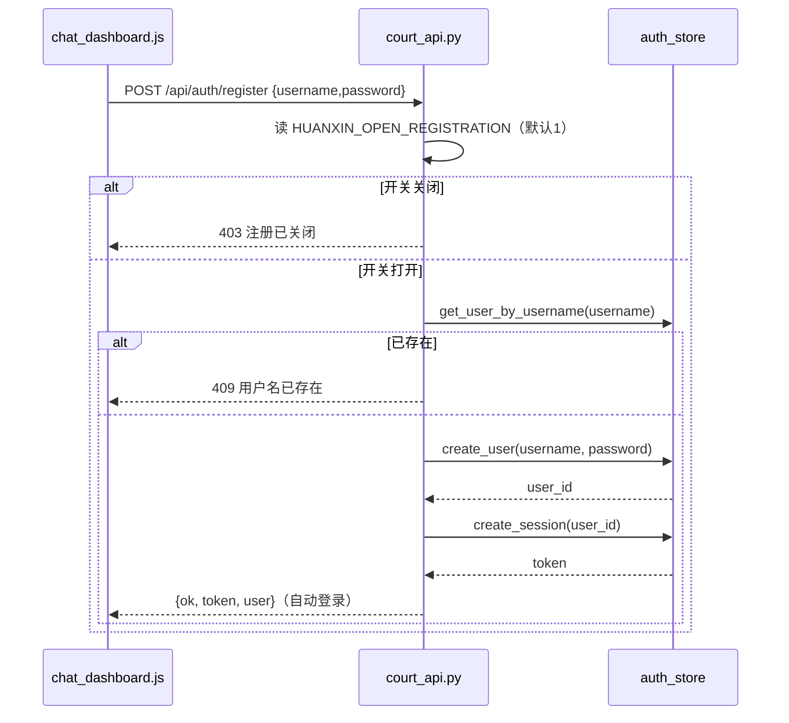
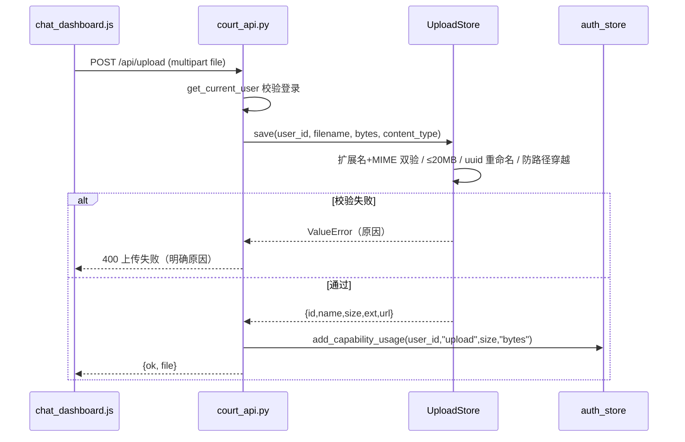
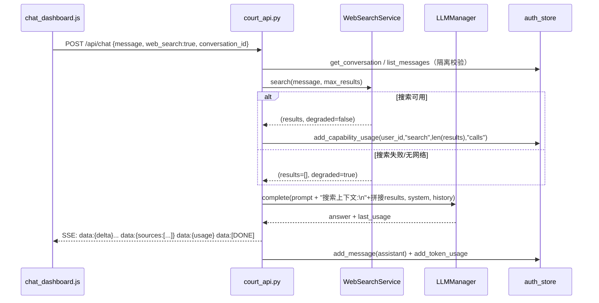
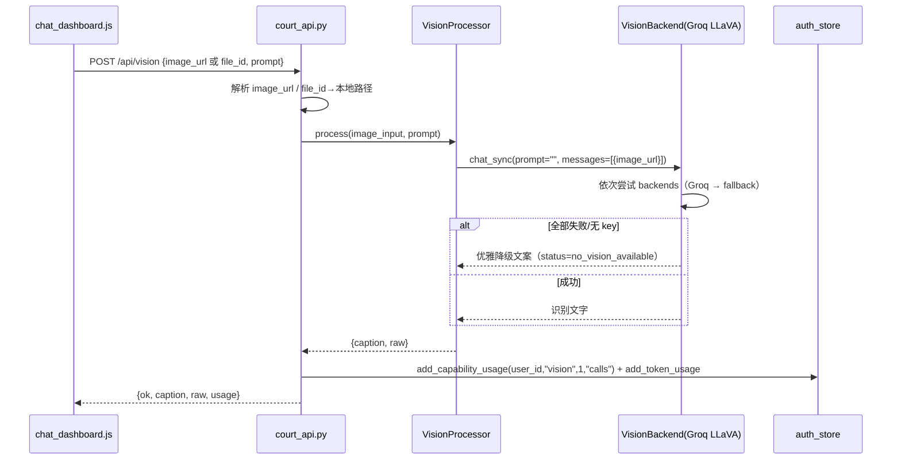
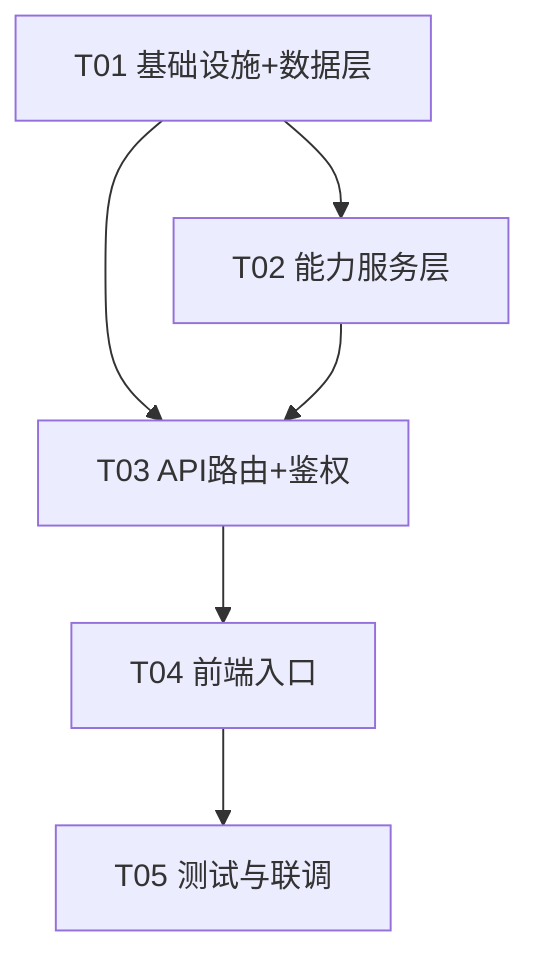

# 架构设计：huanxin-ai 多用户开放 + 文件上传 + 联网搜索 + 图文识别（增量开发）

> 配套 PRD：`docs/PRD_MULTI_USER_AND_CAPABILITIES.md`（已定稿）。
> 本设计遵循「最小变更」：尽量复用 `get_current_user` 依赖、`auth_store` 五表、多后端 `LLMManager`、`VisionProcessor`；前端改动集中在单文件 `chat_dashboard.py`。

---

## 0. 结论速览（TL;DR）

| 能力 | 选型 | 关键落地文件 |
|---|---|---|
| 多用户注册 | 复用 `auth_store.create_user` + env 开关 `HUANXIN_OPEN_REGISTRATION` | `court_api.py` / `auth_store.py` |
| 文件上传 | 本地卷 `/app/data/uploads` + 白名单 + UUID 重命名 | `capabilities/uploads.py`（新增） |
| 联网搜索 | DuckDuckGo（`duckduckgo_search`，无 key） | `capabilities/search.py`（新增） |
| 图文识别 | Groq LLaVA（复用 `GROQ_API_KEY`，OpenAI 兼容 `image_url`） | `capabilities/vision.py`（新增，复用 `VisionProcessor`） |
| 成本归属 | 新增 `capability_usage` 表（search/upload/vision 计量），vision 的 LLM token 额外写入现有 `token_ledger` | `auth_store.py` |
| 权限配额 | 新增 `users.banned`/`users.quota` 字段 + `require_admin` 依赖 | `auth_store.py` / `api/deps.py` |

---

## 1. 实现方案 + 框架选型

### 1.1 图文识别（Vision）选型结论

- **主端点：Groq LLaVA**（`llava-v1.5-7b-4096-preview`），走 OpenAI 兼容 `POST {base}/chat/completions`，`messages[].content` 采用 `[{type:text},{type:image_url, image_url:{url}}]` 标准格式。
  - 复用现有 `FREE_PROVIDERS["groq"]` 的 `base_url=https://api.groq.com/openai/v1` 与 `key_env=GROQ_API_KEY`（无需新 key，直接复用 `GROQ_API_KEY`）。
  - 差异点：groq 的 `default_model` 是文本模型 `llama-3.3-70b-versatile`，vision 需覆盖为 LLaVA，故引入独立 `VISION_MODEL` env。
- **备选端点：Cloudflare Workers AI LLaVA**（`@cf/llava-hf/llava-1.5-7b-hf`）。因其 API 形态（账户级 URL + `CF_API_TOKEN`/`CF_ACCOUNT_ID`）与 OpenAI 兼容不完全一致，不作为硬编码后端，而是通过通用 `VISION_FALLBACK_BASE_URLS/MODELS/KEYS` 三组逗号分隔 env 挂载，需要时由运维注入即可，无需改代码。
- **复用方式**：`VisionProcessor`（`huanxin/multimodal/processor.py`）保持**零改动**。它只依赖注入对象具备 `chat_sync(prompt="", messages=[...]) -> str`。我们新增一个轻量适配器 `VisionBackend` 实现该签名，内部按 backends 顺序做故障转移（与 `LLMManager` 同样的「依次尝试 + 失败降级」思路）。

> 关键澄清：现有 `huanxin/core/llm.py` 的 `LLMEngine/LLMManager` 只有 `complete()`，且其 `_litellm_complete` 只拼字符串消息，**不承载** `image_url` 多模态 content；而 `huanxin/llm/manager.py` 的 `chat_sync` 忽略 `messages` 参数。因此 vision 必须走专用 `VisionBackend`，不能直接复用 chat 的 manager。这正符合「复用 VisionProcessor 引擎、只换后端适配器」的最小变更原则。

### 1.2 联网搜索选型结论

- **DuckDuckGo（`duckduckgo_search` 库 / `DDGS`）**：免费、无 key、返回 title/url/body。
- 封装为 `WebSearchService`：`import` 失败或网络异常时返回 `(results=[], degraded=True)`，**优雅降级**，绝不抛 500。
- env 驱动：`SEARCH_PROVIDER`（默认 `duckduckgo`，为将来换 SearXNG/SerpAPI 预留）、`SEARCH_MAX_RESULTS`（默认 5）、`SEARCH_TIMEOUT`（默认 10s）。

### 1.3 文件上传选型结论

- **本地持久化卷 `/app/data/uploads`**（即 `$HUANXIN_DATA_DIR/uploads`），复用 Docker 命名卷，重启不丢。
- 上传走 **`python-multipart`**（已在 `requirements-docker.txt`，FastAPI `UploadFile` 依赖它）。
- 安全校验（PRD 3.3-3 已拍板）：
  1. 类型白名单：扩展名 `{.jpg,.jpeg,.png,.webp,.txt,.md,.pdf}`；
  2. MIME + 扩展名**双验**；
  3. 单文件 `≤ UPLOAD_MAX_MB`（默认 20MB）；
  4. 文件名清洗 + `uuid4` 重命名（保留原始名入库），**防路径穿越**（不信任原始 filename，绝不拼接用户输入到路径）。

### 1.4 权限与配额选型结论

- **完全开放注册**：`HUANXIN_OPEN_REGISTRATION`（默认 `1`）。
- **管理员能力**：用户列表 / 封禁 / 重置密码 / 调配额；新增 `require_admin` 依赖 + `users.banned` / `users.quota` 字段。
- **普通用户默认不限额**：`users.quota` 默认 NULL（=不限额），管理员可按用户覆盖；全局默认可经 `USER_DEFAULT_QUOTA`（JSON）配置，留作 P1-3。

### 1.5 成本归属选型结论

- 新增轻量表 `capability_usage(id, user_id, kind, amount, unit, detail, at)`，`kind ∈ {search, upload, vision}`，作为**非 token 类成本**的统一计量（search 记调用次数/结果条数、upload 记字节数、vision 记调用次数）。
- **vision 的 LLM token 用量**仍写入现有 `token_ledger`（复用 `add_token_usage`），保证 token 面板口径不变。
- 之所以不强行把 search/upload 塞进 `token_ledger`（其只有 prompt/completion 两列），是避免污染「累计 token」展示；新增独立表更干净、迁移成本极低。

---

## 2. 文件列表及相对路径

### 2.1 新增文件

| 相对路径 | 职责 |
|---|---|
| `huanxin/capabilities/__init__.py` | 能力服务包入口，re-export `UploadStore` / `WebSearchService` / `build_vision_processor` |
| `huanxin/capabilities/uploads.py` | 上传存储与安全校验（白名单、MIME+扩展双验、UUID 重命名、防路径穿越） |
| `huanxin/capabilities/search.py` | DuckDuckGo 联网搜索服务 + 优雅降级 |
| `huanxin/capabilities/vision.py` | Vision 后端解析（Groq LLaVA 主 + fallback env）+ `VisionBackend` 适配器 + `build_vision_processor()` |
| `huanxin/api/deps.py` | 提炼 `get_current_user` + 新增 `require_admin` 依赖（供 `court_api.py` 复用，便于单测） |
| `tests/test_uploads.py` | 上传白名单/大小/路径穿越/MIME 校验单测 |
| `tests/test_search.py` | 搜索服务降级/结果结构单测（mock DDGS） |
| `tests/test_auth_multiuser.py` | 注册开放/重复用户名/数据隔离/越权/封禁 单测 |

### 2.2 修改文件

| 相对路径 | 职责 / 改动点 |
|---|---|
| `huanxin/api/auth_store.py` | ① `users` 增加 `banned`/`quota` 字段迁移；② 新增 `capability_usage` 表；③ 新增 admin 辅助函数（`list_users`/`set_user_banned`/`set_user_password`/`set_user_quota`/`is_user_banned`）与 `add_capability_usage`；④ `verify_user`/`get_session_user` 封禁拦截 |
| `huanxin/court_api.py` | ① 打开 `/api/auth/register`（读 env 开关）；② 新增 `/api/upload`、`/api/files/{id}`、`/api/vision`、`/api/search`、`/api/admin/*`；③ 扩展 `ChatRequest` 与 `/api/chat`（`web_search`/`image_url`/`file_id`）；④ `require_admin` 接线 |
| `huanxin/api/token_guard.py` | 仅注释更新：确认 `/api/auth/register` 已在 `public_paths`（现状已放行，无需改逻辑） |
| `huanxin/chat_dashboard.py` | ① 登录模态框补「注册」tab（用户名/密码/确认密码 + 前端校验 + 注册后自动登录）；② 输入区加「📎 上传」按钮 +「联网搜索」开关；③ 消息区文件卡片/图片缩略图/来源链接展示；④（P1）管理员后台入口 |
| `requirements-docker.txt` | 新增 `duckduckgo-search`、`pillow`、`PyPDF2` |
| `requirements.txt` | 同步新增 `duckduckgo-search`（pillow/PyPDF2 已存在） |
| `.env.example`（如存在） | 追加本节 1.1–1.4 新增 env 变量示例 |

> 说明：`huanxin/multimodal/processor.py`（`VisionProcessor`）**不改**；`huanxin/core/llm.py`、`huanxin/llm/manager.py` **不改**。

---

## 3. 数据结构和接口

### 3.1 新增/扩展 Pydantic 请求模型（`court_api.py` 模块级）

```python
# 复用现有 AuthRequest(username, password) —— 注册与登录共用
class ChatRequest(BaseModel):          # 扩展已有模型
    message: str
    history: list[dict] = []
    conversation_id: Optional[int] = None
    system: str = "你是 幻炘AI ..."
    web_search: bool = False           # 新增：联网搜索开关
    image_url: Optional[str] = None    # 新增：图片 URL（视觉）
    file_id: Optional[str] = None      # 新增：已上传文件引用（图片→视觉；pdf/txt/md→抽取文本）

class VisionRequest(BaseModel):
    image_url: Optional[str] = None
    file_id: Optional[str] = None
    prompt: str = "Describe this image in detail."

class SearchRequest(BaseModel):
    query: str
    limit: int = Field(default=5, ge=1, le=10)

class AdminSetBannedRequest(BaseModel):
    banned: bool = True

class AdminResetPasswordRequest(BaseModel):
    password: str = Field(..., min_length=6)

class AdminSetQuotaRequest(BaseModel):
    quota: Optional[dict] = None       # None = 不限额
```

### 3.2 新增路由签名（全部位于 `create_app` 内，鉴权用 `Depends`）

```python
POST /api/auth/register        body: AuthRequest            -> {ok, token, user}        # 注册后自动登录（复用 login 逻辑）
POST /api/upload               multipart: file (UploadFile) -> {ok, file:{id,name,size,ext,url}}
GET  /api/files/{file_id}      -> FileResponse（属主校验，越权 404）
POST /api/vision               body: VisionRequest          -> {ok, caption, raw, usage}
POST /api/search               body: SearchRequest          -> {ok, results:[{title,url,snippet}], degraded}
POST /api/chat                 body: ChatRequest            -> SSE（扩展 web_search/image_url/file_id）
GET  /api/admin/users          admin                        -> {ok, users:[...]}
POST /api/admin/users/{id}/ban       admin, AdminSetBannedRequest      -> {ok}
POST /api/admin/users/{id}/unban     admin                           -> {ok}
POST /api/admin/users/{id}/password  admin, AdminResetPasswordRequest -> {ok}
PUT  /api/admin/users/{id}/quota     admin, AdminSetQuotaRequest      -> {ok}
```

### 3.3 类图 / 数据结构（Mermaid）



> `VisionBackend` 实现 `chat_sync(prompt="", messages=[...])`，与 `VisionProcessor._llm.chat_sync` 调用点精确匹配，故 `VisionProcessor` 无需改动。

---

## 4. 程序调用流程（时序图）

### 4.1 注册流程（P0-1）



### 4.2 文件上传流程（P0-3）



### 4.3 联网搜索聊天流程（P0-4）



### 4.4 图文识别流程（P1-1）



---

## 5. 任务列表（有序、含依赖）

> 严格遵循「≤5 任务 / 每任务 ≥3 文件 / 首任务为基础设施 / 按依赖顺序」约束。

### T01 — 项目基础设施 + 数据层扩展（P0 依赖）
- **新增/修改文件**：`requirements-docker.txt`、`requirements.txt`、`huanxin/api/auth_store.py`、`.env.example`
- **做什么**：
  1. `requirements-docker.txt` 增 `duckduckgo-search>=6.0.0`、`pillow>=10.0.0`、`PyPDF2>=3.0.0`；`requirements.txt` 同步增 `duckduckgo-search`。
  2. `auth_store.py` 新增 `migrate_schema()`（幂等 `ALTER TABLE users ADD COLUMN banned/quota` + `CREATE TABLE IF NOT EXISTS capability_usage`），并在 `init_db()` 末尾调用；`users` 建表 SQL 同步补 `banned`/`quota`（新库直接含列）。
  3. `auth_store.py` 新增 admin 辅助 + 计量函数：`list_users` / `set_user_banned` / `set_user_password` / `set_user_quota` / `is_user_banned` / `add_capability_usage` / `get_capability_usage`；`verify_user`/`get_session_user` 对 `banned=1` 返回 None。
  4. `.env.example` 追加 env 变量示例（见 §7）。
- **验收标准**：`init_db()` 幂等且含新列/新表；老库升级后 `banned`/`quota` 列存在；封禁用户 `get_session_user` 返回 None；`capability_usage` 可写入并 SUM。
- **依赖**：无

### T02 — 能力服务层（上传/搜索/视觉三模块）（P0/P1 依赖）
- **新增文件**：`huanxin/capabilities/__init__.py`、`huanxin/capabilities/uploads.py`、`huanxin/capabilities/search.py`、`huanxin/capabilities/vision.py`
- **做什么**：
  1. `uploads.py`：`UploadStore`（白名单、MIME+扩展双验、`UPLOAD_MAX_MB` 大小限制、`uuid4` 重命名、`Path.resolve` 防穿越、`save/resolve/get_meta/delete`）。
  2. `search.py`：`WebSearchService`（`DDGS().text()`，`available()`、`search()` 返回 `(results, degraded)`，import/网络异常降级）。
  3. `vision.py`：`resolve_vision_backends()`（读 `VISION_PROVIDER/MODEL/API_KEY` 复用 `FREE_PROVIDERS["groq"]` + `VISION_FALLBACK_*`）；`VisionBackend`（`chat_sync(messages=...)` 故障转移）；`build_vision_processor()` 返回注入 `VisionBackend` 的 `VisionProcessor` 或 None。
  4. `__init__.py` re-export 三件套。
- **验收标准**：三模块可独立 `import`；`UploadStore.save` 拒绝非法类型/超限/穿越路径；`WebSearchService.search` 断网时返回 `([], True)` 不抛异常；`build_vision_processor()` 无 key 时返回 None、有 `GROQ_API_KEY` 时返回可 `process()` 的对象。
- **依赖**：T01

### T03 — API 路由 + 鉴权接入（P0/P1 核心）
- **新增/修改文件**：`huanxin/api/deps.py`（新增）、`huanxin/court_api.py`（修改）、`huanxin/api/token_guard.py`（注释确认）
- **做什么**：
  1. `deps.py`：提炼 `get_current_user`（自 `court_api.py` 闭包迁移，仅依赖 `auth_store` + `Request`）+ 新增 `require_admin`（非 admin 抛 403）。
  2. `court_api.py`：① 打开 `/api/auth/register`（`HUANXIN_OPEN_REGISTRATION` 开关，成功 `create_user`+`create_session` 返回 token）；② 新增 `/api/upload`、`/api/files/{file_id}`、`/api/vision`、`/api/search`、`/api/admin/*`；③ `ChatRequest` 增 `web_search/image_url/file_id`，`/api/chat` 的 `generate()` 按需注入搜索上下文/视觉 caption/文件文本，并新增 `sources` SSE 事件；④ 引入 `Depends(get_current_user)`/`Depends(require_admin)`（替换既有闭包调用点）。
  3. `token_guard.py`：确认 `/api/auth/register` 在 `public_paths`（现状已含，仅补注释，不改逻辑）。
- **验收标准**：新用户注册成功且可登录；重复用户名 409；未登录上传/搜索/视觉返回 401；普通用户访问 `/api/admin/*` 返回 403；`/api/chat` 带 `web_search:true` 时 SSE 含 `sources` 事件；`/api/vision` 无 vision key 时返回可读降级而非 500。
- **依赖**：T01、T02

### T04 — 前端入口（`chat_dashboard.py` 单文件）
- **修改文件**：`huanxin/chat_dashboard.py`
- **做什么**：
  1. 登录模态框补「注册」tab（用户名/密码/确认密码；前端非空/强度/二次一致校验；`submitAuth` 按 tab 分流登录/注册，注册成功 `setToken` 自动登录）。
  2. composer 加「📎 上传」按钮（`<input type=file>` 隐藏 + `FormData` 调 `/api/upload`）+「联网搜索」开关（视觉高亮「已开启联网」）。
  3. 消息区渲染文件卡片（文件名/大小/类型图标）、图片缩略图（`/api/files/{id}` 或 `image_url`）、识别中「正在识别…」、来源链接（解析 SSE `sources`）。
  4. `send()` 携带 `web_search` 状态与已选 `file_id`/`image_url`；失败时 toast 明确原因。
  5. （P1）侧栏加管理员入口：用户列表/封禁/重置密码/调配额（调 `/api/admin/*`，仅 admin 可见）。
- **验收标准**：注册闭环可用；上传入口可用、超限/类型错误有提示；联网开关高亮且返回来源链接；图片识别结果以「缩略图+文字」展示；无 vision key 时前端给出可读提示。
- **依赖**：T03

### T05 — 测试与联调（P0/P1 兜底）
- **新增/修改文件**：`tests/test_uploads.py`、`tests/test_search.py`、`tests/test_auth_multiuser.py`、`docs/PRD_MULTI_USER_AND_CAPABILITIES.md`（验收勾稽）
- **做什么**：
  1. 上传单测（类型/大小/MIME/穿越/属主越权）。
  2. 搜索单测（mock DDGS：正常/异常降级）。
  3. 多用户单测（注册开关/重复用户名/数据隔离/跨用户 404/封禁拦截/admin 越权）。
  4. 端到端手工联调：Docker 重建后上传文件重启仍可访问；开关搜索/视觉走通；token 面板口径不回归。
- **验收标准**：新增用例全绿；P0-1~P0-4、P1-1~P1-4 逐条勾稽通过；既有 `/api/chat`、`/api/me`、`/api/conversations` 无回归。
- **依赖**：T04

---

## 6. 依赖包列表（新增 pip 依赖）

| 包 | 建议版本 | 用途 | 是否已存在 |
|---|---|---|---|
| `duckduckgo-search` | `>=6.0.0` | 联网搜索（DDGS） | 否（新增） |
| `pillow` | `>=10.0.0` | 图片转 base64（VisionProcessor 依赖）+ 上传图片校验 | `requirements.txt` 已有，`requirements-docker.txt` 缺 |
| `PyPDF2` | `>=3.0.0` | PDF 文本抽取（DocumentProcessor 依赖） | `requirements.txt` 已有，`requirements-docker.txt` 缺 |
| `python-multipart` | `>=0.0.9` | FastAPI 文件上传（`UploadFile`） | 已在 `requirements-docker.txt` |

> 同步写回两处：`requirements-docker.txt`（Docker 运行时真实安装源）与 `requirements.txt`（全量开发源），避免两套依赖漂移。

---

## 7. 共享知识（跨文件约定）

### 7.1 错误处理风格
- 沿用现有 `raise HTTPException(status_code, detail)`；detail 为可读中文字符串（前端直接 `j.detail` 展示）。
- 状态码约定：`400` 参数/校验错、`401` 未登录、`403` 无权限/注册关闭、`404` 资源不存在或无权访问、`409` 冲突（重复用户名）、`503` 能力不可用（降级优先于 500）。
- 能力类服务（搜索/视觉/上传）**内部绝不抛 5xx**，一律返回结构化降级结果（`degraded`/`error` 字段），由路由层决定响应。

### 7.2 鉴权依赖复用
- `get_current_user` / `require_admin` 统一放 `huanxin/api/deps.py`，`court_api.py` 与未来模块 `from huanxin.api.deps import get_current_user, require_admin`。
- 所有新路由必须挂 `Depends(get_current_user)`（除 `/api/auth/register`、`/api/auth/login`、`/health`）。
- admin 路由额外挂 `Depends(require_admin)`。

### 7.3 SSE 风格（与 `/api/chat` 一致）
- `media_type="text/event-stream"`，header `Cache-Control: no-cache` + `X-Accel-Buffering: no`。
- 事件 JSON 字段：`{delta}`（增量文本）、`{sources}`（新增，联网搜索来源 `[{title,url}]`）、`{usage}`（token 计量）、`[DONE]`（结束）。
- 流中断也要落库（现有 `finally` 已保证），新能力沿用。

### 7.4 日志规范
- logger 命名：`huanxin.capabilities.<module>`（`huanxin.capabilities.uploads` 等）。
- 计量/降级用 `logger.warning`，正常路径 `logger.info/debug`，异常堆栈用 `exc_info=True`。

### 7.5 新增 env 变量命名（沿用 `OPENAI_*` / `HUANXIN_*` / `*_API_KEY` 约定）

| 变量 | 默认 | 说明 |
|---|---|---|
| `HUANXIN_OPEN_REGISTRATION` | `1` | 开放注册开关（`0` 关闭） |
| `HUANXIN_DATA_DIR` | `/app/data` | 数据卷根（uploads 在其下） |
| `UPLOAD_MAX_MB` | `20` | 单文件大小上限 |
| `VISION_PROVIDER` | `groq` | 视觉主后端（复用 `FREE_PROVIDERS`） |
| `VISION_MODEL` | `llava-v1.5-7b-4096-preview` | 视觉模型 |
| `VISION_FALLBACK_BASE_URLS` / `VISION_FALLBACK_MODELS` / `VISION_FALLBACK_KEYS` | 空 | 视觉备选后端（逗号分隔，如 Cloudflare） |
| `SEARCH_PROVIDER` | `duckduckgo` | 搜索后端 |
| `SEARCH_MAX_RESULTS` | `5` | 单次搜索结果条数 |
| `SEARCH_TIMEOUT` | `10` | 搜索超时（秒） |
| `USER_DEFAULT_QUOTA` | 空（=不限额） | 全局默认配额 JSON |

> 复用现有 `GROQ_API_KEY` 作为 Groq LLaVA 的 key（不新增 `VISION_API_KEY`，除非 provider 非 groq）。

### 7.6 计量口径
- 聊天/视觉的 LLM token → `token_ledger`（`add_token_usage`，vision 从 `last_usage` 取 prompt/completion）。
- 搜索/上传/视觉调用次数 → `capability_usage`（`add_capability_usage`）。

---

## 8. 待明确事项（剩余）

1. **Cloudflare Workers AI 兜底的图片格式**：其 `@cf/llava-hf` 非标准 OpenAI `image_url` 形态，若需真正启用，需在 `VisionBackend` 加一个 `provider="cloudflare"` 分支做 image→base64 数组适配。本设计暂以 env 挂载兜底、不硬编码，**是否本轮实现 Cloudflare 适配器待定**。
2. **配额（P1-3）具体语义**：`users.quota` 的 JSON 结构（按「对话次数/上传字节/搜索次数」哪几项、超限是软提示还是硬拦截）尚未定，本设计先落「字段 + admin 可改」，**拦截规则留待实现时细化**。
3. **注册是否需邮箱/邀请码（P2-4）**：已拍板「完全开放」，本轮不做；仅保留 `HUANXIN_OPEN_REGISTRATION` 总开关。
4. **上传文件生命周期**：暂不实现用户自助删除/过期清理；`capability_usage` 已记录字节，未来可据此做总容量配额。
5. **`/api/files/{id}` 的公开性**：当前设计要求登录 + 属主校验；若需在对话历史中跨端展示图片，需确认是否需要短期签名 URL（本轮先用鉴权直读）。

---

## 9. 任务依赖图（Mermaid）



---

*（本文档由架构师产出，配套 `docs/sequence-diagram.mermaid` 与 `docs/class-diagram.mermaid`。）*
