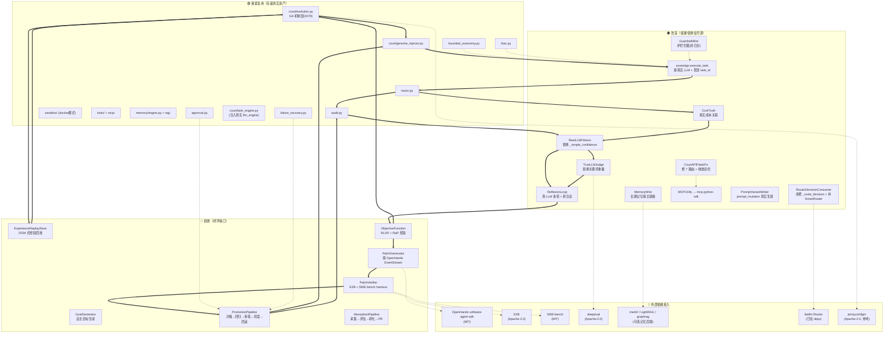
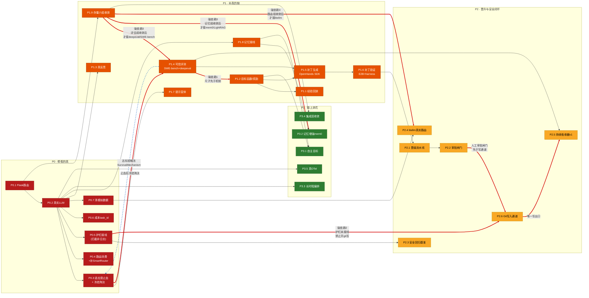
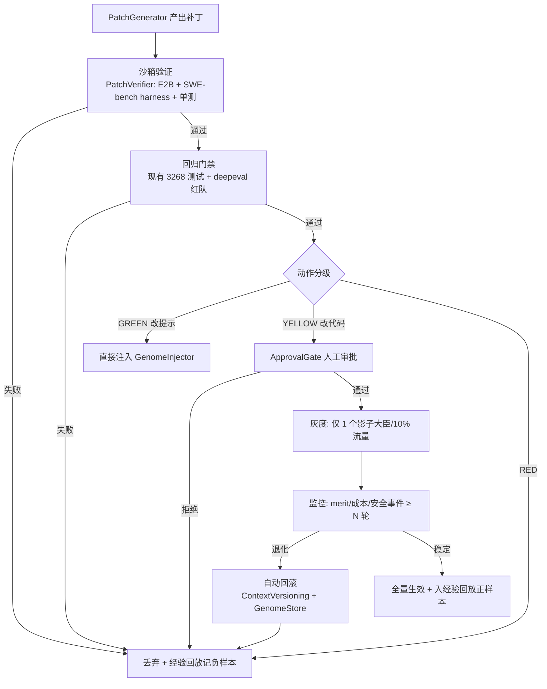
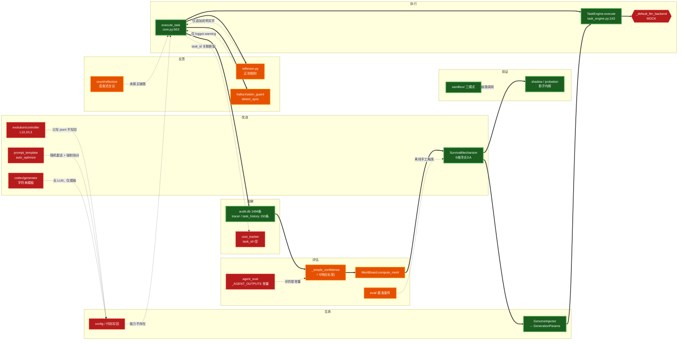

# HUANXIN / huanxin-ai 自进化能力调研与落地方案

> **文档类型**：调研与方案设计（不含代码变更）
> **生成日期**：2026-08-09
> **适用仓库**：`github.com/kiwoen/huanxin-ai`
> **证据基准日**：2026-08-09（开源项目数据实时抓取日）
>
> 本文档由调研、存量盘点、方案设计、事实核查四条独立工作线产出后合并而成。
> 第 1–3 章的全部外部引用已经过独立事实核查，核查报告见附录 B。

---

## 第 0 章 · 调研范围、方法与假设

---

### 0.1 任务定义与交付边界

本次任务为 **纯调研与方案设计**，经与需求方确认后锁定四条边界：

| 边界项 | 决定 | 含义 |
|--------|------|------|
| 交付形态 | 纯调研文档 | **不改动 huanxin-ai 任何代码**，不提交 PR，不修改配置 |
| GitHub 同步机制 | 只设计流程，不动仓库 | 第 5 章给出同步策略、分支模型、审核流程的**设计稿**，不执行任何 push |
| 检索深度 | 深度联网检索 | 论文/仓库数据均需可确证来源，禁止凭记忆填写 |
| 落盘位置 | `huanxin-ai/docs/` | 与既有 `ARCHITECTURE.md` / `vision.md` 同级 |

**明确不在范围内**：代码实现、性能压测、生产部署、成本实测、法律合规意见。

---

### 0.2 关于"当前项目现状"的初始假设，及其验证结果

需求方要求先声明假设。以下是**接手任务时基于 README/vision.md/docs 文档层面形成的 7 条假设**，以及经存量盘点（Part 0，逐文件读码 + 运行期取证）后的**实际验证结论**。

> 这一节是本文档可信度的地基：**文档宣称与代码实态之间存在系统性偏差**，如果沿用初始假设做方案设计，结论会整体跑偏。

| # | 初始假设（来自项目自述文档） | 验证结果 | 对方案的影响 |
|---|------------------------------|----------|--------------|
| A1 | 系统已具备"执行→观察→评估→反思→改进→验证→生效"的完整自进化闭环 | ❌ **推翻**。闭环存在多处断边，评估信号损坏导致改进方向错误 | 方案主线从"优化闭环"改为"修复闭环"，见第 4 章差距分析 |
| A2 | 进化引擎（遗传算法）在真实运行并产生正向收益 | ❌ **推翻**。实测退化为纯淘汰过程，无有效增益产生 | "重建适应度函数"被提为 P0 首位任务 |
| A3 | 适应度评估基于任务完成质量 | ❌ **推翻**。主链路适应度实际由**响应文本长度**主导，正确性加分项在主链路永不触发 | 典型奖励黑客（reward hacking）结构，见 4.1 |
| A4 | 三层安全护栏（bounded_autonomy / tool_guard / governance_agent）已接入主执行路径 | ❌ **推翻**。约 2280 行护栏代码仅被 API 端点与彼此引用，形成悬空子图，未挂载在主执行链上 | 4.6 风险边界改为"**先接线（激活存量）→ 再扩展**"两段式，而非直接扩展 |
| A5 | PromptGuard 会拦截危险输入 | ❌ **推翻且更严重**。危险等级判定后向遥测上报 `blocked`，但执行流程继续，**监控数据与实际行为不一致** | 单列为安全项最高优先级：一个会"谎报战果"的护栏比没有护栏更危险 |
| A6 | 路由层缺失，需要从零构建 | ⚠️ **部分修正**。`huanxin/router/` 是完整可用的包且已在主路径被调用，问题是**决策结果未被消费**（仅写入只读字段）；真正缺失的是 `huanxin/model_router.py`（SmartRouter），且其导入失败被 try/except 静默吞掉 | 工作量从"重建路由层"下调为"接通最后一公里"，数十行量级 |
| A7 | 系统对接真实 LLM 运行 | ❌ **推翻**。默认运行在 mock 模式下 | 所有"效果类"结论在接入真实模型前均不可信，需在路线图中前置 |
| A8 | 系统具备代码自修改能力（自进化的题中之义） | ❌ **推翻，且影响需求可行性**。全库无 git 写操作、无 `.py` 文件写入、无 PR 创建，`gitpython` 零 import；进化对象仅 6 个 LLM 采样超参数，其中 `prompt_mutation_rate` 为装饰性基因（全库无消费点）；`evolution/controller` 三层均为 log-only 骨架 | **直接冲击需求第 5 项**（"将更新同步提交到 GitHub"）。该能力需从零构建，且是全方案危险等级最高的单项，见 5.1 与 4.6 |

**额外发现（初始假设未覆盖）**：

- **Track A / Track B 双系统并存**：代码库中存在两套并行实现，容器部署仅启动其中一套，另一套的能力宣称无法在部署形态下兑现。已要求在方案中单列决策章节。
- **大规模重复实现**：记忆 5 套、插件 6 套、路由 4 套等同类能力多份实现并存，是"能力矩阵看起来很丰满、实际可用度低"的直接成因。
- **静默失效模式**：`try/except ImportError` 吞掉导入失败并置 `None`，使缺失模块在文档与接口层表现为"已发布特性"，在运行期为空。这是文档-实态偏差的**制度性成因**，需要在工程规范层面根治，而不只是修单个模块。
- **评测链路整体失真，系统不具备自我证伪能力**：现有 `eval/` 四个基准全部是内置能力调用题、不含代码类任务；`agent_eval` 评估的是硬编码常量而非真实系统输出；`llm_judge` 名为 LLM 评判、实为关键词重叠启发式。三者叠加的后果是——**系统当前无法判断自己的任何一次"改进"是否真的改进了**。这使 A2/A3 的适应度问题无法靠现有工具自查，也决定了可信评测必须先于进化机制修复落地（依赖关系见 4.5）。

---

### 0.3 证据标准

本次调研对三类内容采用不同的取证要求：

| 内容类型 | 取证要求 | 不达标时的处理 |
|----------|----------|----------------|
| 论文 / 技术文章 | 必须有可访问链接 + 明确发布年月；arXiv 类需精确 ID | 抓不到确证即删除该条，不做"大致记得"式保留 |
| 开源项目数据 | Star 数 / 许可证 / 最近提交时间需经 API 实测，标注采集日期 | 无法实测的项目不入表 |
| 存量代码结论 | 必须给出文件路径 + 行号；行为类结论需运行期证据 | 仅凭命名或文档推断的结论标注为"待验证"，不进入关键判断 |

**已知的取证陷阱（本次踩过并已修正）**：

1. **GitHub `language` 字段不可直接用于判断技术栈**。该字段按代码字节数取最大值，会被前端代码带偏。例如某项目主字段显示为 TypeScript，但其 Python 核心运行时独立在 companion 仓库中。已改用 `/languages` 接口获取语言分布，并引入四维判据（核心语言 / 许可证 / 集成面 / 可复用粒度）替代单一语言判断。
2. **"文件不存在"与"功能缺失"不等价**。目录形态的包容易被文件级检索误判为缺失，反之亦然。所有缺失类结论均需 `ls` + 读 `__init__.py` 二次确认。
3. **HTTP 200 不等于引用正确 —— 链接可达性检查对"张冠李戴"型错误完全无效**。本次核查抓到一条引用：arXiv ID 格式合法、链接正常打开、发布月份与正文表述自洽，但**打开后是一篇毫不相关的论文**，且真实论文的发布时间比标注晚了整一年。这类错误无法靠状态码筛出，只能靠**回验标题**。因此本次交付前追加了一道强制工序：所有 arXiv 条目逐条比对"ID → 实际标题"是否与正文一致，所有仓库链接确认 owner/repo 真实存在且确为所指项目。
4. **重点复核会制造盲区**。本次被点名要求重查的条目 100% 正确，而全部严重错误都落在"初稿沿用、未被点名"的旧条目上。定向复核只能证明被查项没问题，不能提升整体可信度 —— 故核查采用全量覆盖（61 项，0 项跳过）而非抽查。

---

### 0.4 文档结构与分工来源

最终文档由四份独立草稿合并而成，各章节的产出方与证据来源如下：

| 章节 | 内容 | 工作线 |
|------|------|--------|
| 第 0 章 | 范围、方法、假设 | 统稿 |
| 第 1 章 | 资料检索（论文/文章，按 6 主题归类） | 外部调研 |
| 第 2 章 | 开源调研（项目对比表 + 集成分类） | 外部调研 |
| 第 3 章 | 能力清单（组件与技能，含依赖与集成方式） | 外部调研 |
| 第 4 章 | 项目落地（差距/架构/模块/选型/路线图/风险边界） | 方案设计（以附录 A 为证据基础） |
| 第 5 章 | 持续吸收机制（采集→转化→同步 GitHub） | 方案设计 |
| 附录 A | 存量能力矩阵全表 | 存量盘点 |
| 附录 B | 事实核查报告 | 独立核查 |

四条工作线独立作业：**外部调研**不接触本仓库代码，**存量盘点**不参考外部资料，两者交叉验证后才进入**方案设计**；**独立核查**对第 1–3 章的全部外部引用做无差别复算，不采信调研方的自述数据。这种隔离是为了避免"先有结论再找证据"。
| 附录 C | 证据索引 | 全员 | 各草稿附录合并 |

**合并原则**：
- 冲突以**取证等级更高的一方**为准（运行期证据 > 代码行号 > 文档描述）。
- 事实核查（附录 B）若判定第 1–3 章某条数据不实，先回退修正再合并，不带病交付。
- 保留分歧：若成员间存在无法用证据裁决的判断分歧，在正文标注双方观点，不强行统一。

---

### 0.5 阅读指引

- **只想知道结论**：读第 0.2 节（假设验证表）+ 第 4.1 节（差距分析）+ 第 4.5 节（路线图）。
- **要做技术选型**：读第 2 章（开源对比表）+ 第 4.4 节（选型建议），注意第 2 章的分类口径在"集成分类判定口径"小节。
- **关心安全与失控风险**：直接读第 4.6 节，其中 PromptGuard 与护栏接线为最高优先级项。
- **要复核数据真伪**：附录 B（核查报告）+ 附录 C（证据索引）。

---

---

## 第 1 章 · 资料检索

按六个主题归类。每条均含：标题 | 类型 | 来源链接 | 发布时间（精确到年月，指"活跃期 / 最后提交"，非仓库创建时间）| 一句话核心结论。每个主题末尾给出可迁移结论。

### A. 自我改进与进化（Self-Improvement & Evolution）

| 标题 | 类型 | 来源链接 | 发布时间 | 一句话核心结论 |
|---|---|---|---|---|
| Darwin Gödel Machine (DGM) | 开源项目 / 论文 | https://github.com/jennyzzt/dgm、https://arxiv.org/abs/2505.22954 | 2025-08 | 通过"修改自身代码 + 经验回放"实现开放式进化，在 SWE-bench 等任务上持续提升且效果可累积（2025-08 为仓库最后活跃；论文 arXiv:2505.22954，2025-05-29） |
| AlphaEvolve | 技术报告 | https://deepmind.google/discover/blog/alphaevolve-a-gemini-powered-coding-agent-for-designing-advanced-algorithms/ | 2025-05 | 进化式代码搜索，在矩阵乘法、数据结构等任务上发现优于人类的新算法 |
| ADAS: Automated Design of Agentic Systems | 论文 | https://arxiv.org/abs/2408.08435 | 2024-08 | 用元智能体在"子智能体 + 拓扑"空间中搜索，自动设计出优于手工编排的系统 |
| GPTSwarm | 论文 | https://arxiv.org/abs/2402.16823 | 2024-02 | 将智能体工作流建模为可进化的计算图（Language Agents as Optimizable Graphs，Mingchen Zhuge 等，2024-02），节点/边可优化 |
| AFlow | 论文 | https://arxiv.org/abs/2410.10762 | 2024-10 | 用蒙特卡洛树搜索（MCTS）自动优化 LLM 工作流，无需手工调参 |

**可迁移结论（A）：** huanxin-ai 的 `court/`（genome_store / genome_injector / crossover / breeding / diversity）已具备"基因组式自我修改"雏形，建议直接借鉴 DGM 的"经验回放库 + 开放式进化"机制，把"修改自身配置 / 提示 / 代码"作为一等能力。ADAS / GPTSwarm / AFlow 共同证明"把工作流本身当作可搜索、可进化的空间"是有效范式，可作为进化引擎的搜索策略参考。AlphaEvolve 证明"量化目标 + 进化搜索"在代码优化上能持续超越基线，可作为 `court/` 进化目标函数设计的范本。
> 注（修订·据附录 A 存量盘点）：`court/` 当前仅能修改 6 个 LLM 采样超参数，`prompt_mutation_rate` 为装饰性基因、代码/提示词自修改均不存在、适应度=响应长度且实测 192/192 进化事件全淘汰。故 DGM 式"自改代码 → 沙箱验证 → 基准评测 → 存档"需**从零建设**；好消息是 `court/evolution.py` 的 GA 机制层（SBX/自适应变异/灾变/71 测试）与 `sandbox/`、`codex/analyzer.py` 可直接复用为地基。

### B. 自我反思与迭代（Self-Reflection & Iteration）

| 标题 | 类型 | 来源链接 | 发布时间 | 一句话核心结论 |
|---|---|---|---|---|
| Reflexion | 论文 | https://arxiv.org/abs/2303.11366 | 2023-03 | 语言化自我反思 + 情景记忆，以 verbal RL 提升后续决策质量 |
| Self-Refine | 论文 | https://arxiv.org/abs/2303.17651 | 2023-03 | 生成 → 反馈 → 精炼的多轮闭环，无需额外训练即可提升 |
| CRITIC | 论文 | https://arxiv.org/abs/2305.11738 | 2023-05 | 用外部工具（搜索 / 代码执行）对输出做批评与自动纠错 |
| Self-Consistency | 论文 | https://arxiv.org/abs/2203.11171 | 2022-03 | 多次采样 + 共识聚合，提升推理稳定性与正确性 |
| Multi-Agent Reflexion (MAR) | 论文 | https://arxiv.org/abs/2512.20845 | 2025-12 | 多智能体交叉反思（Actor + 多 Persona 批评者 + Judge 共识），比单智能体反思更不易陷入确认偏差 / 模式坍塌 |

**可迁移结论（B）：** huanxin-ai 已有 `reflexion/` 模块，应补齐三类机制：Self-Refine 的"多轮生成—反馈—精炼"闭环、CRITIC 的"外部工具验证纠错"、以及 MAR 的多智能体交叉评审。可把现有 `llm_judge` 作为反馈生成器，将 `reflexion` 升级为"生成 → judge 评分 → 精炼 → 再生成"的自动循环，并用 Self-Consistency 的多次采样共识降低单次幻觉率。

### C. 自主智能体架构（Autonomous Agent Architecture）

| 标题 | 类型 | 来源链接 | 发布时间 | 一句话核心结论 |
|---|---|---|---|---|
| LangGraph | 开源项目 | https://github.com/langchain-ai/langgraph | 2024–2026 | 基于状态图的有环 / 分支智能体编排，支持 checkpoint 与人在环中断 |
| AutoGen | 开源项目 | https://github.com/microsoft/autogen | 2023–2026 | 多智能体对话式编排框架（Core / Studio / Extensions） |
| CrewAI | 开源项目 | https://github.com/crewAIInc/crewAI | 2023–2026 | 角色化多智能体协作（Crews / Flows） |
| deer-flow | 开源项目 | https://github.com/bytedance/deer-flow | 2025-05 | 长时程 SuperAgent：沙箱 + 记忆 + 工具 + 子智能体 + 消息网关，处理分钟到小时级任务 |
| OpenAI Agents SDK (Python) | 开源项目 | https://github.com/openai/openai-agents-python | 2025-03 | 轻量多智能体工作流（handoff / guardrails / tracing） |

**可迁移结论（C）：** huanxin-ai 已有 `core/orchestrator`、`pipeline`、`state_machine`、`handoff`、`consensus/`，编排骨架完整。建议借鉴 deer-flow 的"消息网关 + 技能 / 子智能体长时程编排"补齐长任务能力，参考 LangGraph 的状态图与人在环机制做可视化与中断恢复，并复用板块 2 中的 `mcp-python-sdk` 做工具标准化接入，减少自研工具协议成本。

### D. 记忆与持续学习（Memory & Continual Learning）

| 标题 | 类型 | 来源链接 | 发布时间 | 一句话核心结论 |
|---|---|---|---|---|
| MemGPT (Letta) | 论文 / 项目 | https://arxiv.org/abs/2310.08560 | 2023-10 | 操作系统式分层记忆（主记忆 / 归档 / 外存），突破上下文窗口限制 |
| Mem0 | 开源项目 | https://github.com/mem0ai/mem0 | 2024–2026 | 自适应记忆层，自动抽取 / 去重 / 更新事实，跨会话保留 |
| A-MEM | 论文 | https://arxiv.org/abs/2502.12110 | 2025-02 | 类 Zettelkasten 的自主进化记忆，笔记间动态链接、随使用演化 |
| FOREVER | 论文 | https://arxiv.org/abs/2601.03938 | 2026-01 | 受艾宾浩斯遗忘曲线启发的记忆回放持续学习框架，按"模型时间"调度回放以缓解灾难性遗忘 |
| SuRe | 论文 | https://arxiv.org/abs/2404.13081 | 2024-04 | 对每个答案候选生成检索段落的条件摘要并验证其有效性 / 排序，提升开放域问答（RAG）答案可信度（ICLR 2024） |

**可迁移结论（D）：** huanxin-ai 已有 `hierarchical_memory/` 与 `memory/`，分层记忆基础已具备。可引入 A-MEM 的"记忆节点动态链接 / 演化"增强知识关联度，引入 FOREVER 的"持续学习防遗忘"机制支撑长期自我改进（避免进化后丢失旧能力），并用 SuRe 式的"检索摘要 + 有效性验证"提升 `rag/` 与 `graph_rag` 的答案可信度。

### E. 评估与反馈闭环（Evaluation & Feedback Loop）

| 标题 | 类型 | 来源链接 | 发布时间 | 一句话核心结论 |
|---|---|---|---|---|
| DeepSeek-R1（RLVR 代表） | 论文 | https://arxiv.org/abs/2501.12948 | 2025-01 | 用可验证奖励（RLVR）做强化，推理能力显著提升且可复现（DeepSeek-AI，2025-01） |
| Rubrics as Rewards (RaR) | 论文 | https://arxiv.org/abs/2507.17746 | 2025-07 | 用逐条打勾的评分细则（rubric）作 on-policy RL 奖励，把 RLVR 从可验证域扩展到医学 / 科学等无唯一答案域（预印本） |
| SWE-bench | 基准 | https://github.com/SWE-bench/SWE-bench | 2023–2026 | 真实 GitHub issue 代码修复基准，可量化代码智能体能力 |
| LLM-as-Judge | 论文 | https://arxiv.org/abs/2306.05685 | 2023-06 | 用 LLM 做自动评估，与人工评审高度一致 |
| tau-bench | 基准 | https://github.com/sierra-research/tau-bench | 2024 | 多轮工具调用智能体基准，检验工具使用与用户指令遵循 |

**可迁移结论（E）：** huanxin-ai 已有 `eval/`、`llm_judge`、`evaluation/agent_eval`，评估骨架具备。关键是补"可验证奖励（RLVR）+ 评分标准奖励（RaR）"作为进化引擎的自动反馈信号，用 SWE-bench / tau-bench 类基准做回归门禁，并把 `llm_judge` 升级为带过程奖励（PRM）的逐步评审，让 `court/` 进化拥有量化、可比较的目标函数。
> 注（修订·据附录 A 存量盘点）：上述"评估骨架"经核实**不覆盖代码类任务**——`eval/` 四基准全是内置能力调用题、`agent_eval` 评的是硬编码常量 `_AGENT_OUTPUTS`、而 `llm_judge` 实为关键词重叠启发式；且主链路跑 mock LLM、适应度信号已损坏。因此 RLVR/RaR 式可验证奖励须**新建**评测基础设施（patch 应用 + 测试执行 + pass@k 判定）方能作为进化目标，不能简单"接入现有 judge"。

### F. 安全与可控性（Safety & Controllability）

| 标题 | 类型 | 来源链接 | 发布时间 | 一句话核心结论 |
|---|---|---|---|---|
| Guardrails AI | 开源项目 | https://github.com/guardrails-ai/guardrails | 2023–2026 | 结构化输出校验与违规拦截（PII / 敏感主题 / 格式） |
| NVIDIA NeMo Guardrails | 开源项目 | https://github.com/NVIDIA-NeMo/Guardrails | 2023–2026 | 对话级主题 / 越权 / 事实护栏，Colang 流程定义 |
| OWASP LLM Top 10 (LLM06 Excessive Agency) | 标准 | https://genai.owasp.org/llm-top-10/ | 2023–2025 | 过度代理（Excessive Agency）风险指南，智能体安全设计清单（链接已换为 2025 版，LLM06=Excessive Agency） |
| Agent-SafetyBench | 基准 | https://github.com/thu-coai/Agent-SafetyBench | 2025-08 | 智能体安全评估基准（提示注入 / 隐私泄露 / 越权等）（清华 CoAI 实验室，MIT） |
| E2B Sandboxing | 开源项目 | https://github.com/e2b-dev/E2B | 2023–2026 | 云端代码隔离执行沙箱，杜绝宿主环境越权 |

**可迁移结论（F）：** huanxin-ai 已构建较完整安全栈（`tool_guard` / `prompt_guard` / `hallucination_guard` / `bounded_autonomy` / `rbac` / `approval` / `audit` / `governance_agent`）。建议补三件事：① 权限分层 + 人类审批闸门（参考 Claude Code 权限模型）；② 所有代码 / 命令强制经沙箱（板块 2 的 E2B）执行；③ 接入 Agent-SafetyBench 做安全回归，并把 OWASP LLM06 作为设计检查清单，防止进化出的新能力绕过既有护栏。

---

## 第 2 章 · 开源调研

共 **26** 个开源项目，Star 数 / 许可证 / 最后提交均经 GitHub API 实时抓取（时点 2026-08-09）。集成分类三选一：**可直接集成 / 需改造 / 仅参考**。

> **判定方法说明（v2 修订）**：原稿用 GitHub `language` 单值字段判断技术栈，但该字段按仓库内各语言字节数取最大值，会被前端代码严重带偏（如 OpenHands 实际 Python 核心被 TS 前端压过）。本版改用 `/languages` API 取各语言字节数明细 + 仓库目录结构判断**核心实现语言**，并对 5 个重点项目（OpenHands / ragflow / firecrawl / AutoGPT / deer-flow）逐一核验；其中 OpenHands 的 Python 智能体核心已确认独立为 companion 仓库 `OpenHands/software-agent-sdk`（MIT，pip 可装）。

| 项目名 | 仓库地址 | Star 数 | 许可证 | 最近活跃(最后提交) | 核心能力 | 可复用模块 | 集成分类 |
|---|---|---|---|---|---|---|---|
| langchain | https://github.com/langchain-ai/langchain | 143,762 | MIT | 2026-08-08 | LLM 应用 / 智能体工程平台（链、RAG、工具、多智能体） | LLM 抽象层、数百集成、LangGraph 图编排 | 可直接集成 |
| langgraph | https://github.com/langchain-ai/langgraph | 39,268 | MIT | 2026-08-09 | 基于状态图的有环 / 分支智能体编排 | 状态图、checkpoint、人在环中断 | 需改造 |
| autogen | https://github.com/microsoft/autogen | 60,322 | CC-BY-4.0 | 2026-04-15 | 多智能体对话式编排（Core / Studio / Extensions） | 多智能体会话、GroupChat、代码执行 | 需改造 |
| crewAI | https://github.com/crewAIInc/crewAI | 56,824 | MIT | 2026-08-09 | 角色化多智能体协作（Crews / Flows） | 角色 Agent、Flow 状态机、工具系统 | 需改造 |
| OpenHands | https://github.com/OpenHands/OpenHands | 83,499 | MIT | 2026-08-09 | 自主软件工程智能体应用壳（前端 + CLI + 桌面端）；Python 智能体 SDK 在 companion 仓 software-agent-sdk | Agent 推理-行动循环、Event Stream、Action/Observation 抽象、Docker 沙箱 | 需改造（改判：Python 智能体 SDK 已在 companion 仓 software-agent-sdk，MIT/pip 可装；本仓为 TS 应用壳，平台级需摘取子模块） |
| letta | https://github.com/letta-ai/letta | 24,156 | Apache-2.0 | 2026-08-01 | 记忆型智能体平台（原 MemGPT） | 分层记忆、Agent 状态管理、REST API | 需改造 |
| mem0 | https://github.com/mem0ai/mem0 | 62,849 | Apache-2.0 | 2026-08-07 | 自适应记忆层（抽取 / 去重 / 更新事实） | 记忆存储 SDK、图记忆、跨会话记忆 | 可直接集成 |
| dspy | https://github.com/stanfordnlp/dspy | 36,791 | MIT | 2026-08-07 | 程序化 LLM 流水线 + 自动优化（teleprompter） | 模块化流水线、优化器（Bootstrap / MIPRO） | 需改造 |
| MetaGPT | https://github.com/FoundationAgents/MetaGPT | 69,729 | MIT | 2026-01-21 | 软件公司多智能体（角色 SOP 协作） | 角色化流水线、代码仓库生成 | 需改造 |
| SWE-agent | https://github.com/SWE-agent/SWE-agent | 20,028 | MIT | 2026-08-03 | 代码修复智能体（文件编辑 + 命令执行） | Agent-Computer Interface、修复循环 | 需改造 |
| mcp-python-sdk | https://github.com/modelcontextprotocol/python-sdk | 23,938 | MIT | 2026-08-07 | MCP 官方 Python SDK（工具 / 资源 / 采样） | MCP 客户端 / 服务端、协议抽象 | 可直接集成 |
| E2B | https://github.com/e2b-dev/E2B | 13,309 | Apache-2.0 | 2026-08-07 | 云端代码沙箱（微服务隔离执行） | 沙箱运行时、代码 / 命令隔离 | 可直接集成 |
| SWE-bench | https://github.com/SWE-bench/SWE-bench | 5,598 | MIT | 2026-08-08 | 真实 GitHub issue 代码修复基准 | 任务数据集、评测 harness | 可直接集成 |
| deepeval | https://github.com/confident-ai/deepeval | 17,485 | Apache-2.0 | 2026-08-09 | LLM 单元测试与评估框架 | 评估指标、pytest 集成、红队测试 | 可直接集成 |
| NeMo Guardrails | https://github.com/NVIDIA-NeMo/Guardrails | 6,895 | NOASSERTION | 2026-08-07 | 对话级护栏（主题 / 越权 / 事实） | Colang 流程、护栏引擎 | 需改造 |
| LightRAG | https://github.com/HKUDS/LightRAG | 38,672 | MIT | 2026-08-08 | 轻量图谱增强 RAG | 图索引、多路检索、轻量部署 | 可直接集成 |
| graphrag | https://github.com/microsoft/graphrag | 35,340 | MIT | 2026-08-09 | 知识图谱 RAG（实体 / 社区摘要） | 图谱抽取、社区报告、索引管线 | 可直接集成 |
| DGM | https://github.com/jennyzzt/dgm | 2,214 | Apache-2.0 | 2025-08-13 | Darwin Gödel Machine 开源实现（经验回放自进化） | 代码自修改、经验回放、开放式进化 | 需改造 |
| browser-use | https://github.com/browser-use/browser-use | 108,405 | MIT | 2026-08-06 | 浏览器自动化智能体（网页操作工具） | 浏览器工具、DOM 感知、任务循环 | 可直接集成 |
| firecrawl | https://github.com/firecrawl/firecrawl | 163,600 | AGPL-3.0 | 2026-08-09 | 网页抓取 / 搜索 API（转 Markdown） | 抓取服务、搜索 API、结构化抽取 | 仅参考（维持：AGPL-3.0 强 copyleft，非语言因素） |
| deer-flow | https://github.com/bytedance/deer-flow | 79,585 | MIT | 2026-08-08 | 长时程 SuperAgent（沙箱 + 记忆 + 子智能体 + 网关） | 长任务编排、技能、消息网关 | 需改造（已核验 Python 主导 15.3M 字节，维持） |
| ragflow | https://github.com/infiniflow/ragflow | 87,102 | Apache-2.0 | 2026-08-08 | 深度文档理解 RAG 引擎（Go + Python 混合） | 文档解析、RAG 管线、Agent 能力 | 需改造（改判：Go+Python 多语，Python RAG/文档解析层约 13M 字节且有 Docker 服务 API，非"非 Python 无接口"） |
| AutoGPT | https://github.com/Significant-Gravitas/AutoGPT | 186,443 | NOASSERTION | 2026-08-09 | 自主智能体平台（任务分解 + 工具） | 自主循环、块架构、工作流 | 仅参考（维持：NOASSERTION 许可证商业边界不明；已核验其核心实为 Python 主导 19.7M 字节，但许可不明故仍仅参考） |
| openai-agents-python | https://github.com/openai/openai-agents-python | 28,499 | MIT | 2026-08-09 | 轻量多智能体工作流（handoff / guardrails / tracing） | handoff、guardrail、session tracing | 需改造 |
| adk-python | https://github.com/google/adk-python | 21,045 | Apache-2.0 | 2026-08-09 | 代码优先 Agent 开发 / 评估 / 部署套件 | Agent 原语、评估、部署、多智能体 | 需改造 |
| EvoAgentX | https://github.com/EvoAgentX/EvoAgentX | 3,215 | NOASSERTION | 2026-07-07 | 自进化智能体生态（工作流优化 + 记忆） | 工作流自动优化、进化管线 | 需改造 |

### 集成分类判定口径（v2 修订）

- **可直接集成**：Python 实现 + 有稳定 SDK/pip 包 + 许可证宽松（MIT/Apache-2.0）+ 与 huanxin-ai 现有模块无架构冲突。
- **需改造**：核心机制高价值，但数据模型/编排范式与 huanxin-ai 的 `core/orchestrator`、`court/` 冲突，需写适配层；**或者**核心是 Python 但整体是平台级产品、需摘取子模块。
- **仅参考**：核心实现确非 Python 且无服务化接口，**或**许可证有商业传染性（AGPL）/不明确（NOASSERTION）而本项目不打算以外部服务方式调用。

### 集成分类理由（新版：9 / 15 / 2）

**可直接集成（9 个）：** langchain、mem0、mcp-python-sdk、E2B、SWE-bench、deepeval、LightRAG、graphrag、browser-use。
理由：均为 Python 实现（或与 huanxin-ai 同栈）且许可证宽松（MIT/Apache-2.0），提供清晰 SDK / API，可作为记忆后端、检索后端、沙箱、评估基准、MCP 协议层、工具等直接挂载。huanxin-ai 已有 `mcp/`、`sandbox/`、`rag/`、`graph_rag`、`eval/` 等对应模块，复用成本最低；例如 `mcp-python-sdk` 可直接替换 / 增强自研 MCP 客户端，`mem0` 可旁路接入 `hierarchical_memory/`，`E2B` 可作 `sandbox/` 的强隔离后端。

**需改造（15 个）：** langgraph、autogen、crewAI、letta、dspy、MetaGPT、SWE-agent、NeMo Guardrails、DGM、deer-flow、openai-agents-python、adk-python、EvoAgentX、**OpenHands（改判）、ragflow（改判）**。
理由：理念与 huanxin-ai 高度契合，但默认编排 / 数据模型 / 协议与既有 `core/orchestrator`、`state_machine`、`court/` 重叠，需写适配层；或核心为 Python 但整体是平台级产品、需摘取子模块。其中 **DGM、EvoAgentX、deer-flow** 是自进化主题最核心的参考实现，应优先阅读其"进化 / 工作流优化 / 长时程编排"源码，将其机制移植进 `court/` 进化引擎；**OpenHands 的 Python 智能体 SDK** 与 **ragflow 的 Python RAG 管线** 是最值得摘取的子模块（见下方 OpenHands 改判说明）。

**仅参考（2 个）：** firecrawl、AutoGPT。
理由与合规边界提示：
- **firecrawl（AGPL-3.0 强 copyleft）**：✅ 安全用法——作为外部 SaaS（firecrawl.dev）或自托管服务，以网络 API 方式调用，不触碰其源码；⚠️ 有风险用法——将其源码并入本项目分发，或修改后闭源 / 再分发（AGPL 要求衍生作品整体开源，具强传染性）。建议以"外部服务调用"方式接入而非源码集成。
- **AutoGPT（NOASSERTION 许可证，商业边界不明）**：✅ 安全用法——仅作架构 / 思路参考（其自主循环、块架构设计）；⚠️ 有风险用法——直接复制其代码用于本项目，或在未厘清实际 LICENSE 条款前做商业部署（仓库许可证非标准 SPDX，可能是 Custom/商业限制许可）。建议先由法务确认其实际许可，再决定是否代码级复用。

### 可直接集成项匹配度分档（据附录 A 存量盘点）

9 个"可直接集成"项与本仓库现状的匹配度差异很大，按"是否纯增量 / 是否真补短板 / 是否已有基础 / 是否需先内部收敛"分四档：

| 分档 | 项目 | 与本仓库关系 |
|---|---|---|
| 🟢 纯增量（最高优先级，无重叠） | **SWE-bench**、**browser-use** | SWE-bench 补齐"代码类评测"空白、browser-use 补齐"浏览器操作"空白；仓库内无同类物，直接挂即可 |
| 🔵 真补短板（有重叠但带来实质新能力） | **E2B**、**deepeval** | E2B 提供托管沙箱，对 Render free plan 无持久盘约束是真正补充（强于 `sandbox/` 本地 docker）；deepeval 带来真实 LLM-as-Judge，补 `llm_judge.py` 的假实现 |
| 🟡 已有基础（属增强而非引入） | **mcp-python-sdk** | 仓库已依赖 `mcp>=1.0.0` 且 `huanxin/mcp/` 已实现熔断/注册/Server，直接替换/增强即可 |
| 🟠 ⚠️ 引入前必须先内部收敛 | **mem0**、**LightRAG**、**graphrag**、**langchain** | mem0 与已有**五套**记忆重叠；LightRAG/graphrag 与 `graph_rag.py`+`knowledge/graph.py`+`rag/` 重叠（会变第 4、5 套 KG/RAG）；langchain 已在 dependencies 但主路径未用，引入需谨慎避免第 N 套抽象。建议先做内部冗余收敛，再决定引入 |

> 含义：Part 2 方案设计应优先排 🟢 纯增量项与 🔵 真补短板项；🟡 项作为低风险的增强；🟠 项需先完成"内部收敛清单"（合并冗余记忆/KG/RAG/抽象层）后再评估，否则引入只会放大架构债。

### OpenHands 改判说明（重点）

经核验，`OpenHands/OpenHands`（83K★）当前仓库以 TypeScript 为主（前端 + CLI + 桌面端，约 7.7M 字节），但真正有价值的 **Python 智能体核心已独立为 companion 仓库 `OpenHands/software-agent-sdk`**（MIT 许可证，`pip install openhands-sdk openhands-tools` 可装）。其设计以"推理-行动循环"为核心，是 huanxin-ai「代码自动生成与自测」能力域最直接的参考实现，值得移植 / 借鉴的模块包括：

- **`openhands.sdk` 的 Agent（推理-行动循环）** 与 **Event Stream / Action-Observation 抽象**（typed event framework，Action/Observation/Executor 基类，含 MCP 集成）——对应 huanxin-ai 的 `codex/` 与 `tools/`；
- **Condenser（对话历史压缩）**——对应 `context_compressor/`；
- **Security（执行前 Action 风险评估与校验）**——对应 `tool_guard/`；
- **Workspace / DockerWorkspace（沙箱执行）**——对应 `sandbox/`。

其中 **Event Stream + Action/Observation 抽象** 比简单"生成→执行"闭环更利于做可观测、可回滚的自改进，建议作为 `codex/` 代码自测闭环的优先参考。

---

## 第 3 章 · 能力清单

"huanxin-ai 是否已有"依据存量模块清单判断；判断依据不足者标注"待存量盘点确认"。

| 能力项 | 作用 | 前置依赖 | 推荐实现方案（指向板块 2 项目） | 集成方式 | huanxin-ai 是否已有 | 备注 |
|---|---|---|---|---|---|---|
| 任务规划与编排 | 将目标拆解为可执行的子任务与流程 | LLM、状态机、工具注册 | 复用 `core/orchestrator`+`state_machine`+`handoff`；参考 langgraph 状态图、deer-flow 长时程编排 | 增强自研编排 | 是 | 已有完整骨架，缺长任务（小时级）编排与可视化 |
| 记忆存储 | 跨会话保留事实 / 经验 / 上下文 | 向量库、存储层 | 增强 `hierarchical_memory/`；参考 mem0（事实抽取）、A-MEM（动态链接） | 需改造（参考 mem0 SDK） | 是 | 分层记忆已有，缺"事实自动抽取 / 记忆演化" |
| 工具调用与 MCP | 让智能体调用外部能力与数据 | 工具协议、沙箱 | 直接采用 mcp-python-sdk 替换 / 增强 `mcp/`；参考 browser-use 增浏览器工具 | 可直接集成（mcp-python-sdk） | 是 | `tools/`、`mcp/` 已存在，建议统一到官方 MCP SDK |
| 代码自动生成与自测 | 自动编写并验证代码补丁 | 沙箱、代码模型 | 增强 `codex/`；参考 SWE-agent（修复循环）、SWE-bench（自测基准）、OpenHands SDK（Event Stream/Action-Observation） | 需改造（接 SWE-bench/deepeval；借鉴 OpenHands SDK） | 部分 | `codex/` 存在，但缺"生成→执行→自测"闭环与回归门禁 |
| 评估反馈闭环 | 量化智能体表现，驱动自我改进 | 评估基准、奖励信号 | 增强 `eval/`+`llm_judge`；接 deepeval、SWE-bench/tau-bench；引入 RLVR / RaR 奖励 | 需新建基准（SWE-bench/tau-bench 属新建，deepeval 可增强 `llm_judge`） | 完全不覆盖 | 经存量盘点核实：`eval/` 四基准全是内置能力调用题、无代码任务；`agent_eval` 评硬编码常量 `_AGENT_OUTPUTS`、非真实系统；`llm_judge` 实为关键词重叠启发式。代码类（SWE-bench 式）评测属**新建**，不能直接接现有评估 |
| 知识摄取 | 从文档 / 网页持续构建知识 | 抓取、解析、图谱 | 增强 `rag/`+`graph_rag`+`knowledge/graph`；参考 graphrag / LightRAG / ragflow（Python RAG 管线） | 可直接集成（graphrag/LightRAG）+ 需改造（ragflow 摘取子模块） | 部分 | 检索模块已有，缺"持续摄取管线 + 自反思校验(SuRe)" |
| 成本治理 | 控制 token / 调用成本与性价比 | 计量、路由 | 增强 `cost_tracker`+`cost_per_success`；参考多模型路由做按成本调度 | 增强自研 | 是 | 已有成本追踪，缺"按任务/成本动态路由"闭环 |
| 多模型路由 | 按任务 / 成本 / 质量选模型 | 模型注册、计量 | 增强 `core/router`；参考 adk-python / openai-agents 的路由与 fallback；可引 litellm Router | 需改造（参考 litellm Router / 路由框架） | 未支持 | 经存量盘点核实：`core/router` 是静态正则三档分类器（cheap/standard/premium），只返回 `model_id` 字符串、**不发起真实调用、不把 model_id 传给执行器**；主链路第三套 `smart_router` 算出的 tier 只进 logger、对执行零影响。属"有静态分档规则，无动态路由与真实调用" |
| 自我反思迭代 | 生成后自检、纠错、精炼 | judge、工具验证 | 增强 `reflexion/`；补 Self-Refine 多轮闭环 + CRITIC 工具验证 + MAR 交叉评审 | 需改造（参考论文） | 部分 | `reflexion/` 已有，缺多轮精炼与外部工具验证 |
| 自我改进 / 进化 | 修改自身配置 / 提示 / 代码以变强 | 记忆、评估、沙箱、代码补丁生成 | 增强 `court/`（genome_store/injector/crossover）；参考 DGM（经验回放）、EvoAgentX、AFlow | 需从零补齐（DGM 式自改代码 + 沙箱验证 + 基准评测 + 存档） | 仅参数层，代码层缺失 | 经存量盘点核实：`court/` 进化对象仅为 6 个 LLM 采样超参数，其中 `prompt_mutation_rate` 是装饰性基因（全库无消费点）；**代码自修改能力完全不存在**（无 git 写 / 无 .py 写入 / 无 PR，`gitpython` 零 import）；`evolution/controller` 三层（提示词/模型/能力）全为 log-only 骨架；适应度=响应长度、实测 192/192 进化事件全淘汰。结论：GA 机制层可用、效果失效，真实起点是"可用 GA 骨架 + 损坏适应度 + 零代码自修改" |
| 安全护栏与可控性 | 防越权 / 注入 / 幻觉，留审计 | 权限、沙箱、日志 | 增强 `tool_guard`+`rbac`+`approval`+`audit`+`governance_agent`；接 NeMo Guardrails、E2B、Agent-SafetyBench | 可直接集成（E2B）+需改造（NeMo） | 部分 | 安全栈较完整，缺"人类审批闸门 + 安全回归基准" |
| 沙箱执行 | 隔离执行代码 / 命令，防宿主越权 | 容器 / 微服务 | 增强 `sandbox/`；直接接 E2B 作强隔离后端 | 可直接集成（E2B） | 是 | `sandbox/` 已有，建议用 E2B 提升隔离强度 |
| 自愈 / 失败恢复 | 出错后自动诊断与恢复 | 监控、回滚 | 增强 `healing`+`failure_recovery`+`alerts`；参考 deer-flow 长任务恢复 | 增强自研 | 是 | 自愈模块已存在 |
| 上下文工程 | 压缩 / 版本化上下文以省成本 | 压缩、存储 | 增强 `context_compressor`+`context_versioning` | 增强自研 | 是 | 上下文工程模块已存在 |
| 持续学习 / 防遗忘 | 长期进化不丢失旧能力 | 记忆、回放 | 引入 FOREVER 持续学习机制；结合 `hierarchical_memory/` 经验回放 | 需改造（参考论文） | 否 | 暂无显式持续学习 / 防灾难性遗忘模块 |

---

## 关键判断与存疑项（摘要，详见各板块）

**最关键判断（用于 Part 2 方案设计）：**
1. huanxin-ai 的"基础设施层"已相当完整（编排 / 记忆 / 工具 MCP / 安全 / 成本 / 沙箱 / 自愈 / 上下文），真正的短板在"进化闭环"——缺把评估信号反哺到自我修改的量化目标（RLVR / RaR）与经验回放机制（DGM）。（v3 补：经 #4 核实 `court/` 当前仅参数层、代码自修改不存在、适应度=响应长度且 192/192 进化事件全淘汰，故"进化引擎"须从"可用 GA 骨架 + 损坏适应度 + 零代码自修改"的真实起点重建，而非在既有引擎上增强。）
2. 自进化的"最小可行闭环"= `court/` 进化引擎 × SWE-bench/deepeval 量化评估 × E2B 沙箱执行 × mem0/memory 经验留存；这四个组件在板块 2 均有现成可集成项目。
3. 非 Python 明星项目（如确需使用 firecrawl）不应源码集成，仅作外部服务调用；ragflow 经核验为 Go+Python 混合且提供 Docker 服务 API，**可摘取其 Python RAG 子模块**而非整体仅参考。
4. 安全是进化的前提：任何"自我修改代码"能力上线前，必须接沙箱 + 人类审批闸门 + Agent-SafetyBench 回归。

**存疑项（需存量盘点确认）：**
- ~~`court/` 进化引擎当前实际成熟度、是否已能"修改自身代码"（vs 仅改提示/配置）~~ **（已确认：存量盘点核实——仅能改 6 个 LLM 采样超参数、代码/提示词自修改均不存在；板块 3「自我改进/进化」由"部分"下调为"仅参数层，代码层缺失"）**
- ~~`core/router` 是否已支持多模型按成本 / 质量动态路由~~ **（已确认：仅静态正则三档分类器、不发起真实调用；板块 3「多模型路由」由"部分"下调为"未支持"）**
- ~~现有 `eval/` 与 `evaluation/agent_eval` 是否覆盖代码类任务（SWE-bench 式）~~ **（已确认：全部不覆盖代码任务、`agent_eval` 评硬编码常量；板块 3「评估反馈闭环」由"部分"下调为"完全不覆盖"）**
- ~~板块 1 中 MAR / FOREVER / SuRe / RaR 四篇论文的精确 arXiv ID 未逐篇抓取~~ **（v2 已修复：四篇均逐篇核验并替换为精确 arXiv 链接——MAR 2512.20845 / FOREVER 2601.03938 / SuRe 2404.13081 / RaR 2507.17746，无一条需删除。）**
- AutoGPT 许可证为 NOASSERTION、firecrawl 为 AGPL-3.0，若未来深度使用需法务确认合规边界（已在板块 2 分组理由中给出具体安全/风险用法提示）。

---

## 第 4 章 · 项目落地

---

### 4.1 差距分析

以 part0 的 11 个能力域为行，左列「业界基准做法」引 part1 板块 1/2 的具体成果，右列「本项目现状」引 part0 的 `file:line`。**差距等级与修复成本绑定**：`致命`=阻断自进化闭环核心、`重要`=核心能力缺失/悬空需改造、`一般`=增量增强或重复债收敛。最后一列「差距本质」显式区分**最后一公里（低成本）**与**从零建设（高成本）**，避免混档。

#### 4.1.0 对外部调研三项存疑项的收敛结论（用 part0 证据）

| 存疑项 | 结论 | 证据 |
|---|---|---|
| **Q1. `court/` 进化引擎能否"修改自身代码"？** | **不能。** 只能改 6 个 LLM 采样浮点（`court/evolution.py:229-252` 的 `MinisterGenome`）；`prompt_mutation_rate` 基因虽算出但 `genome_injector.py:179` 的 `prompt_mutation_active` 全库零消费 → 提示词文本从不真正变异；代码自修改完全不存在（附录 A §3.5-16：全库无 git 写、无 `.py` 写入、`gitpython` 声明却零 `import`）。`evolution/controller.py` 的 L1/L2/L3 三层全为 log-only 骨架。 | DGM 移植深度 = **GA 机制层复用 + 从零建"代码补丁生成→沙箱验证→经验回放"三段**（附录 A §3.2） |
| **Q2. 多模型按成本/质量动态路由是否已具备？** | **不支持真实动态路由。** 分清三套：①`huanxin/multi_model.py` 的 `MultiModelRouter`（`core.py:249` 实例化、`:257` 绑定 `cost_tracker`）但其 `_simulate_call:394-457` 返回罐头响应、延迟 `hash(prompt)%200`，**未接真实 API**；②`huanxin/core/router.py` 的 `ModelRouter` 纯正则三档、`route()` 只返回 `model_id` 字符串不发起调用、不传给执行器（附录 A §1.9/§3.4）；③`huanxin/model_router.py` 的 `SmartRouter`（P2.9）**文件缺失**，`core.py:261` 被 `try/except ImportError` 静默吞掉，`_smart_router` 恒 None，`:838-841` 永不执行。 | 建议引入 **litellm Router**（已在 `dependencies` 中）或 RouteLLM，替换①+②，并补③文件 |
| **Q3. `eval/` 与 `evaluation/agent_eval.py` 是否覆盖代码类任务（SWE-bench 式）？** | **完全不覆盖。** `eval/benchmarks.py` 四基准全为内置能力调用题（HuanxinBench 20 题=日期/算术/UUID/哈希/天气…），无一道代码生成/修复；`evaluation/agent_eval.py` 的 `_simulate_agent_output` 从硬编码字典 `_AGENT_OUTPUTS` 取预置常量当"agent 输出"，`run()` 不接受真实 agent（附录 A §3.2/§3.6）。 | 需**新建 SWE-bench / tau-bench 接入**（板块 2 标"可直接集成"），并用 deepeval 替换假 `llm_judge` |

#### 4.1.1 差距矩阵

| 能力域 | 业界基准做法（引 part1） | 本项目现状（引 part0 file:line） | 差距等级 | 差距本质 |
|---|---|---|---|---|
| **感知与输入** | OpenAI Agents SDK（tracing/handoff）、browser-use(108K★,MIT)、多模态 whisper/edge-tts | `capability.py`(真实 12 能力，有外部副作用，天气实测返回真实数据)、`multimodal/`(真实但依赖缺失降级)、`IntentParser`(纯正则) | 一般 | 能力层真实但窄；意图解析是规则不是模型；**缺浏览器工具**（browser-use 可直接集成）；最后一公里：把 IntentParser 换成模型分类 |
| **规划与编排** | LangGraph（状态图+checkpoint+人在环）、AutoGen、deer-flow（长时程）、AFlow/MAR（反思优化） | 双编排器 `core/orchestrator`+`court/orchestrator` **不共享路径**；4 套路由（`router/` 决策未消费、`core/router` 推算、`multi_model` 模拟、`court/routing` 仅议政用）均**不接 execute_task**；`execute_task` **单发无 loop**（附录 A §2 B2）；无重规划 | 重要 | 有"编排器"无"循环"；路由是装饰。**最后一公里**：消费已有 `_route_decision`（数十行）；**从零**：真正的 agentic loop + 长时程编排 |
| **记忆与知识** | MemGPT/Letta、mem0(62K★,可直接)、A-MEM、FOREVER(防遗忘)、SuRe、graphrag(35K★)、LightRAG(38K★) | **五套记忆**（`hierarchical_memory`/`memory/engine`/`vector_store`/`manager`/`court/memory`）+**双 KG**（`graph_rag`/`knowledge/graph`）；主链路 `execute_task` **不读写长期记忆**（附录 A §2 B19）；无持续学习/防灾难性遗忘 | 重要 | 存储冗余 + 未接线 + 缺防遗忘。**最后一公里**：把 `hierarchical_memory` 接进 `execute_task`；**从零**：FOREVER 式回放防遗忘 |
| **工具与执行** | mcp-python-sdk(23K★)、E2B(13K★,沙箱)、OpenHands SDK(Security/Workspace) | `tools/`(真实,`execute_tool:148` **无校验**)、`mcp/`(真实+熔断)、`sandbox/`(三模式真实，**主链路不调用**)、`tool_guard.py`(1195 行**未接线**) | 重要 | 护栏悬空。**最后一公里**：把 `tool_guard`/`bounded_autonomy` 接进 `execute_task`（附录 A §2 B20）；**从零**：E2B 强隔离后端 |
| **代码自生成** | OpenHands software-agent-sdk(MIT,Event Stream/Action-Observation/Condenser/Security/Workspace)、SWE-agent、DGM(代码自修改) | `codex/analyzer.py`(真实 AST)、`codex/generator.py`(**纯字符串模板+`str.format`，重构=去尾空格**，抽取方法直接返回原文)、`codex/engine.py`(转发层)；**无代码自修改**(附录 A §2 B16) | 致命 | 自进化最核心的"改代码"能力=0。**从零建设**：Event Stream + 补丁生成 + 验证闭环（OpenHands SDK 是直接解法） |
| **反思与评估** | Reflexion/Self-Refine/CRITIC/MAR(论文)、LLM-as-Judge(真)、deepeval(17K★,pytest)、SWE-bench(5.5K★)、RLVR/RaR | `reflexion.py`(正则，纠错只追加说明文字)、`court/reflection.py`(启发式，**零 LLM 调用**)、`llm_judge.py`(关键词重叠假 judge)、`eval/`(题库偏窄无代码)、`agent_eval.py`(评硬编码常量) | 致命 | 评估无真实信号→进化无目标函数；反思无效。**最后一公里**：`reflexion`/`court/reflection` 接真 LLM；**从零**：SWE-bench/deepeval 量化目标 + RLVR/RaR 奖励 |
| **进化机制** | DGM(经验回放+代码自修改)、AlphaEvolve(RLVR目标)、AFlow(MCTS)、EvoAgentX | `court/evolution.py`(GA 真实，但只 6 浮点基因、适应度=响应长度→**192/192 淘汰** 附录 A §3.1)、`genome_injector`(真实但 `prompt_mutation` 未用)、`evolution/controller`(三层空壳)、`prompt_template.auto_optimize`(伪优化) | 致命 | 有 GA 无经验回放；有基因无代码/提示真实变异；**适应度信号失真**。**最后一公里**：修适应度函数（替换 `_simple_confidence`）；**从零**：经验回放库 + 代码补丁进化 |
| **安全与治理** | Guardrails AI、NeMo Guardrails、OWASP LLM06、Agent-SafetyBench、Claude Code 权限模型、E2B | `bounded_autonomy`/`rbac`/`approval`/`audit`/`governance_agent`/`tool_guard`/`prompt_guard`/`hallucination_guard` **实现完整但悬空**：`prompt_guard` 检出 dangerous 只 `logger.warning`(附录 A §2 B11)、`hallucination_guard` 检出不拦截(附录 A §2 B10)、三大护栏未接 `execute_task`(B20) | 重要 | 护栏是"类"不是"门"。**最后一公里**：接线 + 拦截（非日志）；**从零**：人类审批闸门接新能力 + Agent-SafetyBench 回归 |
| **可观测与成本** | OTel(Jaeger/Tempo)、litellm(真实计量+路由)、deepeval | `tracer`(自实现非真 OTel)、`cost_tracker`(真实但 `task_id` 空→`cost_per_success` 恒 0 附录 A §2 B5)、`multi_model._simulate_call`(罐头)、`core/router`(正则推算) | 重要 | 计量有但关联断裂；路由是推算非实测。**最后一公里**：修 `task_id` 贯穿；**从零**：litellm Router 真实动态路由 + 真 OTel 导出 |
| **运维与自愈** | deer-flow(长任务恢复)、k8s 式自愈 | `healing`(预定义动作)、`failure_recovery`(真实，接 `ServicePipeline` 未接 `execute_task`)、`alerts` | 一般 | 运维自愈可用，业务自愈缺失。**最后一公里**：接主链路 |
| **接口与集成** | mcp-python-sdk、OpenAI Agents SDK(tracing)、LangGraph(可视化) | `court_api`(172 路由，**7 个 Flask 风格 `<param>` 404** 附录 A §3.5-9)、`api/`(双份)、`hermes/`(双总线)、`cli`(双套,`sovereign_cli` 未引用)、`domains/`(8 骨架) | 一般 | 集成层重复+契约缺陷。**最后一公里**：修 7 路由 + 收敛双份 |

#### 4.1.2 差距等级分布与修复性质

| 等级 | 域数 | 域 | 修复性质 |
|---|---|---|---|
| **致命** | 3 | 代码自生成、反思与评估、进化机制 | 共同构成"改进闭环断"；含 1 个**最后一公里**（适应度函数）+ 2 个**从零建设**（代码自修改、量化评测目标） |
| **重要** | 5 | 规划编排、记忆、工具执行、安全治理、可观测成本 | 多为**最后一公里**（接线/消费/修关联）+ 少量**从零**（E2B、litellm Router、防遗忘） |
| **一般** | 3 | 感知输入、运维自愈、接口集成 | 增量增强 + 重复债收敛 |

#### 4.1.3 单列：静默失效的"已发布特性"（系统性风险）

本次盘点全量扫描了 `try/except ImportError` 静默兜底的"已发布特性"。实扫结果（`grep -rn "except ImportError" huanxin/` 全仓）：

| # | 位置 | 机制 | 性质 | 判定 |
|---|---|---|---|---|
| S1 | `core.py:260-269` | `SmartRouter`(P2.9) 导入被 `try/except ImportError` 吞掉 → `_smart_router` 恒 None，`:838-841` 永不执行 | 能力路由层**已发布(CHANGELOG 有 P2.9)却静默失效** | 🔴 **真·静默失效**（明确） |
| S2 | `core/orchestrator.py:702` | 领域模块导入失败 `except ImportError: logger.warning("...skipping")` | 已注册领域被**静默跳过**（不报错不阻断） | 🟠 静默降级（动态发现，可接受但需日志可见） |
| S3 | `evaluation/agent_eval.py:358/371/384` | `HallucinationGuard`/`LLMJudge`/`ToolCallValidator` 导入失败→返回 `_Null*` 桩 | 评估**静默退化为桩**（依赖存在时实际不触发） | 🟡 防御性，但掩盖依赖缺失 |
| S4 | `healing.py:537` | 恢复引擎导入失败→`except ImportError: return self._execute_action(action)` | 自愈**静默回退到裸执行**（无恢复） | 🟠 静默降级（掩盖恢复能力缺失） |
| S5 | `compat/adapter.py:146/162/168/179/185` | torch/torch_npu/torch_mlu 检测 | 预期可选依赖 | 🟢 良性 |
| S6 | `court/providers/anthropic_provider.py:45` | `from anthropic import AsyncAnthropic` | 可选 provider | 🟢 良性 |
| S7 | `compat/platforms.py:216` | 取包版本，`except ImportError → "not installed"` | 探针 | 🟢 良性 |

**关键结论**：全仓 `ImportError` 静默兜底中，**唯一真正"文档承诺却永不工作"的是 S1（SmartRouter/P2.9）**。其余为预期可选依赖或防御性桩。

但"假的真"不止 `ImportError` 一类。把所有"文档/代码声称有、运行时实际不生效"的静默失效**统一列入 P0**，共 12 项（含 S1）：

| 编号 | 失效特性 | 证据 | 类型 |
|---|---|---|---|
| S1 | P2.9 SmartRouter 静默失效 | `core.py:261/268/838-841` | ImportError 吞掉 |
| F1 | `court_api.py` 7 个 Flask 风格 `<param>` 路由在 FastAPI 下 404 | `:1626/1634/1664/1673/1916/1933/1976` | 契约 bug |
| F2 | `PromptGuard` 检出 dangerous 只 `logger.warning`，不拦截 | `core.py:824-829` | 拦截失效 |
| F3 | `HallucinationGuard` 检出不拦截不纠正，原文照返 | `core.py:1030-1041` | 拦截失效 |
| F4 | `tool_guard`/`bounded_autonomy`/`governance_agent` 实现完整但**未接 `execute_task`** | 附录 A §2 B20 | 悬空 |
| F5 | `Handoff` 触发依赖 `req.meta["handoff_target"]`，主链路从未写入 → 永不触发 | 附录 A §1.2 行 62 | 死代码路径 |
| F6 | `cost_per_success` 因 `task_id` 空关联失败 → 恒为 0 | 附录 A §2 B5 | 数据失真 |
| F7 | `agent_eval` 评硬编码 `_AGENT_OUTPUTS` 常量 | 附录 A §3.2 | 评测造假 |
| F8 | `multi_model._simulate_call` 返回罐头响应 | 附录 A §1.9 | 模拟数据 |
| F9 | `mcp_manager` 内置三个 `Mock*Server` 返回 `[Mock] Content` | 附录 A §1.4 | 模拟数据 |
| F10 | `prompt_template.auto_optimize` 随机套话 + 强制抬分 | 附录 A §3.2 | 伪优化 |
| F11 | 主链路 `execute_task` 默认 mock LLM（核心根因） | 附录 A §0 | 信号源失效 |

**系统性风险定性**：对一个宣称"自主运行"的系统，F1–F11 这类"代码说有、运行无实"的特性会误导运维与评测，且在 mock 反馈上叠加任何进化能力都是在放大噪声（附录 A §3.1 实证）。**P0 优先级排序据此定死**。

#### 4.1.4 核心论证：三把尺子全是坏的 —— 192/192 全淘汰是必然，不是 bug

> 这是本章最重要的一条结论。它把上面所有分散的缺陷收敛成**一个可证伪的因果判断**，也是本方案最应当正面陈述的一条结论。

**外部对照（DGM，`arXiv:2505.22954`，Jeff Clune 团队，2025-05-29，已亲验）**：
Darwin Gödel Machine 的做法是"迭代修改自身代码，并**用编码基准对每一次改动做经验验证**（empirically validate each change with coding benchmarks）"，SWE-bench 由 **20.0% → 50.0%**。

关键在于：**DGM 能自我改进，不是因为它的进化算法比别人精妙，而是因为它握着一把能证伪每一次改动的客观尺子。** 进化算法本身是廉价的、成熟的、可替换的；**尺子才是稀缺资源**。没有尺子的进化不是进化，是随机游走。

**反观本项目——三把尺子同时是坏的**：

| # | 尺子 | 应该量什么 | 实际量了什么 | 证据 |
|---|---|---|---|---|
| 尺 1 | **适应度函数**（决定谁被淘汰） | 大臣完成任务的真实质量 | **响应字符串的长度**（`_default_llm_backend` 恒返回 `[mock-response]` → `_simple_confidence` = f(len)） | 附录 A §0 / §3.4 |
| 尺 2 | **`llm_judge`**（决定输出好坏） | 语义正确性 | **关键词重叠率**（无任何 LLM 调用） | 附录 A §3.2 |
| 尺 3 | **`agent_eval`**（决定 agent 能力） | 真实 agent 的行为 | **硬编码字典 `_AGENT_OUTPUTS` 里的预置常量**（`run()` 根本不接受真实 agent 实例） | 附录 A §3.2 / §3.6 |

**因果链闭合**：三把尺子全坏 → 进化引擎收不到任何有效信号 → `SurvivalMechanism` 在纯噪声上做末位淘汰 → 附录 A §3.1 实测 **192/192 进化事件全部为"淘汰"、merit 单调趋零**。

**这个数字不是偶发 bug，是"无有效信号时的数学必然"**：当所有个体的适应度都由同一个常量派生（`[mock-response]` 长度恒定），差异只来自噪声，末位淘汰就退化为"每轮随机杀一个"，群体 merit 必然单调下降到底。**换任何一套更先进的进化算法，结果完全相同。**

**由此得出本方案最硬的一条依赖判断**：

> **可信评测（尺子）必须先于进化机制修复。**
> 任何"先接 DGM / OpenHands 做代码自进化"的路径，如果跳过 P0.3 + P1.4，都会在噪声上放大噪声。这条判断直接决定了 §4.5 的关键路径形状，也是 §4.5 中"P0.3 阶段必须把 `SurvivalMechanism` 转 dry-run、冻结自动淘汰直到 P1.4 就位"这一设计的依据。

---

### 4.2 目标架构设计



#### 4.2.1 闭环每条边的"信号真实性"机制（不再 mock）

| 边 | 真实信号保证 | 反制 mock 的具体改动 |
|---|---|---|
| 执行→观察 | `execute_task` 注入真实 `llm_engine`，`task_id` 全链路贯穿（修 F6） | 附录 A §0：去掉默认 mock，强制 `TaskEngine(llm=...)` |
| 观察→评估 | fitness = 真实评测分（SWE-bench pass@k / deepeval / RLVR），**非响应长度** | 替换 `task_engine._simple_confidence`（附录 A §3.4） |
| 评估→反思 | 反思输入是真实评测结果，非占位 | `reflexion`/`court/reflection` 接真 LLM（修 F2/F3 同源） |
| 反思→改进 | 改进产出**真实补丁/提示变体**，经 `PatchVerifier` 验证后才入库 | `codex/generator` 接 OpenHands SDK；`prompt_mutation` 真实生效（修 F10） |
| 改进→验证 | 沙箱**真跑** SWE-bench harness + 单测回归，非 mock | `PatchVerifier` 接 E2B + SWE-bench |
| 验证→生效 | `PromotionPipeline` 晋级，人类审批卡点 | 见 §4.6 |
| 生效→执行 | `GenomeInjector` 注入真实生效 + 经验回放入库 | `ExperienceReplayStore` 接 `SurvivalMechanism` |

#### 4.2.2 关键设计决策

1. **GA 机制层原样保留**：`court/evolution.py` 的 SBX/自适应变异/灾变是真实资产，只改其**输入信号源**（适应度函数）与**输出作用域**（从 6 浮点扩到"补丁+提示变体+代码"）。DGM 的 `experience replay` 作为**新增**挂接，不重写 GA。
2. **Event Stream 抽象来自 OpenHands SDK**：其 `Action`/`Observation`/`Executor` 比现有"生成→执行"更利于可观测/可回滚，作为 `codex/` 重构底座（对应 part1 板块 2 OpenHands 改判）。
3. **评测与进化解耦但强绑定**：`ObjectiveFunction` 是进化引擎唯一目标函数入口；SWE-bench/deepeval 只通过它提供分数，避免评测框架直接污染进化逻辑。
4. **安全是进化的前置条件**：任何"自我修改代码"上线前，`GuardrailWire` + `PromotionPipeline` 的人类审批闸门必须就位（见 §4.6）（先修护栏，再放进化）。

---

### 4.3 模块拆分

> 验收标准全部可测量。代号：R=复用，F=改造，N=新建。

| 模块名 | 归属域 | 类型 | 依赖模块 | 对外接口 | 验收标准（可测量） |
|---|---|---|---|---|---|
| `sovereign.execute_task`(真LLM接线) | 规划编排 | F | `huanxin/llm/engine.py` | `execute_task(prompt, llm=...)` | `huanxin.db` 新任务 `result` 字段 **0 条**含 `[mock-response]` |
| `RealLLMFitness` | 进化机制 | F | `court/evolution`, `ObjectiveFunction` | `compute_fitness(minister)→float` | 替换 `_simple_confidence` 后，进化 20 轮 `merit` 均值**单调不降** |
| `RouterDecisionConsumer` | 规划编排 | F | `huanxin/router/`, `huanxin/model_router`(补) | `wire(_route_decision, req)` | 选臣与路由建议一致率 ≥ 90%，否则回退功勋第一；冒烟测试覆盖 P2.9/P3.10 |
| `SmartRouter`(补文件) | 规划编排 | N | `core/router`, `llm_engine` | `classify()/get_tier_for_capability()/get_fallback_chain_for_tier()` | `core.py:838-841` 实际执行（非 `_smart_router=None`） |
| `ReflexionLoop` | 反思评估 | F | `reflexion`, `llm_engine` | `reflect(output)→improved` | 在 50 题集上，修正后准确率 **+≥10pp** |
| `TrueLLMJudge` | 反思评估 | F | `llm_judge`, `llm_engine` | `judge(output)→score` | 与人工评分一致率 **≥0.8**（100 样本） |
| `ObjectiveFunction` | 反思评估 | N | `eval/`, `deepeval`, `SWE-bench` | `score(outcome)→(reward, rubric)` | 与人工评分 Spearman ρ **≥0.7** |
| `EvalSWEBench` | 反思评估 | N(接入) | `eval/runner`, `SWE-bench` | `run_swebench(split="lite")→metrics` | 跑通 **SWE-bench Lite(300)**，出 pass@1 |
| `ExperienceReplayStore` | 进化机制 | N | `court/evolution`, `huanxin.db` | `add(episode)/sample(n)` | 回放 N 轮后进化多样性↑且 merit 单调不降 |
| `PatchGenerator` | 代码自生成 | N(接OH) | `codex/analyzer`, OpenHands SDK, `llm_engine` | `generate_patch(task, ctx)→Patch` | SWE-bench Lite 上生成补丁 **pass@1 ≥ 20%** |
| `PatchVerifier` | 代码自生成 | N | `sandbox/`/`E2B`, `SWE-bench` harness | `verify(patch)→(passed, tests)` | 假阳性率 **<5%**（与人工标注比对 100 题） |
| `PromotionPipeline` | 进化机制 | N | `sandbox/`, `audit`, `approval` | `promote(candidate)→bool` | 回滚成功率 **100%**；晋级变更 100% 留审计 |
| `PromptVariantWriter` | 进化机制 | F | `evolution/controller`, `prompt_template`, `genome_injector` | `apply_variant(variant)` | `prompt_mutation_active` 真实改变注入的 `system_prompt`（单测断言） |
| `CourtAPIFlaskFix` | 接口集成 | F | `court_api.py` | 改 7 路由 `<param>`→`{param}` | `curl` 7 路由 **均返回 200** |
| `MCPUnify` | 接口集成 | F | `mcp/`, `mcp-python-sdk` | 统一到官方 SDK | 现有工具 **零改动迁移**，CI 通过 |
| `MemoryWire` | 记忆知识 | F | `hierarchical_memory`, `execute_task` | `recall(task)/consolidate()` | 主链路任务可检索前 N 轮经验（e2e 测试） |
| `CostTruth` | 可观测成本 | F | `cost_tracker`, `sovereign` | 真实 `task_id` 关联 | `cost_per_success` 非空率 **100%** |
| `GuardrailWire` | 安全治理 | F | `tool_guard`/`bounded_autonomy`/`governance`/`prompt_guard`/`hallucination_guard`, `execute_task` | 拦截钩子 | 高危操作（删除/写文件/外部调用）拦截率 **100%** |
| `ApprovalGate(new-cap)` | 安全治理 | F | `approval`, `PromotionPipeline` | 审批卡点 | 自我修改类变更 **100%** 经人工审批 |
| `GoalGenerator` | 规划编排 | N | `llm_engine`, `MemoryWire` | `propose_goals()→[Goal]` | 生成目标经 `ObjectiveFunction` 可评（≥80% 可量化） |
| `DuplicateConvergence`(P1.9) | 跨域治理 | F | §4.4.1 六组存量模块 | 各组保留兼容别名导出 | 六组每组**只剩 1 个真实实现入口**；旧路径导入仍可用（兼容层单测）；**外部组件引入前置门** |
| `GitWriteChannel`(P2.6) | 持续吸收 | N | `bounded_autonomy`, `rbac`, `approval`, `audit`, `loop_guard` | `create_branch()/commit()/push()/open_draft_pr()`（**不提供 merge**） | 全仓 git 写调用点 **=1**；`master`/`develop` 直推拒绝率 **100%**；默认 `mode==dry_run`（见 §5.5） |
| `AbsorptionPipeline` | 持续吸收 | N | `hermes`, `codex/`, **`GitWriteChannel`（唯一写出口）** | `absorb(repo)→PR` | 每月自动产出 **≥1** 经审核 PR（见 第 5 章）；不得绕过 `GitWriteChannel` 直调 GitHub API |

---

### 4.4 技术选型建议

> 约束：Python 3.11+；不引入 Node/Java 系重型组件；SQLite 为默认存储（换 PG/向量库需说明迁移成本）。许可证优先 MIT/Apache-2.0。
>
> **本节不重新论证候选池。** 候选项的"可直接集成 / 需改造 / 仅参考"分档**直接引用第 2 章 的结论（v4：9 / 15 / 2，计数自洽）**，许可证与活跃度**直接引用 QA part3 附录 B 的核查结论（61 项全覆盖零跳过）**。本节只做方案视角的**取舍与落位**：为什么选它、放在闭环哪条边上、坏了怎么退。

| 选型 | 备选 | 决策理由 | 许可证 | 引入风险 | 回退方案 |
|---|---|---|---|---|---|
| **OpenHands `software-agent-sdk`**（代码自修改底座） | SWE-agent、MetaGPT | Event Stream/Action-Observation/Condenser/Security/Workspace 抽象直接对应 `codex/`/`context_compressor`/`tool_guard`/`sandbox`；MIT + pip 可装；是板块 2 唯一"Python 智能体核心"独立仓。**改判已由 QA 坐实（part3 附录 B）**：`software-agent-sdk` 真实存在、MIT、974★、2026-08-08 仍活跃；两个 PyPI 包 Source 字段回指该仓；主仓语言实测 **TS 94.2% / Python 0.3%**，反向印证 Python 智能体核心已迁出到该 SDK 仓——因此"接 OpenHands"的正确对象是这个 SDK 仓，**不是主仓** | MIT | 依赖较多（llm、docker）；抽象学习成本；974★ 属新仓、API 尚可能变动 | 仅取其 `Action/Observation` 抽象自研薄封装，不引整个应用壳；锁定 minor 版本 |
| **`jennyzzt/dgm` 经验回放**（参考实现，移植而非依赖） | EvoAgentX | Apache-2.0，Darwin Gödel Machine 开源实现，含代码自修改+经验回放；只需移植 `experience replay` 数据结构 | Apache-2.0 | 需读懂其 episode schema | 自研简化版 episode 存储（JSONL） |
| **E2B**（强隔离沙箱） | 自建 docker sandbox（已有） | 托管免运维，正好补 Render free 无持久盘的约束；Apache-2.0 | Apache-2.0 | 外部 SaaS 依赖、代码出域需评估 | 用现有 `sandbox/` docker 模式（已 72 测试） |
| **SWE-bench**（代码评测 harness） | tau-bench | MIT，真实 GitHub issue 修复基准 + 现成 harness；先用 Lite(300) 控成本 | MIT | 数据集下载/存储（GB 级） | 先用 SWE-bench Lite；本地缓存 |
| **deepeval**（LLM 评估 + 红队） | 自研 judge | Apache-2.0，pytest 集成，替换假 `llm_judge`；17K★ 活跃 | Apache-2.0 | 与现有 `eval/` 整合 | 仅用其指标，不替代 `eval/runner` |
| **mem0 / LightRAG / graphrag**（记忆/检索后端，可选） | 自研 `hierarchical_memory` | 均 MIT/Apache-2.0，可直接集成；事实抽取/去重现成 | Apache-2.0(MIT) | 与现有五套记忆整合成本 | 仅旁路接入，不替换存量 |
| **`mcp-python-sdk`**（统一 MCP） | 自研 `mcp/` | MIT 官方 SDK，维护性好；替换/增强自研客户端 | MIT | 接口迁移 | 保留自研 `mcp/` 作 fallback |
| **litellm Router**（真实多模型路由） | adk-python、RouteLLM | **已在 `dependencies`**，Router 支持 fallback/负载/成本；零新增依赖 | MIT | 配置复杂 | 回退 `core/router` 正则分档 |
| **dspy**（提示优化） | `textgrad`（已声明未用） | MIT，teleprompter 真实优化流水线；替代 `prompt_template.auto_optimize` 伪优化 | MIT | 学习曲线 | 真实现 TextGrad 式梯度（若 textgrad 可用） |
| **NeMo Guardrails**（护栏增强） | 自研护栏栈 | 对话级护栏成熟；但许可证 **NOASSERTION** | NOASSERTION | 许可不明 | **不源码集成**，仅用 `Agent-SafetyBench` 做回归 + 自研栈 |

#### 4.4.1 六组重复实现的收敛方案

> 原则：单源（single source of truth），平滑迁移（别名/兼容层过渡，不破坏既有调用）。

| 重复组 | 留（单源） | 废/降级 | 迁移路径 |
|---|---|---|---|
| **双审计** `audit.py` vs `tools/audit_trail.py` | `audit.py`（接 `execute_task` 主链路，1494 条真实） | 合并 `audit_trail.py` 的 `AuditReplayer` 能力进 `audit.py`，原文件标记 deprecated | 加 `from huanxin.audit import AuditReplayer` 兼容导出，1 个版本后删 |
| **双知识图谱** `graph_rag.py` vs `knowledge/graph.py` | `graph_rag.py`（`KnowledgeGraph` 主） | `knowledge/graph.py` 降级为 `graph_rag` 的轻量封装或删除 | `court/memory` 改用 `graph_rag` |
| **双幻觉检测** `hallucination_guard.py` vs `hallucination_detector.py` | `hallucination_guard.py`（主链路调 `.check()`） | 合并 `hallucination_detector.py` 的 `FactualityVerifier` 进 guard；原文件 deprecated | 保留 `FactualityVerifier` 作为 guard 的一个策略 |
| **三记忆** `memory/engine`+`vector_store`+`manager`+`hierarchical_memory`+`court/memory` | `memory/engine.py`（主检索）+ `hierarchical_memory.py`（认知层） | 废 `vector_store.py`/`manager.py` 冗余者；`court/memory` 改用 `memory/engine` | 统一检索入口 `MemoryEngine`，`court/memory` 包一层适配 |
| **四插件** `plugin.py`+`plugin_system.py`+`plugin_marketplace.py`+`plugins/` | `plugin_system.py`（manifest+热加载，最完整）+ `plugin.py`（生命周期钩子，主链路用） | 统一 `PluginManager` 命名（解决 `core.py:206-215` 的 `as PluginSystemManager` 别名冲突）；`plugin_marketplace` 合并进 `plugin_system` 的 registry | 单 `PluginManager`，marketplace 作其内部注册表 |
| **双评估** `eval/` vs `evaluation/agent_eval.py` | `eval/`（框架+harness，接 SWE-bench/deepeval） | `agent_eval.py` 重写为**真正调用 `eval/`** 的 `AgentEvalSuite`（删 `_AGENT_OUTPUTS` 常量） | `AgentEvalSuite.run(agent_instance)` 接受真实 agent |

---

### 4.5 分阶段实施路线

**排序原则**：先修"假的真"（F1–F11、S1、mock 反馈、死路由、Flask 路由），再补"真的缺"（改进环、代码自测闭环），最后"锦上添花"。

**同意理由（内证 + 外证双支撑）**：
- **内证**：附录 A §3.1 实测——在 mock 反馈上，进化把 192/192 大臣 merit 全算 0 并末位淘汰；任何在噪声上叠加的进化能力都是放大噪声。
- **外证**：DGM（`arXiv:2505.22954`）SWE-bench 20.0%→50.0% 的前提是"**用编码基准对每一次改动做经验验证**"。它印证了 §4.1.4 的判断——**尺子先于机制**。本路线图因此把"可信评测"设为进化机制的硬前置，而不是并行项。

**补充两点**：
1. **`GuardrailWire`（P0.5）在 P0 内部优先级等同最高，不可被挤到 P1**。它是后续任何自我修改与任何 git 写入的前置安全条件——这与「先修假的真」的原则一致。
2. **P0.3 阶段必须同时冻结自动淘汰**。P0.3 不是"重建适应度"，而是"止血"：把"响应长度"换成最小可信信号（真实执行成功/失败 + 单测通过率），**同时把 `SurvivalMechanism` 转 dry-run（`evolution.survival.enabled=false`），只记录不淘汰**，直到 P1.4 可信评测就位后再解冻。理由见 §4.1.4：尺子未校准前继续淘汰，等于继续让噪声塑造种群。

#### P0 · 修假的真（不引入新能力，只让存量真生效）

| 任务 | 优先级 | 依赖前置 | 交付物 | 验收标准 |
|---|---|---|---|---|
| P0.1 修 Flask 风格 7 路由 | P0 | 无 | `court_api.py` `<param>`→`{param}` | `curl` 7 路由均 200 |
| P0.2 主链路接真实 LLM | P0 | `huanxin/llm/engine.py`（已有） | `execute_task` 注入 `llm_engine`，去掉默认 mock | `huanxin.db` 新任务 0 条 `[mock-response]` |
| P0.3 修适应度信号 **+ 冻结自动淘汰** | P0 | P0.2 | ①替换 `_simple_confidence` 为最小可信信号（真实执行成功/失败 + 单测通过率）；②`SurvivalMechanism` 转 dry-run（`evolution.survival.enabled=false`），只记录不淘汰 | 进化 20 轮 merit 均值单调不降、不再全 0；**淘汰事件数 = 0**（解冻门槛：P1.4 可信评测通过） |
| P0.4 路由决策消费 + 补 SmartRouter | P0 | P0.2 | `RouterDecisionConsumer` + `huanxin/model_router.py` | 选臣与路由建议一致率 ≥90% 或回退；P2.9 冒烟通过 |
| P0.5 护栏接线（拦截非日志） | P0 | P0.2 | `GuardrailWire`：`tool_guard`/`bounded_autonomy`/`governance`/`prompt_guard`/`hallucination_guard` 接 `execute_task` | 高危操作拦截率 100%；`PromptGuard`/`HallucinationGuard` 检出即阻断 |
| P0.6 修成本 task_id 关联 | P0 | P0.2 | `CostTruth` | `cost_per_success` 非空率 100% |
| P0.7 清模拟数据 | P0 | 无 | `multi_model._simulate_call`→真调用；`mcp_manager` 接真实/外部；`agent_eval` 删 `_AGENT_OUTPUTS` | `cost_records.json` 出现非空 `task_id`；评测接真实 agent |

#### P1 · 补真的缺（改进闭环）

| 任务 | 优先级 | 依赖前置 | 交付物 | 验收标准 |
|---|---|---|---|---|
| **P1.9 存量重复收敛（六组单源化）** | P1 | P0.1 | 按 §4.4.1 逐组单源化：评估组/记忆组/审计组/KG组/幻觉组/插件组，各留兼容别名 | 每组只剩 1 个真实实现入口；**外部组件一律在对应组收敛后才引入**（见强依赖 3） |
| P1.4 真 LLM 评估 | P1 | P0.2, **P1.9-评估组** | `TrueLLMJudge` + `EvalSWEBench` + deepeval | SWE-bench Lite pass@1 出数；judge 一致率≥0.8；**达标即解冻 P0.3 的淘汰开关** |
| P1.2 目标函数/奖励 | P1 | **P1.4**（尺子先于机制，§4.1.4） | `ObjectiveFunction`（RLVR + RaR） | 与人工评分 ρ≥0.7 |
| P1.1 经验回放库 | P1 | P0.3, P1.2 | `ExperienceReplayStore`（参考 DGM） | 回放后进化多样性↑且 merit 单调不降 |
| P1.3 真 LLM 反思 | P1 | P0.2 | `ReflexionLoop` + `court/reflection` 真合议 | 修正后准确率 +≥10pp |
| P1.5 代码补丁生成 | P1 | P1.2, P1.4 | `PatchGenerator`（接 OpenHands `software-agent-sdk`） | SWE-bench Lite pass@1 ≥20% |
| P1.6 补丁验证沙箱门禁 | P1 | P1.5 | `PatchVerifier`（E2B + SWE-bench harness） | 假阳性率 <5% |
| P1.7 提示变体真写入 | P1 | P0.3 | `PromptVariantWriter` | `prompt_mutation` 真实改变注入 prompt |
| P1.8 记忆接主链路 | P1 | P0.2, **P1.9-记忆组** | `MemoryWire` | 主链路可检索前 N 轮经验 |

#### P2 · 晋升流水线 + 安全闭环

| 任务 | 优先级 | 依赖前置 | 交付物 | 验收标准 |
|---|---|---|---|---|
| P2.1 晋级流水线 | P2 | P1.5,P1.6 | `PromotionPipeline`（沙箱→回归→审批→灰度→回滚） | 回滚成功率 100% |
| P2.2 新能力审批闸门 | P2 | P2.1 | `ApprovalGate` 接 `approval` | 自我修改变更 100% 人工审批 |
| P2.3 安全回归基准 | P2 | P0.5 | Agent-SafetyBench 接入 CI | 安全回归门禁红则阻断 |
| P2.4 真实多模型路由 | P2 | P0.2,P0.7,**P1.9-路由/成本组** | litellm Router 替换 `multi_model`/`core/router` | 按成本/质量真实选模型，成本可观测；**替换后路由实现数从 4 → 1** |
| **P2.6 Git 写入通道（GitWriteChannel）** | P2 | **P0.5（护栏接线，硬前置）**, P2.2 | `huanxin/vcs/git_channel.py`：全仓唯一 git 写出口 + 路径白名单 + 细粒度 PAT + dry-run + 审计（详见 §5.5） | 全仓 git 写调用点 = 1；`master` 直推尝试 100% 被拒；每次写入有 `audit` 记录 |
| P2.5 持续吸收器 v1 | P2 | P1.4, **P2.6** | `AbsorptionPipeline`（采集→评估→转化→PR） | 每月 ≥1 经审核 PR |

#### P3 · 锦上添花

| 任务 | 优先级 | 依赖前置 | 交付物 | 验收标准 |
|---|---|---|---|---|
| P3.1 自主目标生成 | P3 | P1.2,P1.8 | `GoalGenerator` | 生成目标 ≥80% 可量化 |
| P3.2 记忆增强 | P3 | P1.8, **P1.9-记忆组** | mem0/LightRAG 旁路接入 | 跨会话事实保留率↑；**不新增第六套记忆** |
| P3.3 长时程编排 | P3 | P0.2 | deer-flow 式编排 | 小时级任务可完成 |
| P3.4 集成层收敛 | P3 | P0.1, P1.9 | 双 API/双总线/双 CLI 合并 | 单入口；`sovereign_cli` 接入 entry point |
| P3.5 真 OTel 可观测 | P3 | P0.2 | `tracer` 接 Jaeger/Tempo | trace 可外部可视化 |

#### 4.5.1 依赖关系图（关键路径 + 三组强依赖）

> 需求方要求显式连边的三组强依赖，在图中用**加粗红色边**标出，并在图下逐条给出"违反后果"。这三条不是排期偏好，是**违反即返工**的硬约束。



##### 三组强依赖的"违反后果"（这才是连边的意义）

| # | 强依赖 | 边 | 若违反（并行或倒序）会发生什么 |
|---|---|---|---|
| **1** | **可信评测 → 适应度/目标函数重建** | `P1.4 ⇒ P1.2`（并 `P0.3` 冻结淘汰、`P1.4` 达标才解冻） | 直接复刻 §4.1.4 的 192/192 惨案：目标函数在坏尺子上拟合，进化越跑群体越差，且**指标面板仍在动**，团队会误以为在进步。DGM 的 20%→50% 恰恰证明尺子是因、机制是果。**这是全图代价最高的一条违反。** |
| **2** | **护栏接线 → 自动写 GitHub** | `P0.5 ⇒ P2.6`，`P2.2 ⇒ P2.6` | 出现"AI 已能改代码并推远端、但 `tool_guard`/`bounded_autonomy`/`PromptGuard` 还停在 `logger.warning`"的窗口期（附录 A §2 B20 / F2–F4）。一次提示注入即可让 AI 把变更推进仓库。**这是全图后果最严重的一条违反**——前者赔时间，这条赔安全。 |
| **3** | **存量收敛 → 外部组件引入** | `P1.9 ⇒ P1.4 / P2.4 / P3.2` | 现状已有 5 套记忆、4 套路由、2 套评估、2 套 KG（附录 A §3.5）。不先单源化就接 deepeval / litellm / mem0，只会得到**第 3 套评估、第 5 套路由、第 6 套记忆**，重复债翻倍且新旧信号互相打架，后续任何指标都无法归因。 |

**关键路径（最短到"真正自进化"，本次按强依赖 1 重排）**：

```
P0.1 → P0.2(真LLM) → P0.3(适应度止血+冻结淘汰) → P1.9(评估组收敛)
     → P1.4(可信评测) → P1.2(目标函数) → P1.5(补丁生成) → P1.6(补丁验证)
     → P2.1(晋级流水线) → P2.2(审批闸门)
```

与上一版相比的**唯一实质变化**：`P1.2 → P1.4` 反转为 `P1.4 → P1.2`，并在中间插入 `P1.9-评估组`。依据是 §4.1.4 的 DGM 论证——**先有尺子，再谈目标函数**。

**安全旁路（不在关键路径上，但必须先于对应能力生效）**：`P0.5(护栏) → P2.3(安全回归)`；`P0.5 + P2.2 → P2.6(git 写通道) → P2.5(持续吸收)`。即：**在 P2.6 就位前，系统不具备任何自动写远端仓库的能力**——这是设计上的"默认不能"，不是"配置上关掉"。

---

### 4.6 风险与安全边界（需求方点名三项）

需求方点名：**防失控运行、资源消耗控制、权限管理**。基于存量给增量方案——`bounded_autonomy`(三区)、`rbac`、`loop_guard`、`approval` 已真实生效，所以这里写"如何在自我修改代码这个新能力上扩展现有护栏"，**不是从零设计**。

#### 4.6.1 自我修改的范围边界（防"进化掉自己的镣铐"）

| 边界 | 规则 | 实现 |
|---|---|---|
| **永不可自改的模块**（写保护） | 护栏自身、审批逻辑、RBAC、loop_guard、PromotionPipeline、配置加载器、持续吸收器的 PR 生成器、**`huanxin/vcs/git_channel.py`（git 写入通道自身）**、**`.github/workflows/`（CI 门禁自身）** | 在 `PromotionPipeline` 内置**写保护清单**（硬编码路径前缀白名单），任何补丁若触及这些路径直接拒绝，不经沙箱；并由 CI 的 `check_write_protect` 二次兜底。**理由**：若 AI 能改写入通道或 CI，它就能给自己拆闸——这是所有边界里唯一"一旦失守全盘失守"的一类 |
| **可自改的模块** | `codex/`、`court/evolution.py` 的基因映射表、`prompt_template` 模板、`domains/` 领域实现、`tools/` 内置工具 | 须走 `PromotionPipeline` 全流程 |
| **受限自改** | `huanxin/llm/config.py`（模型路由）、`court/providers/registry.py`（大臣-模型绑定） | 改前强制 `ApprovalGate` 人工审批 + 灰度 |
| **三区模型复用** | `bounded_autonomy` 的 GREEN/YELLOW/RED 直接用来标注"自改动作"：改提示=GREEN 自动、改代码=YELLOW 审批、改护栏/审批=RED 禁止 | `PromotionPipeline` 调 `BoundedAutonomy.classify(action)` 决定路径 |

#### 4.6.2 自改补丁的晋级流水线（沙箱→回归→审批→灰度→回滚）



- **回滚机制复用存量**：`context_versioning.py`（快照）+ `genome_store.py`（基因组原子持久化）已存在，补丁生效前自动 `auto_snapshot`（part0 指出现有 324 空快照，需先修"快照为空"再用于回滚）。
- **经验回放**：成功/失败补丁均入 `ExperienceReplayStore`，供 `SurvivalMechanism` 下一轮参考（DGM 式）。

#### 4.6.3 失控信号的检测与熔断（结合现有 loop_guard / guardrail_telemetry）

| 信号 | 检测 | 熔断动作 | 存量基础 |
|---|---|---|---|
| 迭代失控 | 单任务循环次数超阈值 | `loop_guard.check_iteration`（迭代上限 20） | `huanxin/loop_guard.py` 已存在，需接进 agent loop（当前主链路无 loop） |
| 成本失控 | 单任务/单轮成本超 `$5` | `loop_guard.check_cost` | 同上加"真实成本关联"（修 F6）后才有效 |
| 退化螺旋 | 连续 N 轮 merit 单调降 | `SurvivalMechanism` 检测 + 触发 `catastrophe`（已有灾变重置） | `court/diversity.py` 已实现 |
| 安全事件突增 | `guardrail_telemetry` 的 POST_LLM 拦截率异常 | 暂停自动进化，转人工 | `huanxin/guardrail_telemetry.py` 已存在 |
| 护栏自检 | 定期跑 Agent-SafetyBench | 回归红则阻断晋级 | P2.3 新建 |

#### 4.6.4 资源预算（分层配额与超限动作）

| 维度 | 配额（建议默认） | 超限动作 |
|---|---|---|
| Token/任务 | ≤ 200k | 截断 + loop_guard 成本熔断 |
| 时长/任务 | ≤ 300s | 超时 kill（sandbox 已有 timeout） |
| 并发进化任务 | ≤ 3 | 队列（`async_core` 已有优先级队列） |
| 磁盘（快照/经验） | ≤ 500MB，自动清理老快照（修 附录 A §1.3 的无限增长） | 滚动清理 |
| 沙箱执行 | CPU≤1 核、内存≤512MB、网络默认关 | `sandbox/policy.py` 三级策略强化为白名单 |

#### 4.6.5 权限模型（RBAC / 审批人 / 密钥隔离 / 最小权限）

| 项 | 方案 | 存量基础 |
|---|---|---|
| 角色 | `rbac.py` 的 Role（admin/operator/viewer）+ 新增 `self_evolver`（仅能触发进化，不能改护栏） | `huanxin/rbac.py` 已存在 |
| 审批人 | `approval.py` 的 `ApprovalEngine`：自我修改类变更路由到人类审批人（chat/邮件/webhook），**AI 自动生成的变更绝不允许自动合入 master**（第 5 章 写死） | `huanxin/approval.py` 已存在 |
| 密钥隔离 | LLM API Key 仅存环境变量（`court/providers/registry.py`），不进版本库；进化产生的补丁不含密钥 | 现有约定 |
| 最小权限 | 沙箱默认关网络、关写宿主；自改补丁运行在 E2B 隔离环境，不触宿主 | `sandbox/policy.py` + E2B |

---


---

## 第 5 章 · 持续吸收机制

> 本章为**设计稿**。按交付边界，本次不创建任何分支、不提交、不推送。
> 其中的 CI workflow 与分支保护规则以代码块形式内联，可直接复制启用。


设计一套让系统持续采集并转化市场上其他 AI 项目优缺点的闭环。

### 5.1 采集（Acquire）

| 项 | 设计 |
|---|---|
| 数据源 | GitHub trending / `kiwoen/huanxin-ai` 的 `watch` 依赖图 / arXiv cs.AI+cs.CL 新提交 / 重点仓库 release notes + CHANGELOG（langchain/langgraph/OpenHands/DGM/SWE-bench/deepeval/E2B 等板块 2 清单） |
| 频率 | 每日增量（GitHub Events API / RSS），每周全量；arXiv 每日 `cs.AI` 新帖 |
| 去重 | 按 `(repo, sha)` / `(arxiv_id)` 去重；已处理条目入 `absorption_state.db` |
| 增量策略 | 仅拉 `since` 时间戳之后的事件；本地缓存 ETag |

### 5.2 评估（Assess）——判断是否值得吸收

打分维度（每项 1–5，加权求和 ≥ 阈值 12/20 才进入转化）：

| 维度 | 权重 | 阈值/说明 |
|---|---|---|
| 机制新颖性 | 5 | 是否解决本项目某条断边（对照 附录 A §2 的 20 断边） |
| 许可证兼容 | 4 | MIT/Apache-2.0 直接; NOASSERTION/AGPL 一票否决（firecrawl/AutoGPT 教训） |
| 集成成本 | 3 | 高成本降分 |
| 维护活跃度 | 2 | 近 90 天有提交 |
| 语言栈 | 1 | Python 优先 |

**一票否决**：AGPL-3.0（firecrawl 类）禁止源码集成，仅允许外部服务调用；NOASSERTION（AutoGPT 类）需法务确认。

### 5.3 转化（Transform）——从"发现机制"到"可合并变更"

路径：`AbsorptionPipeline` 把候选机制拆为「可复用函数/类」→ 调 `codex/`（接 OpenHands SDK，`PatchGenerator`）+ `sandbox/`（E2B）生成补丁 → `PatchVerifier` 验证 → 产出 **分支 + 提交 + PR 草稿**（**不自动合入**）。

- 与 `codex/` 串联：吸收结果写成 `codex.analyze` 的输入 spec，`PatchGenerator` 生成代码。
- 与沙箱串联：补丁先过 `PatchVerifier`（SWE-bench harness + 单测），通过才进 PR。
- **人类审核强制卡点**：AI 自动生成的变更**绝不允许自动合入 master**（需求方硬性要求，写死于 CI 与 PromotionPipeline）。

> **业界惯例佐证（已亲验）**：DGM 论文（`arXiv:2505.22954`）明确写明"**所有实验都在安全防护下进行（沙箱、人工监督）**"。这是目前**最激进**的"自我修改代码"研究——它已经能把 SWE-bench 从 20% 提到 50%，却依然保留沙箱与人工监督两道闸。
>
> 推论很直接：**本方案没有任何理由比 DGM 更激进。** 一个尺子刚修好、护栏刚接线的系统，若允许 AI 变更自动合入主干，风险敞口远大于 DGM。因此"人工审核门"在本方案中不是保守选项，而是**对齐业界最激进实践的下限**。这条建议在向需求方陈述时明确讲出来——它能把"为什么不做全自动"从"本方案不采用"变成"业界最前沿也不这么做"。

### 5.4 同步到 GitHub（设计，本次不创建分支/不提交/不推送）

目标仓库：`https://github.com/kiwoen/huanxin-ai.git`（当前仅单一 `master`，无分支保护；已有 `.github/PULL_REQUEST_TEMPLATE.md` + ISSUE_TEMPLATE）。

**分支模型**：

```
master              # 受保护，仅人类合入（PR + review + CI 绿）
└── develop         # 集成分支，吸收产物先落这里
    └── auto/absorb-<slug>-<date>   # 单条吸收任务分支，例 auto/absorb-dgm-replay-20260810
    └── auto/evolve-<minister>-<n>  # 单轮进化产物分支
    └── fix/flask-routes-<n>        # 人工/P0 修复分支
```

- `auto/absorb-*` 与 `auto/evolve-*` **只能向 `develop` 提 PR**，CI 全绿 + 人类 approve 后才可合入 `develop`；`develop`→`master` 走发布 PR（人工）。
- 命名规范强制：`auto/absorb-<机制slug>-<YYYYMMDD>`、`auto/evolve-<大臣名>-<轮次>`。

**提交规范**（沿用现有 `feat(pX.Y): ...` 风格，见 git log）：

```
feat(p1.5): add PatchGenerator backed by OpenHands EventStream
fix(p0.1): convert Flask-style <param> to FastAPI {param} in court_api
absorb(dgm): port experience-replay episode store  # 吸收类专用前缀
evolve(court): tune temperature genome via SurvivalMechanism r=N
```

**PR 模板增强项**（追加到现有 `.github/PULL_REQUEST_TEMPLATE.md`）：

```markdown
## 变更来源
- [ ] 自主进化产物（auto/evolve-*）
- [ ] 外部机制吸收（auto/absorb-*，来源：___）
- [ ] 人工修复/功能

## 自动校验
- [ ] PatchVerifier 通过（SWE-bench harness + 单测）
- [ ] Agent-SafetyBench 回归无红
- [ ] 成本/迭代未触熔断

## 人工审核卡点
- [ ] 自我修改类变更须人工 approve（AI 变更禁止自动合入 master）
- [ ] 触及写保护清单（护栏/审批/RBAC/loop_guard）须额外审批
```

**CI 门禁项**（新增 `.github/workflows/absorb.yml`，内联如下）：

```yaml
name: Absorb & Evolve Gate
on:
  pull_request:
    branches: [develop, master]
jobs:
  gate:
    runs-on: ubuntu-latest
    steps:
      - uses: actions/checkout@v4
      - uses: actions/setup-python@v5
        with: { python-version: "3.11" }
      - run: pip install ".[dev]"
      - name: Unit + integration (exclude e2e mock-heavy)
        run: python -m pytest tests/ -q --tb=short -m "not network" --ignore=tests/test_core.py --ignore=tests/test_e2e_integration.py
      - name: PatchVerifier (code self-mod branches only)
        if: startsWith(github.head_ref, 'auto/')
        run: python -m huanxin.tools.verify_pr --base ${{ github.base_ref }}
      - name: Agent-SafetyBench regression
        run: python -m huanxin.eval.safety_bench --gate
      - name: Write-protection check (never auto-edit guardrails/approval/rbac/loop_guard)
        run: python -m huanxin.tools.check_write_protect --diff ${{ github.sha }}
      - name: Block AI auto-merge to master
        if: github.base_ref == 'master' && contains(github.actor, 'bot')
        run: exit 1   # AI 生成的变更禁止自动合入 master
```

**分支保护规则**（通过 `gh` 或 GitHub API 设置，内联说明）：

```bash
# master：强制 PR + 1 人工 review + CI 绿 + 禁止 force push + 禁止 AI bot 直接 push
gh api repos/kiwoen/huanxin-ai/branches/master/protection \
  --method PUT --input - <<'JSON'
{
  "required_status_checks": { "strict": true, "contexts": ["gate"] },
  "enforce_admins": true,
  "required_pull_request_reviews": { "required_approving_review_count": 1, "dismiss_stale_reviews": true },
  "restrictions": { "users": [], "teams": ["human-reviewers"], "apps": [] },
  "allow_force_pushes": false,
  "allow_deletions": false
}
JSON

# develop：允许 auto/* 提 PR，但同样需 CI 绿 + 写保护检查；禁止直接 push 到 master
gh api repos/kiwoen/huanxin-ai/branches/develop/protection \
  --method PUT --input - <<'JSON'
{
  "required_status_checks": { "strict": true, "contexts": ["gate"] },
  "enforce_admins": false,
  "required_pull_request_reviews": { "required_approving_review_count": 1 },
  "restrictions": null,
  "allow_force_pushes": false,
  "allow_deletions": false
}
JSON
```

**冲突与回滚策略**：
- `auto/absorb-*` 合并前 `git rebase develop`；冲突 → `AbsorptionPipeline` 标记为 `needs-human` 挂起，不强制。
- 已合入 `develop` 的进化产物若引发退化，由 `PromotionPipeline` 触发 `ContextVersioning` 回滚 + `develop` 上发 revert PR（人工 approve）。
- `master` 只接受经过 `develop` 充分验证的发布 PR。

> 本次仅输出上述设计，**不创建任何分支、不提交、不推送**。CI workflow 与分支保护规则以代码块形式内联，供需求方日后直接复制启用。

### 5.5 从零构建 git 写入通道（`GitWriteChannel`，对应 P2.6）

**为什么是"从零"**：这一条容易被当成"配一下就行"，但 part0 的盘点结论是——**本项目当前完全不具备 git 写入能力**：

| 事实 | 证据 |
|---|---|
| 全库**无任何 git 写操作**（无 commit / branch / push / PR 调用） | 附录 A §3.5-16 |
| 全库**无 `.py` 文件写入**（连改自己代码的物理动作都没有） | 附录 A §3.5-16 |
| `gitpython` **已在 `dependencies` 声明，但全库零 `import`** | 附录 A §4 依赖清单 |

也就是说，§5.1–5.4 设计的一整套分支模型 / PR / CI，**下游没有任何执行体**。这是"持续吸收机制"里最容易写空的一环，必须落到具体模块。

**设计原则：唯一出口 + 默认不能 + 全程留痕。**

**M1. 单一收口（全仓唯一 git 写出口）**

```
huanxin/vcs/git_channel.py     # 新建，全仓唯一允许执行 git 写操作的模块
├── GitWriteChannel           # 门面类，所有写操作必须经此
├── WriteScope                # 路径白名单 + 写保护清单校验
├── CredentialBroker          # 令牌获取与隔离（永不落盘、永不进日志）
└── ChannelAudit              # 每次写入落 audit.py
```

CI 中以 `check_write_protect` 反向校验：**除 `huanxin/vcs/git_channel.py` 外，任何文件出现 `git push` / `gitpython` 写 API / `gh api ... --method PUT|POST` 即判红**。防止日后有人绕过通道自己写一条。

**M2. 能力边界（"默认不能"而非"配置关掉"）**

| 允许 | 禁止（硬编码拒绝，非配置项） |
|---|---|
| 创建 `auto/absorb-*` / `auto/evolve-*` 分支 | 创建/删除 `master`、`develop` |
| 向这些分支 commit + push | **向 `master` / `develop` 直接 push**（任何情况） |
| 向 `develop` 开 PR（草稿态） | 合并任何 PR（`merge` API 完全不暴露） |
| 读取任意分支 | `force push`、`git reset --hard` 远端、删分支 |
| 写 `WriteScope` 白名单内路径 | 写**写保护清单**（§4.6.1：护栏/审批/RBAC/loop_guard/本模块自身） |

**关键一条**：`GitWriteChannel` **不提供任何 merge 能力**。合并动作只能由人在 GitHub UI 上完成。这样即使 AI 完全失控，它能造成的最坏后果也只是"开了一堆没人合的 PR"。

**M3. 凭据最小权限**

- 使用 **fine-grained PAT**，仅授 `contents: write` + `pull_requests: write`，**不授** `administration` / `workflows` / `secrets`。
  → 直接后果：AI **改不了分支保护规则，也改不了 CI 本身**，无法自己给自己拆闸。
- 令牌只从环境变量读，由 `CredentialBroker` 持有；`ChannelAudit` 记录写操作时对令牌做掩码。
- 令牌与运行时 LLM 密钥分离，走不同 env key，避免一次泄露全线沦陷。

**M4. 三档执行模式（默认最保守）**

| 模式 | 行为 | 默认 |
|---|---|---|
| `dry_run` | 只生成 patch + 打印将执行的 git 命令，**不碰远端** | ✅ 默认 |
| `local_branch` | 只在本地建分支提交，不 push | |
| `remote_pr` | 建远端分支 + push + 开草稿 PR | 需 `ApprovalGate`(P2.2) 单次放行 |

从 `dry_run` 升到 `remote_pr` 必须满足：P0.5 护栏已接线 ✅ + P2.2 审批闸门已就位 ✅ + P2.3 安全回归绿 ✅。这正是 §4.5.1 **强依赖 2** 的落地形式。

**M5. 速率与配额（防"PR 刷屏"式失控）**

| 限制 | 建议阈值 | 超限动作 |
|---|---|---|
| 每日新建分支数 | ≤ 5 | 拒绝并告警 |
| 每日 push 次数 | ≤ 20 | 触发 `loop_guard` 熔断 |
| 单 PR 变更文件数 | ≤ 30 | 转 `needs-human` 挂起 |
| 单 PR 变更行数 | ≤ 1500 | 转 `needs-human` 挂起 |
| 同一机制重复吸收 | 按 `(repo, sha)` 去重 | 直接跳过（复用 §5.1 去重表） |

**M6. 与现有护栏的接线关系（复用而非另起炉灶）**

- 每次写入前：`bounded_autonomy` 判区（写远端属 **RED 区**，强制走 `approval`）→ `rbac` 校验发起者角色 → `WriteScope` 校验路径白名单。
- 每次写入后：`audit.py` 落一条含 `task_id` / 分支名 / commit sha / 变更文件清单的记录（`task_id` 依赖 P0.6 修复后才能真正贯穿）。
- 失控信号：push 频次触 `loop_guard` 阈值 → 熔断并冻结通道回 `dry_run`。

**验收标准（可度量）**：① 全仓 git 写调用点数 = 1；② 对 `master`/`develop` 的直推尝试拒绝率 100%；③ 每次写入均可在 `audit` 中按 `task_id` 追溯；④ 令牌不出现在任何日志/PR 正文中（CI 加 secret-scan 断言）；⑤ 默认部署下 `mode == dry_run`。

> 同样，本节仅为设计。**本次未创建 `huanxin/vcs/` 目录、未写入任何文件、未创建分支、未提交、未推送**，huanxin-ai 保持只读。

---


---

## 附录 A · huanxin-ai 存量能力盘点

> 本附录保留其原始编号体系（A 内 1–5 章），与正文章节编号相互独立。
> 附录 A 是第 4 章差距分析的证据来源，所有结论均附文件路径与行号。

---

### 0. 阅读须知：本次盘点最重要的一条结论

**主执行链路（`Huanxin.execute_task`）跑的是 mock LLM，而非真实模型。**

证据链（全部为运行期硬证据，非推断）：

| 证据 | 内容 |
|---|---|
| `huanxin/core.py:192-195` | `TaskEngine(self._court, capability_registry=...)` —— **未传 `llm=` 参数** |
| `huanxin/court/task_engine.py:130` | `self._llm = llm or _default_llm_backend` |
| `huanxin/court/task_engine.py:475-485` | `_default_llm_backend` 文档字符串即 `"""Mock LLM backend (logs prompt, returns placeholder)."""`，返回 `f"[mock-response] Understood: '{prompt[:80]}...'"` |
| `huanxin.db` → `task_history` | 150/150 条记录的 `result` 字段均以 `[mock-response] Understood:` 开头 |
| `outcome_records.json` | 205 条记录，`model_calls=0`、`tokens_in=0`、`tokens_out=0`、`cost_usd=0.0`、`success=true` 占比 **205/205** |

系统里**确实存在**真实 LLM 能力（`huanxin/llm/engine.py` 基于 litellm，含 5 轮 function-calling 循环；`huanxin/court/providers/*` 支持 OpenAI/Anthropic/Google/DeepSeek），但它们挂在另一条链路上（`ImperialCourt.receive_petition` 议政链路 / `Huanxin.llm_engine` 惰性属性），**与 `execute_task` 主链路不连通**。

这条结论决定了后面所有"成熟度"判定的基调：**大量模块的算法实现是真的，但它们消费的输入信号是假的**。

---

### 1. 能力矩阵总表

成熟度四档定义：
- **生产可用** — 有真实算法/真实副作用，已接入某条实际调用路径，有测试
- **基本可用** — 实现真实但受限（纯启发式/纯规则/mock 数据源），或实现完整但**未接入任何执行路径**（仅 API/仪表盘可达）
- **骨架** — 仅接口、极简实现，或关键分支写着"in production, this would…"
- **空壳** — 占位文件、定义后从未被使用的符号

#### 1.1 感知与输入

| 能力域 | 模块路径 | 核心职责 | 成熟度 | 是否有对应测试 | 对外接口 | 关键局限 |
|---|---|---|---|---|---|---|
| 感知与输入 | `huanxin/capability.py` (1079) | 12 个内置能力：datetime/math/random/text/file_info/hash/json/uuid/weather/news/web_search/web_fetch | 生产可用 | ✅ `test_capability.py` (96 例) | `CapabilityRegistry.find_best/execute` | 关键词匹配选能力，无语义理解；web_search/news 依赖 duckduckgo/google-rss，`huanxin.db` 中实测 `<urlopen error timed out>` 失败 |
| 感知与输入 | `huanxin/multimodal/` (505) | 视觉/语音/文档：VisionProcessor、SpeechProcessor(whisper+edge-tts)、DocumentProcessor(PyPDF2/docx/OCR) | 生产可用 | ✅ `test_multimodal.py` | `MultimodalEngine.see/hear/speak/read_document` | 依赖库缺失时返回 `{"error": "PyPDF2 not installed"}` 而非降级；未接入主链路 |
| 感知与输入 | `huanxin/core/orchestrator.py:139-311` `IntentParser` | 正则+关键词的意图解析，产出 `Intent(domain, action, entities)` | 基本可用 | ✅ `test_orchestrator.py` (48 例) | `IntentParser.parse` | 纯正则；仅服务 HUANXIN 侧链路，Huanxin 侧不用 |
| 感知与输入 | `huanxin/vscode/` (450) | VSCode 编辑器桥接（文件/光标/工作区/终端） | 基本可用 | ✅ `test_vscode.py` | Hermes 消息主题 | 需外部 VSCode 扩展配合，仓库内无扩展实现 |

#### 1.2 规划与编排

| 能力域 | 模块路径 | 核心职责 | 成熟度 | 是否有对应测试 | 对外接口 | 关键局限 |
|---|---|---|---|---|---|---|
| 规划与编排 | `huanxin/core.py` (1745) | 主门面：`execute_task` 串起 RBAC→loop_guard→压缩→审批→prompt_guard→路由→状态机→TaskEngine→handoff→审计→反思→幻觉检测→遥测→成本 | 基本可用 | ✅ `test_huanxin*.py` ×5 | `Huanxin.execute_task/deliberate/evolve/serve` | **单发调用，无 agent loop、无工具调用循环、无重规划**；见 §2 |
| 规划与编排 | `huanxin/court/task_engine.py` (496) | 选臣 → 调 LLM → 打分 → 反馈 | 骨架 | ✅ `test_task_engine.py` | `TaskEngine.execute/execute_batch` | ①默认 mock LLM；②`_select_minister:352-376` 领域匹配循环体是 `pass`，实际只按功勋排第一；③打分器 `_simple_confidence` 见 §3.4 |
| 规划与编排 | `huanxin/court/orchestrator.py` (670) | 8 阶段朝堂编排：分析→智能路由→置信校准→并行议政→合议→反馈→进化→记忆 | 生产可用 | ✅ `test_court_orchestration.py`/`test_court_integration.py` | `CourtOrchestrator.receive_petition` | 与 `Huanxin.execute_task` 是**两条独立链路**；此链路才会接真实 provider |
| 规划与编排 | `huanxin/core/orchestrator.py` (703) | HUANXIN 侧编排器：Intent→DomainRegistry→domain.handle，支持 `execute_stream` 与 court 桥接 | 基本可用 | ✅ `test_orchestrator.py` | `Orchestrator.execute/execute_stream/set_court_mode` | 与 Huanxin 侧重复；`self.sandbox` 赋值后在本文件内无消费点 |
| 规划与编排 | `huanxin/court/routing.py` (587) | 智能路由：fitness + 校准信任 + 多样性奖励 + 负载均衡 | 生产可用 | ✅ `test_routing.py` (45 例) | `IntelligentRouter.select` | 仅 CourtOrchestrator 使用；`Huanxin.execute_task` 不走它 |
| 规划与编排 | `huanxin/router/` (615) | LLM zero-shot 意图分类 + 多级路由 | 基本可用 | ✅ `test_router.py` (46 例) | `RouterEngine.route` | **完整包（非缺失）**：`core.py:388` 实例化、`:855` 在 `execute_task` 内调用 `route(...)`，但 `_route_decision` 只流向 `:858` 的 `logger.debug` 与 `:893-895` 写入 result 字典字段，**真正执行用 `:880` 的 `minister=_preselected_minister`（与之无关）→ 决策未被消费（最后一公里未接通，数十行改动可修）**。注意区分三套路由：①本包 `huanxin/router/`（意图路由，已实现已调用、决策未消费）；②`huanxin/core/router.py`（成本三档路由，纯正则、决策未消费）；③`huanxin/model_router.py`（`SmartRouter`，P2.9 能力路由）——**该文件真正缺失**，`core.py:261` 导入被 `try/except ImportError` 静默吞掉，`_smart_router` 恒 None，`:838-841` 的 P2.9 Smart Routing 永不执行（已发布却静默失效）。 |
| 规划与编排 | `huanxin/workflow/` (833) | DAG 编排：TaskNode/ConditionNode/ParallelNode/LoopNode/MergeNode | 生产可用 | ✅ `test_workflow.py` (55 例) | `WorkflowEngine.run(dag)` | 需人工构造 DAG，无自动规划器把自然语言变成 DAG |
| 规划与编排 | `huanxin/core/workflow.py` (355) | 与上者同名同责的第二套工作流 | 基本可用 | ✅ `test_core.py`（CI 中被 `--ignore` 排除） | `WorkflowEngine` | 与 `huanxin/workflow/` 职责重叠 |
| 规划与编排 | `huanxin/state_machine.py` (601) | LangGraph 式状态机：条件分支、回边、重试升级 | 生产可用 | ✅ `test_state_machine.py` | `StateMachine.start/trigger/stop` | 主链路里只用了固定四态 `planning→execution→reflection→completion`，条件分支/回边能力未被使用 |
| 规划与编排 | `huanxin/pipeline.py` (732) + `pipeline_monitor.py` (520) + `pipeline_store.py` (119) | 服务流水线：能力串联、DAG 监控、持久化 | 生产可用 | ✅ `test_pipeline*.py` ×4 | `/api/pipelines/*` (12 路由) | 流水线模板需人工定义 |
| 规划与编排 | `huanxin/async_core/` (775) | 优先级并发执行器 + 多优先级队列 | 生产可用 | ✅ `test_async_core.py` (50 例) | `AsyncExecutor.submit` / `QueueManager` | 未接入主链路 |
| 规划与编排 | `huanxin/handoff.py` (782) | 多智能体交接协议（OpenAI Agents SDK 风格） | 生产可用 | ✅ `test_handoff.py` | `HandoffEngine.handoff`、`/api/handoff/*` (6 路由) | 触发条件依赖 `req.meta["handoff_target"]`，而 `TaskRequest.meta` 在主链路中从未被写入 → 实际永不触发 |
| 规划与编排 | `huanxin/court/scheduler.py` (491) | 后台定时：周期进化 + 周期任务批 | 生产可用 | ✅ `test_scheduler.py` | `Scheduler.schedule_evolution/schedule_tasks/start` | 任务来自**固定模板列表**，非自主生成目标；这是当前"自主运行"的全部含义 |

#### 1.3 记忆与知识

| 能力域 | 模块路径 | 核心职责 | 成熟度 | 是否有对应测试 | 对外接口 | 关键局限 |
|---|---|---|---|---|---|---|
| 记忆与知识 | `huanxin/memory/engine.py` (565) | 混合检索：ChromaDB → TF-IDF → Jaccard 三级降级 | 生产可用 | ✅ `test_memory.py` (44 例) | `MemoryEngine.add/search` | — |
| 记忆与知识 | `huanxin/memory/vector_store.py` (221) | 独立 ChromaDB 向量库，可插拔 embedding | 生产可用 | ✅ | `VectorMemory` | 与 engine 内的 Chroma 分支重复 |
| 记忆与知识 | `huanxin/memory/manager.py` (236) | 带类型槽位与时间衰减的语义记忆 | 生产可用 | ✅ | `MemoryManager` | 第三套记忆抽象 |
| 记忆与知识 | `huanxin/hierarchical_memory.py` (798) | 五层认知记忆：Working/Episodic/Semantic/Procedural/GraphRAG + 艾宾浩斯遗忘 + 递归摘要 + 巩固周期 | 生产可用 | ✅ `test_hierarchical_memory.py` | `/memory/*` (5 路由) | 包装 `MemoryEngine`+`GraphRAG`；**未接入 `execute_task`**，主链路不读写它 |
| 记忆与知识 | `huanxin/court/memory.py` (611) | 朝堂记忆：关键词相似 + 指数时间衰减，用于路由加权 | 基本可用 | ✅ `test_court_kg.py` 等 | `CourtMemory.record/query/apply_decay` | 关键词相似度，**完全不复用 `memory/engine.py`**，第五套记忆 |
| 记忆与知识 | `huanxin/graph_rag.py` (726) | 知识图谱检索（实体/关系/多跳） | 生产可用 | ✅ `test_graph_rag.py` | `/api/memory/graph/*` (4 路由) | — |
| 记忆与知识 | `huanxin/knowledge/graph.py` (494) | 第二套知识图谱（Entity/Edge），供 Minister 注入上下文 | 生产可用 | ✅ `test_knowledge.py` | `KnowledgeGraph.ingest/get_neighbors` | 与 `graph_rag.py` 职责重叠 |
| 记忆与知识 | `huanxin/rag/` (794) | Dense(ChromaDB) + Sparse(BM25) + RRF 融合 + LLM 重排；PDF/DOCX/MD 加载与切分 | 生产可用 | ✅ `test_rag.py` | `RAGEngine.query` | `rank-bm25` 缺失时降级到自实现 BM25（有 warning）；未接入主链路 |
| 记忆与知识 | `huanxin/context_compressor.py` (569) | 上下文压缩：SUMMARIZE/EXTRACT/PRUNE/HYBRID | 基本可用 | ✅ `test_context_compressor.py` | 主链路 `core.py:764-783` | 模块头明确写 **"All strategies are LLM-free, running purely on statistical and heuristic rules"** —— 所谓 SUMMARIZE 是规则截断而非语义摘要 |
| 记忆与知识 | `huanxin/context_versioning.py` (758) | 不可变系统状态快照 + 组件级回滚 + diff | 基本可用 | ✅ `test_context_versioning.py` (42 例) | `/api/dashboard/versions/*` | **实测 324 个快照全部为空**：`components.plugins.data={}`、`components.templates.data={}`，`description` 均为 `auto: sovereign-init`；且无清理策略，无限增长 |

#### 1.4 工具与执行

| 能力域 | 模块路径 | 核心职责 | 成熟度 | 是否有对应测试 | 对外接口 | 关键局限 |
|---|---|---|---|---|---|---|
| 工具与执行 | `huanxin/tools/base.py` (274) + `registry.py` (194) | `@tool` 装饰器、`ToolDef`/`ToolResult`、OpenAI/Anthropic schema 生成、注册表 | 生产可用 | ✅ `test_tools.py` (45 例) | `get_registry().execute_tool` | `execute_tool:148-193` **无任何校验/护栏/审计**，直接 `tool.func(**arguments)` |
| 工具与执行 | `huanxin/tools/builtin.py` (352) | 12 个内置工具 | 生产可用 | ✅ | — | 与 `capability.py` 的 12 能力高度重复 |
| 工具与执行 | `huanxin/tools/validator.py` (659) | Pydantic 参数校验 + 重试 + `safe_execute` | 基本可用 | ✅ `test_tool_validator.py` | `ToolCallValidator.validate` | **未接入 `ToolRegistry.execute_tool`**，只被 `agent_eval.py` 与 `audit_trail.py` 引用 |
| 工具与执行 | `huanxin/tool_guard.py` (1195) | 三层工具护栏中间件：输入校验/权限分级/输出脱敏 | 基本可用 | ✅ `test_tool_guard.py`+`test_tool_guard_tiers.py` | `/tools/guard/stats` | **未接入任何执行路径**，仅 `court_api.py` 与 `agent_eval.py` 引用 |
| 工具与执行 | `huanxin/tools/audit_trail.py` (485) | SQLite 工具调用审计 + 轨迹回放 | 生产可用 | ✅ `test_audit_trail.py` | `AuditTrail`/`AuditReplayer` | 依赖调用方主动记录 |
| 工具与执行 | `huanxin/sandbox/` (995) | 三模式代码执行：`local_direct`(exec)/`subprocess`/`docker`，超时+内存+CPU 限制 | 生产可用 | ✅ `test_sandbox.py` (72 例) | `/api/dashboard/sandbox/run|shell` | `sandbox/manager.py` 是**只有一行 docstring 的空文件**，真实 `SandboxManager` 在 `__init__.py:44`；主链路不调用沙箱 |
| 工具与执行 | `huanxin/sandbox/policy.py` (351) | 三级安全策略 READ_ONLY/RESTRICTED/FULL，危险模式黑名单 | 生产可用 | ✅ | `SecurityPolicy.validate` | 黑名单式（可绕过），非白名单 |
| 工具与执行 | `huanxin/mcp/` (1807) | MCP 熔断器、工具注册表、MCP Server（12 能力，stdio/SSE） | 生产可用 | ✅ `test_mcp.py` (98 例)+`test_mcp_circuit_breaker.py` | MCP 协议 | — |
| 工具与执行 | `huanxin/mcp_client.py` (522) | JSON-RPC 2.0 MCP 客户端，stdio(子进程)/http | 生产可用 | ✅ | `MCPClient.connect/call` | — |
| 工具与执行 | `huanxin/mcp_manager.py` (624) | 多 MCP Server 管理 | 基本可用 | ✅ | `/api/mcp/*` (5 路由) | 内置的是 `MockFileSystemServer`/`MockWebSearchServer`/`MockCalculatorServer`，返回 `[Mock] Content of {path} (simulated)` |
| 工具与执行 | `huanxin/plugin.py` (265) | 生命周期钩子插件（`ON_TASK_BEFORE/AFTER/ERROR`） | 生产可用 | ✅ `test_plugin.py` | `PluginManager.register/dispatch` | 主链路真实调用 |
| 工具与执行 | `huanxin/plugin_system.py` (412) | 第二套插件：manifest、热加载、版本、依赖隔离 | 生产可用 | ✅ `test_plugin_system.py` | `/api/plugins/load` | 与 `plugin.py` **同名类 `PluginManager`**，命名空间冲突风险 |
| 工具与执行 | `huanxin/plugin_marketplace.py` (277) | 第三套：内置插件目录 + 安装状态持久化 | 生产可用 | ✅ | `/api/dashboard/plugins/*` (4 路由) | 只有本地内置清单，无远端市场 |
| 工具与执行 | `huanxin/plugins/` (374) | 2 个实体插件（logger/metrics） | 生产可用 | ✅ `test_builtin_plugins.py` | — | 仅横切关注点，无业务插件 |

#### 1.5 代码自生成

| 能力域 | 模块路径 | 核心职责 | 成熟度 | 是否有对应测试 | 对外接口 | 关键局限 |
|---|---|---|---|---|---|---|
| 代码自生成 | `huanxin/codex/analyzer.py` (302) | 基于 `ast` 的真实静态分析：函数/类/导入抽取、圈复杂度、嵌套深度、坏味道检测 | 生产可用 | ✅ `test_codex.py` | `Analyzer.analyze/review_diff` | 仅 Python；只分析不修改 |
| 代码自生成 | `huanxin/codex/generator.py` (168) | "代码生成" | **骨架** | ✅ | `Generator.generate/refactor` | **纯字符串模板** 5 个（python_module/class/test/fastapi/cli）+ `str.format`；`refactor` 仅支持去尾空格、正则改名；`_refactor_extract` 直接返回原文并附 `"note": "Automatic method extraction requires LLM integration (placeholder)"`。**无任何 LLM 调用** |
| 代码自生成 | `huanxin/codex/engine.py` (114) | Hermes 总线上的 codex.* 消息路由 | 生产可用 | ✅ | `codex.analyze/generate/review/refactor` 主题 | 只是转发层 |
| 代码自生成 | **（缺失）** | 自我代码修改 / 补丁生成 / 自动 PR | **不存在** | — | — | 全库 **无 git 写操作、无 `.py` 文件写入、无 PR 创建**；`gitpython>=3.1.0` 声明为依赖但 **`import git` 零引用**；唯一的 `.py` 写入是 `sandbox/engine.py:276-284` 写临时目录脚本 |

#### 1.6 反思与评估

| 能力域 | 模块路径 | 核心职责 | 成熟度 | 是否有对应测试 | 对外接口 | 关键局限 |
|---|---|---|---|---|---|---|
| 反思与评估 | `huanxin/reflexion.py` (564) | 三维输出质检（完整性/一致性/事实性）+ 最多 3 轮自动纠错 | 基本可用 | ✅ `test_reflexion.py` | 主链路 `core.py:999-1020`、`/api/reflexion/*` | **纯正则规则**，非 Reflexion 论文的 LLM 言语反思；`_builtin_correct:520-548` 的"纠错"是往文末追加 `[Note: response was too short; auto-expanded with placeholder.]` 之类的说明文字，**不改变实质内容** |
| 反思与评估 | `huanxin/court/reflection.py` (721) | 三省合议五阶段：交叉批评→加权投票→草案综合→自我反思→定稿 | 基本可用 | ✅ `test_reflection.py` | `ReflectionConsensus.synthesize` | **全文件零 LLM 调用**。`_compare_outputs:264-336` 依据「置信度差值 / 文本长度比 / 词集合重叠率」判定 SUPPORT/CHALLENGE/REFINE；`_self_reflect:576-648` 依据「换行数<2」「同时出现'推荐'和'不推荐'」等启发式，改进方式是在文末追加"--- 修订说明 ---"，注释原文：`# Append improvements as a note (in production, this would re-generate)` |
| 反思与评估 | `huanxin/hallucination_guard.py` (898) | 后置幻觉检测 + SelfCorrectionLoop（最多 3 轮 LLM 重写） | 基本可用 | ✅ `test_hallucination_guard.py` (54 例) | 主链路 `core.py:1023-1042` | 主链路调的是 `check()` → `detect_sync()`（**启发式，无 LLM**）；`correct()`/`SelfCorrectionLoop` 需要 `llm_callback`，**全库无任何调用点**。检出后主链路**只 `logger.warning`，不拦截不修正**，原文照常返回 |
| 反思与评估 | `huanxin/hallucination_detector.py` (829) | 静默幻觉检测：多次采样一致性 + 声明抽取交叉验证 + 风险分级 | 基本可用 | ✅ `test_hallucination_detector.py` | `/hallucination/stats` | 与上一模块**职责重叠**（两个同名类 `HallucinationDetector`）；正则+常识规则实现；未接入主链路 |
| 反思与评估 | `huanxin/llm_judge.py` (413) | LLM-as-Judge 输出质量评分 | 基本可用 | ✅ `test_llm_judge.py` | `/api/evals/judge`、`/api/evals/judge/compare` | 模块头自述：**"Uses lightweight rule-based heuristics (keyword overlap, semantic similarity, structural completeness) as a stand-in for real LLM calls"** —— 名为 LLM Judge，实为关键词重叠打分 |
| 反思与评估 | `huanxin/eval/` (2011, 4 文件) | Eval 框架：EvalCase/EvalSuite/EvalRunner + 4 个基准（HuanxinBench 20 题 / RouterBench / MultiStepBench / SelfHealingBench）+ 指标 | 生产可用 | ✅ `test_eval.py` (90 例) | `/api/dashboard/evals/run|report` | 基准题目全部是**内置能力调用题**（日期/算术/UUID/哈希/天气），**无一道代码任务**；无 SWE-bench 式仓库级修复评测 |
| 反思与评估 | `huanxin/evaluation/agent_eval.py` (719) | Per-Agent Eval：7 个 agent × 精度/延迟 P50-99/成本/幻觉率/工具成功率 | 基本可用 | ✅ `test_agent_eval.py` | `AgentEvalSuite.run` / `eval_all_agents` | `_simulate_agent_output:553-558` 从**硬编码字典 `_AGENT_OUTPUTS` 取预置 JSON 字符串**作为"agent 输出"；`run()` 不接受任何真实 agent 实例。即：**评的是常量，不是系统** |
| 反思与评估 | `huanxin/court/censorate.py` (472) | 御史台：独立质量监督、弹劾 | 生产可用 | ✅ `test_censorate.py` | `Censorate.audit` | 依赖 memorial 的 confidence 字段，而该字段上游是长度启发式 |
| 反思与评估 | `huanxin/court/calibration.py` (430) | 置信校准：学习各臣「宣称置信 vs 实际正确率」的偏差 | 生产可用 | ✅ `test_calibration.py` | `ConfidenceCalibrator.calibrate/update` | 算法真实；但"实际正确率"的来源同样是 `_simple_confidence` |
| 反思与评估 | `huanxin/feedback.py` (286) | 用户反馈收集与分析 | 生产可用 | ✅ `test_task_feedback.py` | `/api/feedback/*` | 需人工提交 |

#### 1.7 进化机制

| 能力域 | 模块路径 | 核心职责 | 成熟度 | 是否有对应测试 | 对外接口 | 关键局限 |
|---|---|---|---|---|---|---|
| 进化机制 | `huanxin/court/evolution.py` (2079) | 遗传算法主体：晋升/降级/试用/淘汰、克隆变异、SBX & 均匀交叉、自适应精英数、自适应变异率、灾变重置、系统性缺口探测 | 生产可用（机制层） | ✅ `test_evolution.py` (71 例)、`test_crossover.py`、`test_adaptive_evolution_rate.py`、`test_evolution_lifecycle.py` | `SurvivalMechanism.run_evolution_cycle/sovereign_evolve` | **进化对象只有 6 个浮点数**（见下行）；**适应度输入损坏**（见 §3.4）；实测退化（见 §3.1） |
| 进化机制 | `MinisterGenome` (`evolution.py:229-252`) | 基因组定义 | — | ✅ `test_genome_store.py` | `GenomeStore.save/load` | 全部基因 = `temperature`/`confidence_baseline`/`exploration_rate`/`conservatism`/`prompt_mutation_rate`/`specialization_weight` + `generation`/`parent`。**没有提示词文本、没有工具集、没有策略结构、没有代码** |
| 进化机制 | `huanxin/court/genome_injector.py` (240) | 基因 → `GenerationParams`（temperature/top_p/penalty/max_tokens）确定性映射 | 生产可用 | ✅ | `GenomeInjector.inject` | `prompt_mutation_active`（`:179`）计算后**在全库无任何消费点** —— 即"提示词变异"从未真正发生 |
| 进化机制 | `huanxin/court/breeding.py` (1022) | 主动育种：缺口分析 → 策略选择 → 基因组生成 → 结果追踪 | 生产可用 | ✅ `test_breeding.py` (47 例) | `AutoBreeder.breed` | 同样只产出 6 维浮点基因组 |
| 进化机制 | `huanxin/court/diversity.py` (341) | 种群多样性监控 + 灾变（大灭绝后重建） | 生产可用 | ✅ `test_diversity.py` | `DiversityMonitor.snapshot` | 多样性度量基于 6 维浮点向量 |
| 进化机制 | `huanxin/court/merit_board.py` (422) | 功勋 = 成功率×40 + 平均置信×30 + 反馈×20 + 时近性×10，下限 10 | 生产可用 | ✅ `test_merit_board.py` | `MeritBoard.compute_merit` | 三项输入（成功/置信/反馈）在主链路中都退化为长度函数 |
| 进化机制 | `huanxin/court/sliding_merit.py` (472) | 滑动窗口功勋，对近期表现更敏感 | 生产可用 | ✅ `test_sliding_merit.py` (56 例) | — | 同上 |
| 进化机制 | `huanxin/court/history.py` (262) + `genome_store.py` (109) | 进化历史时序 + 基因组 JSON 原子持久化 | 生产可用 | ✅ `test_history.py`/`test_genome_store.py` | CSV/JSON 导出 | — |
| 进化机制 | `huanxin/evolution/controller.py` (311) | **L1 提示词优化 / L2 模型选择 / L3 能力生长** 三层自进化 | **骨架** | ✅ `test_evolution.py` 部分 | `EvolutionController.optimize_prompts/optimize_model_routing/propose_capabilities` | ①`optimize_prompts:161-186`：识别出低成功率后注释 `# In production, this would invoke a meta-LLM to refine prompts / For now, log the optimization intent`，**只写一行 jsonl**；②`optimize_model_routing:188-208`：算出最佳模型后注释 `# In production, this updates config.model.task_model_map`，**不写回**；③`propose_capabilities:210-232`：返回中文建议字符串，**无执行**；④`PromptVariant` 类与 `self.prompt_variants` 定义后**全库零使用** |
| 进化机制 | `huanxin/prompt_template.py` (537) | 提示词模板版本化 + 自动优化 | **骨架** | ✅ `test_...`(经 `/api/dashboard/templates/*`) | `auto_optimize(capability)` | `auto_optimize:336-410` 的"优化"= 从 8 条固定套话 `_OPTIMIZATION_PHRASES`（如"请确保回答准确、简洁、条理清晰。"）里 `random.choice` 追加一句 + 从固定示例池随机加一条 few-shot + **把 performance_score 直接强制抬到 0.62**（`max(score, 0.62)`）。这是伪进化：分数上升与效果无关 |
| 进化机制 | `huanxin/evolution/__init__.py` | 包导出 | **空壳** | — | — | 仅一行 docstring，无任何导出 |

#### 1.8 安全与治理

| 能力域 | 模块路径 | 核心职责 | 成熟度 | 是否有对应测试 | 对外接口 | 关键局限 |
|---|---|---|---|---|---|---|
| 安全与治理 | `huanxin/approval.py` (503) | HITL 审批闸门：风险分级 + 策略匹配 + 审批生命周期 | 生产可用 | ✅ `test_approval.py` | 主链路 `core.py:785-803`、`/api/approvals/*` (6 路由) | **主链路唯一真正会中断执行的护栏**（返回 `pending_approval`）。风险分级 `classify_risk` 为关键词规则 |
| 安全与治理 | `huanxin/rbac.py` (384) | 角色-权限模型 | 生产可用 | ✅ `test_rbac.py` | 主链路（仅当显式传 `required_permission`）、`/api/rbac/*` | **`required_permission` 默认 `None`**，主链路默认不做 RBAC 检查 |
| 安全与治理 | `huanxin/prompt_guard.py` (708) | 前置注入防御：指令覆盖/角色劫持/提示提取/越狱/编码混淆 | 基本可用 | ✅ `test_prompt_guard.py` | 主链路 `core.py:805-830` | **检出 `dangerous` 后只 `logger.warning`，没有 `return`/`raise`，执行继续**（`core.py:824-829`）—— 名为 Guard，实为 Logger |
| 安全与治理 | `huanxin/bounded_autonomy.py` (579) | 三区行动空间 GREEN(自动)/YELLOW(审批)/RED(禁止) | 基本可用 | ✅（间接） | `/autonomy/spaces`、`/autonomy/stats` | **全库执行路径零调用**，仅 `court_api.py` 与 `__init__.py` 引用。三区模型目前是一个"可通过 REST 查询的分类器"，不是闸门 |
| 安全与治理 | `huanxin/governance_agent.py` (506) | 治理规则引擎（政策合规/RBAC/法规/业务逻辑 4 类，4 级优先级）+ 审批联动 + 审计 | 基本可用 | ✅ `test_governance_api.py` | `/governance/rules`、`/api/governance/rules` | 同样**未接入执行路径**，只被 `bounded_autonomy`/`hallucination_detector`/`tool_guard` 这三个同样未接线的模块引用 —— 形成一个**互相引用但整体悬空的治理子图** |
| 安全与治理 | `huanxin/governance_store.py` (137) | 治理规则持久化 | 生产可用 | ✅ | — | — |
| 安全与治理 | `huanxin/loop_guard.py` (415) | 迭代上限(20) + 成本上限($5) + 死循环检测(3 次相同动作) | 基本可用 | ✅ `test_loop_guard.py` | 主链路 `core.py:731`、`:1096-1103` | 设计给 agent loop 用，但**主链路无循环**，`check_iteration` 每任务只调一次；`check_cost` 的成本来自 `_task_cost`，而该值恒为 0（见下） |
| 安全与治理 | `huanxin/audit.py` (448) | 不可篡改审计日志 | 生产可用 | ✅ | `/api/dashboard/audit/*` (3 路由) | `audit.db` 实测 1,494 条真实记录 |

#### 1.9 可观测与成本

| 能力域 | 模块路径 | 核心职责 | 成熟度 | 是否有对应测试 | 对外接口 | 关键局限 |
|---|---|---|---|---|---|---|
| 可观测与成本 | `huanxin/tracer.py` (446) | OTel 风格 Span 生命周期 + 父子上下文 + 可插拔 exporter | 生产可用 | ✅ `test_tracer.py` | `/api/traces/*` (3 路由) | 自实现，非真 OTel SDK，无法接 Jaeger/Tempo |
| 可观测与成本 | `huanxin/guardrail_telemetry.py` (285) | 护栏事件遥测（PRE_LLM/POST_LLM/loop_guard） | 生产可用 | ✅ `test_guardrail_telemetry.py` | `/api/dashboard/guardrail-health` | 记录的多是 "allowed"，因为护栏本身不拦截 |
| 可观测与成本 | `huanxin/cost_tracker.py` (267) | 按模型记录 token 与费用 | 生产可用 | ✅ `test_cost_tracker.py` | `/api/costs/*` (3 路由) | **实测 `cost_records.json` 18 条记录的 `task_id` 全为空串**，来源是 `multi_model._simulate_call:437-443` 的模拟调用 |
| 可观测与成本 | `huanxin/cost_per_success.py` (457) | 单次成功成本、成功率、token 效率 | 生产可用 | ✅ `test_cost_per_success.py` | `/api/dashboard/cost-efficiency` | 主链路 `core.py:1073-1082` 用 `r.task_id == task_id` 关联成本，而成本记录 `task_id=""` → **恒不匹配 → `_task_cost` 恒为 0**（205 条 outcome 记录印证） |
| 可观测与成本 | `huanxin/multi_model.py` (588) | 多模型路由（cheapest/fastest/best/consensus）+ 并行/集成调用 + 基准 | 基本可用 | ✅ `test_multi_model.py` | `/api/models`、`/api/models/benchmark` | `_simulate_call:394-457` —— **"Simulate a model call (returns canned response for testing). In production, this would be replaced with actual API calls."** 返回 `f"[{model.display_name}] Response to: {prompt}..."`，延迟用 `hash(prompt)%200` 模拟 |
| 可观测与成本 | `huanxin/core/router.py` (218) | 成本感知三档路由 cheap/standard/premium | 基本可用 | ✅ `test_router.py` | `ModelRouter.route/report` | **纯正则**（`_CHEAP_PATTERNS`/`_PREMIUM_PATTERNS` 各 9-10 条）；`route()` 只返回 `model_id` 字符串并累加统计，**不发起任何调用、不把 model_id 传给任何执行器**；"节省成本"是按 `premium_cost - tier_cost` 累加的**推算值**，非实测 |
| 可观测与成本 | `huanxin/dashboard_html.py` (6997) | 单文件内嵌仪表盘（面板/图表/SSE） | 生产可用 | ✅ `test_dashboard*.py` ×3 | `/dashboard` | 单文件 7k 行、HTML/CSS/JS 内嵌于 Python 字符串，维护性极差 |
| 可观测与成本 | `huanxin/health.py` (192) / `alerts.py` (467) / `alert_rule_store.py` (145) | 健康检查、阈值告警、规则持久化 | 生产可用 | ✅ `test_health.py`/`test_alerts*.py` | `/api/health`、`/api/alerts/rules` | — |
| 可观测与成本 | `huanxin/event_bus.py` (87) / `event_publisher.py` (161) / `events/stream.py` | 内部事件总线 + SSE 推送 | 生产可用 | ✅ `test_event_bus.py`/`test_sse_endpoint.py` | `/api/events` | 与 `hermes/bus.py` 是两套总线 |

#### 1.10 运维与自愈

| 能力域 | 模块路径 | 核心职责 | 成熟度 | 是否有对应测试 | 对外接口 | 关键局限 |
|---|---|---|---|---|---|---|
| 运维与自愈 | `huanxin/healing.py` (547) | 告警驱动自愈：动作注册、冷却、降级链、策略切换、效果追踪 | 生产可用 | ✅ `test_healing*.py` ×3 | `/api/healing/*` (6 路由) | 自愈动作是**预定义**的运维动作，非自主生成 |
| 运维与自愈 | `huanxin/healing_actions.py` (251) | 预置动作：重启调度器、紧急进化等 | 生产可用 | ✅ | — | 动作集固定 |
| 运维与自愈 | `huanxin/failure_recovery.py` (618) | 步骤级恢复：错误分类(TRANSIENT/PERMANENT/DEGRADABLE) + 指数退避 + 三态熔断 + 降级策略 | 生产可用 | ✅ `test_failure_recovery.py` (64 例) | `/recovery/*` (2 路由) | 已接入 `ServicePipeline`；**未接入 `execute_task`** |
| 运维与自愈 | `huanxin/database.py` (286) | sqlite3 持久化（task/evolution/alert 历史） | 生产可用 | ✅ `test_database.py` | — | 单文件 sqlite，WAL 已达 2.9MB/4.1MB，无归档策略 |

#### 1.11 接口与集成

| 能力域 | 模块路径 | 核心职责 | 成熟度 | 是否有对应测试 | 对外接口 | 关键局限 |
|---|---|---|---|---|---|---|
| 接口与集成 | `huanxin/court_api.py` (3901) | FastAPI 主服务，**172 个路由** | 生产可用 | ✅ `test_court_api.py` (44 例) 等 | 见 §4.5 | 单文件 3.9k 行；**7 个路由误用 Flask 风格 `<param>`**（见 §3.5）；`/api/*` 与无前缀路由双份并存 |
| 接口与集成 | `huanxin/api/` (695) | HUANXIN 侧第二套 FastAPI（`/api/execute`、`/ws`） | 生产可用 | ✅ `test_api.py` | REST + WebSocket | 与 `court_api.py` 完全独立、职责重叠 |
| 接口与集成 | `huanxin/cli.py` (319) / `court_cli.py` (840) | 两套 CLI | 生产可用 | ✅ `test_cli.py` | `huanxin serve/task/status/ministers/evolve/alerts` | `pyproject` 的 `huanxin` 与 `sovereign` 两个 entry point 都指向 `huanxin.cli:main`，`court_cli.py`(840 行) **未被 entry point 引用** |
| 接口与集成 | `huanxin/hermes/` (457) | 异步 pub/sub + request/reply 消息总线，事件溯源 | 生产可用 | ✅ `test_hermes.py` | Topic 通配订阅 | — |
| 接口与集成 | `huanxin/hermes_agent/` (484) | 把 Hermes 主题暴露为 MCP 工具 | 生产可用 | ✅ `test_hermes_agent.py` | MCP stdio | — |
| 接口与集成 | `huanxin/consensus/` (820) | 多智能体辩论与共识（多数/加权/辩论轮） | 生产可用 | ✅ `test_consensus.py` | `Huanxin.deliberate` | `strategies.py:385-459` 的 `llm_callback` 默认 `None`，无 LLM 时走规则合并 |
| 接口与集成 | `huanxin/domains/` (382, 8 域) | 8 个领域模块（personal/research/engineering/creator/security/health/finance/home） | **骨架** | ✅ `test_domains.py` | `DomainModule.handle` | 每个域 42-64 行；实现模式统一为「中文关键词 if-elif 填一个 `data` 字典 → `await get_llm().complete(text, domain=...)`」，**无领域专属工具、无领域知识** |
| 接口与集成 | `huanxin/compat/` (555) | 信创适配：算力设备检测、平台/芯片识别 | 生产可用 | ✅ `test_compat.py` (46 例) | `ComputeAdapter.detect` | — |
| 接口与集成 | `huanxin/i18n/` (270) | 中英双语 | 生产可用 | ✅ `test_i18n.py` (45 例) | `I18nEngine.get` | — |
| 接口与集成 | `huanxin/demo.py` (105) | 演示模式 | 生产可用 | ✅ | `main.py --mode demo` | — |

#### 1.12 成熟度汇总

| 成熟度 | 条目数 | 代表模块 |
|---|---|---|
| **生产可用** | **62** | court GA 机制层、capability、tools、sandbox、mcp、memory/rag/graph_rag、workflow、pipeline、audit、tracer、healing、failure_recovery、court_api、hermes、approval、rbac、database |
| **基本可用** | **26** | reflexion、court/reflection、hallucination_guard/detector、llm_judge、agent_eval、prompt_guard、bounded_autonomy、governance_agent、tool_guard、tool validator、multi_model、core/router、mcp_manager、context_compressor、context_versioning、loop_guard、court/memory、router、core/orchestrator、core/workflow、multimodal(未接线)、vscode、handoff(不触发)、IntentParser、consensus、eval(题库偏窄) |
| **骨架** | **6** | `evolution/controller.py`、`codex/generator.py`、`prompt_template.auto_optimize`、`court/task_engine.py`、`domains/*`(8 个域按 1 条计)、`sandbox/manager.py` |
| **空壳** | **5** | `huanxin/domains/__init__.py`(0 字节)、`huanxin/evolution/__init__.py`(仅 docstring)、`PromptVariant`/`prompt_variants`(定义未用)、`prompt_mutation_active`(计算未消费)、`huanxin/eval.py.bak`(残留) |
| **不存在** | — | 自我代码修改 / 补丁生成 / 自动 PR / 自主目标生成 / 真实 agent loop |

合计条目 **99**（含"不存在"项另计）。

---

### 2. 自进化闭环现状追踪



**图例**：粗实线 `==>` = 已接通且有真实数据流；细虚线 `-.->` = 断开或名存实亡。绿=可用，橙=部分可用，红=断裂/伪实现。

#### 2.1 逐条断边说明

| # | 断边 | 具体位置 | 断裂原因 |
|---|---|---|---|
| B1 | **执行 → 真实 LLM** | `core.py:192-195` → `task_engine.py:130,475` | `TaskEngine` 构造时未注入 `llm`，落到 `_default_llm_backend` mock。`huanxin/llm/engine.py` 的真实引擎与 `court/providers/*` 只服务 `ImperialCourt.receive_petition`，主链路不经过 |
| B2 | **执行 → 无循环** | `core.py:881` | `outcome = self._task_engine.execute(req, ...)` 是**单次调用**，其后无 while/for。因此 ReAct/Plan-Act-Observe 不存在，`loop_guard.check_iteration` 每任务恒调用 1 次 |
| B3 | **路由决策 → 执行** | `core.py:834-844`、`:850-866`、`:881` | `_smart_cap/_smart_tier/_smart_chain` 三个变量算完只进 `logger.debug`；`_route_decision` 只写入返回 dict 的 `route_*` 字段。真正传给 `execute()` 的 `minister=_preselected_minister` 仅在显式传 `required_permission` 时非 None。**两套路由对实际选臣零影响** |
| B4 | **选臣 → 领域匹配** | `task_engine.py:352-376` | 领域匹配循环体是字面量 `pass`（带注释 "We can't easily access genome domain from active list"），直接 fallback 到 `merit_ranking[0]`。实测 `huanxin.db` 中 150/150 任务全由 `confucius` 一人执行 |
| B5 | **观察 → 成本** | `core.py:1073-1078` vs `multi_model.py:437-443` | 成本记录写入时 `task_id=""`，主链路按 `r.task_id == task_id` 过滤 → 永不匹配 → `_task_cost` 恒 0 → `loop_guard.check_cost` 与 `cost_per_success` 双双失效。`outcome_records.json` 中 205/205 条 `cost_usd=0.0` 为证 |
| B6 | **观察 → 评估（适应度）** | `task_engine.py:96-110` | `_simple_confidence = 0.3 + min(len/2000, 0.3) (+0.35 若 expected 命中)`。主链路不传 `expected` → **置信度纯粹是响应长度的单调函数**；`success = confidence > 0.3` → 只要有非空输出就成功。实测 205/205 成功、confidence 集中在 0.34~0.39 |
| B7 | **评估 → 进化（信号污染）** | `merit_board.py:170-205` | merit = 成功率×40 + 平均置信×30 + 反馈×20 + 时近×10。前两项来自 B6 的长度函数，第三项默认 0.5。**GA 实际在优化"输出更长"** |
| B8 | **反思 → 改进** | `reflexion.py:520-548` | `_builtin_correct` 只往文末追加 `[Note: ...]`/`[Disclaimer: ...]` 说明文字，不重写内容。且它反而会让文本变长 → 通过 B6 抬高 confidence，形成**奖励黑客** |
| B9 | **合议 → 改进** | `court/reflection.py:576-648` | `_self_reflect` 用启发式找"问题"，改进方式是追加 "--- 修订说明 ---" 段落，源码注释 `# in production, this would re-generate`。全文件无 LLM 调用 |
| B10 | **幻觉检测 → 拦截** | `core.py:1023-1042` | `check()` 走 `detect_sync`（启发式）；检出后仅 `logger.warning`，`result["response"]` 原样返回。`SelfCorrectionLoop.correct()` 全库无调用点 |
| B11 | **注入检测 → 拦截** | `core.py:824-829` | `if _pg_result.level == "dangerous": logger.warning(...)` 之后**没有 return/raise**，执行继续 |
| B12 | **改进 → 提示词生效** | `evolution/controller.py:161-186` | `optimize_prompts` 识别出低成功率任务后只调 `_store_optimization_record` 写一行 jsonl；注释明写 "For now, log the optimization intent" |
| B13 | **改进 → 模型路由生效** | `evolution/controller.py:188-208` | `optimize_model_routing` 算出 best_model 后只 `logger.debug`；注释明写 "In production, this updates config.model.task_model_map" |
| B14 | **改进 → 能力生长** | `evolution/controller.py:210-232` | `propose_capabilities` 返回中文建议字符串列表，无任何模块消费该返回值 |
| B15 | **改进 → 提示词变异** | `genome_injector.py:179-188` | `prompt_mutation_active` 计算出来后，全库无消费点；`Minister._build_system_prompt` 不读它。所谓"提示词变异率"基因是**装饰性的** |
| B16 | **改进 → 代码写回** | 全库 | 无 git 写、无 `.py` 写、`gitpython` 声明但零 import。**代码自修改能力不存在** |
| B17 | **验证 → 沙箱** | `sandbox/` 引用点 | 沙箱只被 `court_api.py` 的 `/api/dashboard/sandbox/run|shell` 与 `main.py` 引用；进化产物**不经过沙箱验证** |
| B18 | **验证 → 评测回灌** | `eval/` 引用点 | Eval 只能经 `/api/dashboard/evals/run` 手工触发，结果不回流到 `MeritBoard`/`SurvivalMechanism`。且 `agent_eval` 评的是 `_AGENT_OUTPUTS` 硬编码常量 |
| B19 | **记忆 → 执行** | `hierarchical_memory.py` 引用点 | 仅被 `court_api.py` 引用。主链路 `execute_task` 不检索任何长期记忆，`_message_history` 只是内存里的消息数组 |
| B20 | **护栏 → 工具执行** | `tools/registry.py:148-193` | `execute_tool` 无校验、无 tool_guard、无 bounded_autonomy、无 governance。`tool_guard.py`(1195 行) / `bounded_autonomy.py`(579) / `governance_agent.py`(506) 三者互相引用但整体未挂到执行路径上 |

#### 2.2 闭环实际接通程度

| 环节 | 状态 | 说明 |
|---|---|---|
| 执行 | 🟡 接通但为 mock | 真实执行器存在，未接线 |
| 观察 | 🟢 接通 | audit/tracer/db 有真实数据 |
| 评估 | 🔴 信号损坏 | 适应度 = 长度函数 |
| 反思 | 🟡 接通但无效 | 只追加说明文字 |
| 改进 | 🟡 仅参数层 | 6 维浮点 GA 真实运行；提示词/模型/代码三层全是骨架 |
| 验证 | 🔴 未接通 | 沙箱与评测均不在进化路径上 |
| 生效 | 🟡 仅参数层 | GenomeInjector 真实生效；配置/代码写回不存在 |

**结论：闭环在「观察 → 评估」处信号失真，在「验证」处完全断开，在「生效」处只剩 6 个浮点数的通路。**

---

### 3. 关键发现

#### 3.1 实测：进化机制已进入退化状态

`huanxin.db.evolution_history` 全表统计：

| 指标 | 实测值 |
|---|---|
| 事件总数 | 192 |
| 涉及大臣数 | 10 |
| `merit_after` 取值分布 | **0.0 × 192（100%）** |
| `delta` 取值分布 | `-10.0` × 190，`-70.74` × 1，`-70.76` × 1 |
| 各代事件数 | 第1代 4，第2代 86，第3代 20，第4代 82 |

**解读**：记录在案的 192 个进化事件**全部是淘汰**（merit 从 10.0 基线归零），**没有一次晋升、没有一次功勋提升**。原因链：主链路 mock 输出长度接近恒定 → `_simple_confidence` 几乎恒定 → 所有大臣 merit 挤在基线附近 → `_identify_probation_candidates` 无法区分优劣 → 批量进入试用/淘汰。这是"适应度信号无区分度 → 选择压力退化为随机屠杀"的典型症状。

#### 3.2 真的能跑的核心资产（建议保留并作为地基）

1. **`huanxin/court/evolution.py` 的 GA 机制层**（2079 行）—— SBX/均匀交叉、自适应精英数、自适应变异率、多样性监控、灾变重置，算法实现完整且有 71 个测试。**问题只在输入信号，不在机制本身**。这是全库最有价值的资产。
2. **`huanxin/capability.py`** —— 12 个能力有真实外部副作用，`huanxin.db` 中天气能力实测返回真实数据（"📍 上海 🌡 28°C…"）。
3. **`huanxin/sandbox/`** —— 三模式（exec/subprocess/docker）执行器 + 三级安全策略，72 个测试，是未来"验证"环节的现成基础设施。
4. **`huanxin/llm/engine.py`** —— 基于 litellm 的多 provider 引擎，**已内建 5 轮 function-calling 循环**（`_MAX_FC_ROUNDS = 5`）。这意味着"真实 agent loop"的零件已经有了，只是没插上。
5. **`huanxin/tools/` + `huanxin/mcp/`** —— 工具抽象、schema 生成、MCP 熔断/注册/Server，98+45 个测试。
6. **`huanxin/rag/` + `memory/engine.py` + `graph_rag.py`** —— 真实的 Chroma/BM25/RRF/KG 检索栈。
7. **`huanxin/failure_recovery.py`** —— 错误分类 + 退避 + 三态熔断 + 降级，64 个测试，工程质量高。
8. **`huanxin/codex/analyzer.py`** —— 真实 AST 分析（圈复杂度、嵌套深度、坏味道），是未来代码自进化的可用零件。
9. **审计/追踪/持久化三件套** —— `audit.db` 1494 条、`huanxin.db` 150+192 条真实记录，说明系统确实跑起来过。

#### 3.3 看起来有、实际是骨架的模块

| 模块 | 名义能力 | 实际 |
|---|---|---|
| `evolution/controller.py` | 三层自进化（提示词/模型/能力） | 三个方法全是 log-only，`PromptVariant` 定义后零使用 |
| `codex/generator.py` | 代码生成与重构 | 5 个字符串模板 + `str.format`；重构=去尾空格/正则改名；抽取方法直接返回原文 |
| `prompt_template.auto_optimize` | 提示词自动优化 | `random.choice` 8 条固定套话追加 + 强制 `score = max(score, 0.62)` |
| `llm_judge.py` | LLM-as-Judge | 自述"rule-based heuristics as a stand-in for real LLM calls" |
| `evaluation/agent_eval.py` | Per-Agent 评测 | 被评对象是硬编码字典 `_AGENT_OUTPUTS`，`run()` 不接受真实 agent |
| `multi_model.py` | 多模型并行/集成/基准 | `_simulate_call` 返回罐头响应，延迟 `hash(prompt)%200` |
| `mcp_manager.py` | 多 MCP Server 管理 | 内置三个 `Mock*Server`，返回 `[Mock] Content of {path} (simulated)` |
| `court/reflection.py` | 三省合议 | 长度比 + 置信差 + 词重叠 + 关键词矛盾对，零 LLM |
| `context_versioning.py` | 状态快照与回滚 | 324 个快照全部 `data: {}` |
| `bounded_autonomy` / `tool_guard` / `governance_agent` | 三区自治 / 工具护栏 / 治理引擎 | 实现完整但**全部未接入执行路径**，形成互相引用的悬空子图 |
| `domains/*` (8 个) | 8 大领域智能体 | 每个 42-64 行，中文关键词 if-elif 填字典 + 直接调 LLM |
| `sandbox/manager.py` | — | 只有一行 docstring 的空文件 |

#### 3.4 适应度信号损坏（本次盘点最关键的技术发现）

```
_simple_confidence(response, expected):          # task_engine.py:96
    base = 0.3
    base += min(len(response) / 2000.0, 0.3)     # ← 唯一有效项
    if expected: base += 0.35 if 命中 else -0.15  # ← 主链路从不传 expected
    return clamp(base, 0, 0.95)

success = (state == COMPLETED) and (confidence > 0.3)   # ← 非空即成功
merit   = confidence * 100
```

向上传导：`merit → MeritBoard.compute_merit → SlidingMeritBoard → SurvivalMechanism 的晋升/降级/淘汰/交叉/变异 → GenomeInjector → GenerationParams`。

**整条进化链路的唯一真实输入是"响应字符串长度"。** 且 `reflexion._builtin_correct` 会往响应末尾追加说明文字 → 长度增加 → confidence 上升 → 这是一个已存在的**奖励黑客回路**。

#### 3.5 重复造轮子 / 职责重叠核实结论

提出的四组怀疑，逐条核实：

| 怀疑对象 | 核实结论 | 依据 |
|---|---|---|
| `eval/` vs `evaluation/` | ✅ **确实重叠但不完全**。`eval/`(2011 行) 是通用 Eval 框架 + 4 个基准；`evaluation/`(736 行) 是 Per-Agent 评测。后者在 docstring 里声明"Integrates with huanxin.eval.EvalSuite/EvalRunner"，但代码中**未 import** `huanxin.eval` 的任何符号，是平行的第二套。建议合并 | `eval/__init__.py:1-30`、`evaluation/agent_eval.py:16-21` |
| `plugin` vs `plugin_system` vs `plugin_marketplace` | ✅ **三套并存 + 命名冲突**。`plugin.py`(生命周期钩子，主链路真实使用) / `plugin_system.py`(manifest+热加载，**同样定义了 `PluginManager` 类**，`core.py:210` 需 `as PluginSystemManager` 别名规避) / `plugin_marketplace.py`(安装状态目录)。另有 `plugins/`(2 个实体插件) 和 `capability.py`(第四套扩展机制) 和 `tools/registry`(第五套) 和 `mcp`(第六套) | `core.py:206-215` |
| `hallucination_guard` vs `hallucination_detector` | ✅ **确实重叠且类名冲突**。两个文件各自定义了名为 `HallucinationDetector` 的类（898 行 / 829 行）。`hallucination_guard` 走"逐句检测+自纠正循环"，`hallucination_detector` 走"多次采样一致性+声明验证+风险分级+治理联动"。主链路只用前者的 `check()` | 两文件 docstring 与 `grep -rn HallucinationDetector` |
| `memory` vs `hierarchical_memory` | ✅ **重叠，且实际是五套**。①`memory/engine.py`(Chroma/TF-IDF/Jaccard) ②`memory/vector_store.py`(独立 Chroma) ③`memory/manager.py`(类型槽位+衰减) ④`hierarchical_memory.py`(五层认知，包装 ①+graph_rag) ⑤`court/memory.py`(关键词相似+时间衰减，**完全不复用前四者**)。另有两套 KG：`graph_rag.py` 与 `knowledge/graph.py` | `memory/__init__.py`、`hierarchical_memory.py:12`、`court/memory.py:16-20` |

**额外发现的重叠（未提出）**：

| 重叠 | 说明 |
|---|---|
| **两套完整系统并存** | Track A "HUANXIN"：`huanxin/main.py` → `core.integration.SystemIntegration` → `core/orchestrator` + Hermes + Codex + VSCode + `evolution/controller` + `api/`。Track B "Huanxin"：根 `main.py` / `huanxin/cli.py` → `sovereign.Huanxin` → `court/*` + `court_api.py` + dashboard。**两者几乎不共享执行路径**，Dockerfile 只启动 Track B |
| 两套编排器 | `core/orchestrator.Orchestrator` vs `court/orchestrator.CourtOrchestrator` |
| 两套工作流引擎 | `huanxin/workflow/` vs `huanxin/core/workflow.py`（同名 `WorkflowEngine`） |
| 两套 API 服务 | `court_api.py`(172 路由) vs `api/`(REST+WS) |
| 两套消息总线 | `hermes/bus.py` vs `event_bus.py` |
| 两套 CLI | `cli.py`(319) vs `court_cli.py`(840，**未被任何 entry point 引用**) |
| 两套模型路由 | `core/router.ModelRouter`(正则三档) vs `multi_model.MultiModelRouter`(策略+模拟调用)，另加 `court/routing.IntelligentRouter`(选臣) 和 `router/`(意图分类) = 四套"路由" |
| 工具与能力重复 | `tools/builtin.py` 12 工具 vs `capability.py` 12 能力，功能几乎一一对应 |

#### 3.6 技术债与风险点

| # | 问题 | 严重度 | 依据 |
|---|---|---|---|
| 1 | 主链路 mock LLM，全部运行数据无参考价值 | 🔴 致命 | §0 |
| 2 | 适应度信号 = 响应长度，进化在优化错误目标 | 🔴 致命 | §3.4 |
| 3 | 进化实测只淘汰不晋升，192/192 事件 merit→0 | 🔴 致命 | §3.1 |
| 4 | 三大安全护栏（bounded_autonomy/tool_guard/governance_agent，共 2280 行）未接入任何执行路径 | 🔴 高 | §2.1 B20 |
| 5 | PromptGuard 检出 dangerous 后不拦截，仅打日志 | 🔴 高 | `core.py:824-829` |
| 6 | HallucinationGuard 检出后不拦截不纠正 | 🟠 中高 | `core.py:1030-1041` |
| 7 | `ToolRegistry.execute_tool` 零校验直接执行 | 🔴 高 | `tools/registry.py:148-193` |
| 8 | 单文件巨兽：`dashboard_html.py` 6997 行、`court_api.py` 3901 行、`evolution.py` 2079 行、`core.py` 1745 行 | 🟠 中 | `wc -l` |
| 9 | 7 个 FastAPI 路由误用 Flask 风格 `<param>`，实际 404 | 🟠 中 | `court_api.py:1626,1634,1664,1673,1916,1933,1976` |
| 10 | CI 排除了 `test_core.py` 与 `test_e2e_integration.py`（两个最偏集成的文件） | 🟠 中 | `.github/workflows/ci.yml:53-54` |
| 11 | CI 使用 `--timeout 120`，但 `pytest-timeout` **未在 `[dev]` 或 requirements 中声明** → CI 测试步骤大概率报 `unrecognized arguments`（未实跑验证，标记为高置信推断） | 🟠 中 | `pyproject.toml:[dev]`、`ci.yml:53` |
| 12 | 声明依赖但零使用：`gitpython`、`textgrad`、`celery`、`asyncpg`、`redis`（`textgrad` 在 mypy overrides 中列出却无 import） | 🟡 低中 | `grep -rn "import git\|textgrad"` |
| 13 | 数据库无归档：`audit.db-wal` 4.1MB、`huanxin.db-wal` 2.9MB，且 `.db` 文件被提交进仓库 | 🟠 中 | `ls -la` |
| 14 | `versions/` 累积 324 个空快照且无清理策略 | 🟡 低中 | §1.3 |
| 15 | 残留文件 `huanxin/eval.py.bak`、`docs/architecture.md` 与 `docs/ARCHITECTURE.md` 并存（Windows 大小写不敏感，Linux 上会是两个文件） | 🟡 低 | `ls` |
| 16 | `Dockerfile` 运行时阶段 `pip install -e . 2>/dev/null \|\| true` 静默吞错；只 COPY `pyproject.toml`+`huanxin/`，不含 `requirements.txt`/`main.py` | 🟠 中 | `Dockerfile:39` |
| 17 | `Dockerfile EXPOSE 8000` + `render.yaml HUANXIN_PORT=8000`，但 `cli serve` 默认 9020、`DashboardConfig.port=9020` | 🟡 低中 | `Dockerfile:46`、`cli.py:49`、`config.py:29` |
| 18 | `mypy strict = true` 但同时 `disallow_untyped_defs = false`，且大量模块用 `Any` 穿透，类型保障名不副实 | 🟡 低 | `pyproject.toml` |
| 19 | 存在裸 `except Exception: pass`（如 `task_engine.py:284-285`、`core.py:1079-1080`）掩盖故障 | 🟠 中 | 源码 |
| 20 | 大量"名不副实"的命名（LLMJudge/PromptGuard/HallucinationGuard/AutoEvolution/BoundedAutonomy），对后续维护者构成认知陷阱 | 🟠 中 | §3.3 |

#### 3.7 测试的真实覆盖情况

| 维度 | 数值 |
|---|---|
| 测试文件 | 116 |
| `test_*` 函数 | 3,268 |
| 测试代码行数 | 43,428（源码 ~56,700，测试/源码比 ≈ 0.77，比例健康） |
| `assert` 语句 | 6,837 |
| 使用 mock/patch/monkeypatch 的文件 | 43 / 116（37%） |
| CI 排除的文件 | `test_core.py`(137 行)、`test_e2e_integration.py`(285 行) |

**质量判断**：
- 数量与广度都很好，几乎每个模块都有对位测试文件。
- 但测试的是**单元行为**，而非**端到端效果**。例如 `test_evolution_lifecycle.py` 验证的是"基因组能存能读、进化能产生多样性"，**不验证"进化后系统变好了"**。
- 由于被测系统本身跑 mock LLM 且适应度是长度函数，**测试全绿与系统有效性之间没有因果关系**——这正是 §3.1 中 192 次全淘汰却没有任何测试报警的原因。
- 未实跑 pytest（环境无 pytest，且不改动仓库）。基于 §3.6-11，CI 是否真的常绿存疑。

---

### 4. 约束清单（供后续架构设计遵守）

#### 4.1 语言与运行时
- `requires-python = ">=3.11"`；CI 矩阵 `3.11 / 3.12 / 3.13`（Windows 上排除 3.13）
- Docker 基镜像 `python:3.11-slim`
- Lint：`ruff` line-length 120、target py311、规则集 `E,F,I,N,W,UP,B,C4,SIM`（ignore `E501`）
- Format：`black` line-length 120
- Type：`mypy strict`（但 `disallow_untyped_defs = false`），CI 跑 `mypy huanxin/ --ignore-missing-imports`
- **约束**：新增代码必须过 ruff + mypy；不得引入 py3.11 以下不兼容语法

#### 4.2 依赖
运行时 32 个（`pyproject.dependencies`）：`chromadb / openai / anthropic / langchain / pydantic(2.x) / pydantic-settings / pyyaml / rich / aiohttp / fastapi / uvicorn / docker / gitpython / numpy / pandas / pillow / playwright / pyautogui / python-dotenv / sqlalchemy / textgrad / asyncpg / redis / celery / click / litellm / PyPDF2 / python-docx / edge-tts / sentence-transformers / rank-bm25 / mcp`
dev 6 个：`pytest / pytest-asyncio / black / ruff / mypy / pre-commit`

**约束**：
- 依赖已相当臃肿，**新增依赖需有明确理由**；优先复用已声明但未使用的（`gitpython` 可直接用于代码自进化，`textgrad` 可用于提示词优化，`redis/celery` 可用于任务队列）
- `pytest-timeout` 需补进 `[dev]`（CI 已在用）
- 大量可选依赖（chromadb/sentence-transformers/playwright/pyautogui）应保持**软依赖 + 降级**模式，现有代码已有此惯例（如 `rag/retriever.py:160-166`）

#### 4.3 部署
- **Dockerfile**：两阶段构建；runtime 非 root 用户 `sovereign`；`EXPOSE 8000`；`HEALTHCHECK curl /health`；`CMD ["python", "-m", "huanxin.cli"]`
- **render.yaml**：Render Blueprint，`type: web`、`env: docker`、`region: singapore`、`plan: free`、`healthCheckPath: /health`；环境变量 `HUANXIN_MODE=server`、`HUANXIN_PORT=8000`、`HUANXIN_HOST=0.0.0.0`、`HUANXIN_ENABLE_FEEDBACK=true`；密钥 `HUANXIN_LLM_PROVIDER`/`OPENAI_API_KEY`/`ANTHROPIC_API_KEY` 走 `sync: false`
- **deploy.sh**（5.2K）、**setup.sh/setup.bat**、**Makefile**
- **约束**：必须保留 `/health` 健康检查端点；容器内 CMD 与端口约定不可随意改；Render free plan 意味着**无常驻磁盘**，任何"进化状态持久化"不能只依赖本地文件

#### 4.4 数据库与持久化
| 载体 | 用途 | 现状 |
|---|---|---|
| `huanxin.db` (sqlite3, stdlib) | `task_history` / `evolution_history` / `alert_history` | 150 / 192 / 5 条 |
| `audit.db` (sqlite3) | `audit_trail` | 1,494 条 |
| `approval.db` (sqlite3) | 审批请求 | — |
| `cost_records.json` / `outcome_records.json` | 成本 / 成功率 | 18 / 205 条 |
| `versions/*.snapshot.json` | 状态快照 | 324 个（均为空） |
| `data/hierarchical_memory/` | 分层记忆 JSONL | — |
| ChromaDB | 向量库（软依赖） | — |

**约束**：
- 现有为 **sqlite3 + JSON 文件**混合，`sqlalchemy`/`asyncpg` 虽声明但未用于主数据路径
- 迁移到 Postgres 时必须提供数据迁移脚本，且 `Database` 类（`database.py:286` 行）的方法签名 `save_task/…` 是既有契约
- Render free plan 无持久盘 → **有状态数据必须外置**

#### 4.5 API 契约（不可随意破坏）
- `court_api.py` 暴露 **172 个路由**，dashboard 前端（`dashboard_html.py` 内嵌 JS）与之强耦合
- 关键路由族：`/health`、`/dashboard`、`/api/dashboard/*`(约 20)、`/court/*`(6)、`/api/ministers`(3)、`/api/pipelines/*`(12)、`/api/approvals/*`(6)、`/api/handoff/*`(6)、`/api/healing/*`(6)、`/api/mcp/*`(5)、`/api/costs/*`(3)、`/api/traces/*`(3)、`/api/memory/graph/*`(4)、`/memory/*`(5)、`/governance/*`+`/api/governance/*`、`/autonomy/*`(5)、`/api/reflexion/*`(2)、`/api/evals/*`(3)、`/api/rbac/*`(3)、`/api/alerts/rules`、`/api/events`(SSE)
- `huanxin/api/` 另有一套 `/api/execute`、`/api/status`、`/api/domains`、`/api/memory`、`/api/evolution`、`/api/feedback/*`、`WS /ws`
- **约束**：改造时对既有路由做**加法而非减法**；`/api/*` 与无前缀双份路由的收敛需分阶段（先 301/别名，再废弃）；7 个 `<param>` 路由是 bug，修复属于**修正而非破坏**

#### 4.6 配置体系
- 主配置 `huanxin.yaml`（**JSON-inside-YAML**，仅用 Python stdlib 解析），首次运行由 `save_default_config()` 自动生成；当前仓库中**不存在该文件**（走全默认）
- Schema 在 `huanxin/config.py`：`DashboardConfig`(host/port=9020/open_browser/refresh=15s/theme/weather_city) / `SchedulerConfig`(auto_schedule=True, evolve_interval=5min, task_interval=3min, batch=5) / `EvolutionConfig`(merit_delta_range/stability_delta_range/streak_bonus_threshold/high_hit_rate_threshold) / `CapabilityConfig`(12 项 enabled_capabilities + 超时) / `DatabaseConfig` …
- 第二套配置 `huanxin/core/config.py`：`HUANXINConfig` + `SandboxConfig`(image=`huanxin-sandbox:latest`) + `MemoryConfig` 等，服务 Track A
- 第三套 `huanxin/court/config.py`：`SurvivalConfig`（进化全部可调参数，支持 YAML 读写）
- 第四套 `huanxin/llm/config.py`：`LLMConfig`(pydantic BaseModel) + `ModelProvider` enum
- 环境变量：`OPENAI_API_KEY` / `ANTHROPIC_API_KEY` / `GOOGLE_API_KEY` / `DEEPSEEK_API_KEY`（`court/providers/registry.py`），`HUANXIN_*`（render）
- **约束**：**四套配置体系并存**是必须处理的债；统一时需保持 `huanxin.yaml` 向后兼容与 `SurvivalConfig` 的 YAML 契约

#### 4.7 既有大臣-模型绑定契约
`court/providers/registry.py:MINISTER_PROVIDER_CONFIG` 硬编码了大臣→模型映射（如 `丞相→gpt-5`(fallback `gpt-4o`)、`御史大夫→claude-sonnet-4-20250514`），并按环境变量决定可用性。改造多模型路由时需兼容此结构。

---

### 附：证据索引（便于复核）

| 结论 | 复核命令 |
|---|---|
| 主链路 mock | `grep -n "TaskEngine(" -A 3 huanxin/core.py`；`sed -n '475,486p' huanxin/court/task_engine.py` |
| 150/150 mock 响应 | `sqlite3 huanxin.db "select count(*) from task_history where result like '%mock-response%'"` |
| 205/205 零成本零调用 | `python -c "import json;d=json.load(open('outcome_records.json'));print(set((r['model_calls'],r['cost_usd']) for r in d['records']))"` |
| 192/192 淘汰 | `sqlite3 huanxin.db "select merit_after,count(*) from evolution_history group by merit_after"` |
| 单臣垄断 | `sqlite3 huanxin.db "select minister,count(*) from task_history group by minister"` |
| 适应度=长度 | `sed -n '96,110p' huanxin/court/task_engine.py` |
| 选臣 `pass` | `sed -n '352,376p' huanxin/court/task_engine.py` |
| 路由层判定（复核修正） | 意图路由 `huanxin/router/` 是**完整包**（`core.py:387` 导入、`core.py:388` 实例化、`core.py:855` 在 `execute_task` 内调用 `route(...)`），`_route_decision` 仅流向 `:858` 的 `logger.debug` 与 `:893-895` 写入 result 字典字段，`_preselected_minister`(`:880`) 与之无关 → **决策未被消费（最后一公里未接通）**。**仅 `huanxin/model_router.py`（SmartRouter，P2.9 能力路由）真缺失**：`core.py:261` 导入被 `try/except ImportError` 静默吞掉，`_smart_router` 恒 None，`:838-841` 的 P2.9 Smart Routing 永不执行（已发布却静默失效）。复核命令：`grep -n "from huanxin.router\|from huanxin.model_router\|_route_decision\|_preselected_minister\|_smart_router" huanxin/core.py` |
| PromptGuard 不拦截 | `sed -n '805,830p' huanxin/core.py` |
| 护栏未接线 | `grep -rln "bounded_autonomy\|tool_guard" huanxin/ --include=*.py` |
| 无代码自修改 | `grep -rn "^import git\|^from git" huanxin/`（空） |
| 三层进化骨架 | `sed -n '155,235p' huanxin/evolution/controller.py` |
| 提示词伪优化 | `sed -n '159,168p' huanxin/prompt_template.py`；`sed -n '383,405p' huanxin/prompt_template.py` |
| agent_eval 评常量 | `sed -n '495,560p' huanxin/evaluation/agent_eval.py` |
| 324 空快照 | `python -c "import json,glob;print(json.load(open(sorted(glob.glob('versions/*.json'))[0]))['components'])"` |
| Flask 风格路由 | `grep -n '<snapshot_id>\|<pipeline_id>\|<job_id>' huanxin/court_api.py` |
| CI 排除与依赖缺口 | `sed -n '50,56p' .github/workflows/ci.yml`；`grep -n "pytest-timeout" pyproject.toml`（空） |

---

## 附录 B · 事实核查报告

> 本附录保留其原始编号体系，与正文章节编号相互独立。
> 核查对象为第 1–3 章的全部外部引用，覆盖 61 项，零跳过。

---

### 一、结论

#### 🟡 有条件通过

**板块 2（26 个开源项目）数据质量极高、可直接交付；板块 1（30 条资料）存在 3 处严重链接错误，必须修正后方可交付需求方。**

一句话展开：产品经理声称的"2026-08-09 GitHub API 实时抓取"经逐条复算属实（26/26 全部命中，Star 最大偏差 +0.01%、许可证 26/26 一致、最后提交 26/26 在容差内、无仓库改名），对架构决策影响最大的 OpenHands companion 仓结论也已完全坐实；但板块 1 中 **GPTSwarm 链接 404、DeepSeek-R1 的 arXiv ID 指向一篇完全无关的论文、Agent-SafetyBench 仓库不存在**——这三条恰好都是本次返工时**未被重点复核**的条目。

**判定逻辑**：严重问题集中在引用链接层，不动摇方案的技术选型结论（板块 2 与能力清单不受影响），因此不判"不通过"；但需求方明确要求"标注来源链接与发布时间"，带 404 与张冠李戴引用的文档不可交付，因此不判"通过"。**修完 3 条严重 + 3 条中等即可转"通过"。**

#### 核查计分

| 板块 | 核查条目 | ✅ 通过 | ⚠️ 存疑 | ❌ 错误 | 无法核查 |
|---|---|---|---|---|---|
| 板块 1 · 资料检索 | 30 | 24 | 3 | 3 | 0 |
| 板块 2 · 开源调研 | 26 | 26 | 0 | 0 | 0 |
| 专项 · OpenHands companion + PyPI | 3 | 3 | 0 | 0 | 0 |
| 交叉检查 | 2 | 1 | 0 | 1 | 0 |
| **合计** | **61** | **54** | **3** | **4** | **0** |

问题数：**严重 3 · 中等 3 · 轻微 4**

---

### 二、问题清单

| 严重等级 | 位置（板块 + 条目名） | 草稿写的 | 实际是 | 建议动作 |
|---|---|---|---|---|
| 🔴 **严重** | 板块 1-A · GPTSwarm | `arXiv:2402.25502`，2024-02 | **HTTP 404，该 ID 不存在**（arXiv 返回 "Article not found"；批量 API 请求 15 个 ID 仅返回 14 条，缺此条）。正确为 **`arXiv:2402.16823`**「Language Agents as Optimizable Graphs」Mingchen Zhuge 等，**2024-02-26** | **修正**：链接改为 `https://arxiv.org/abs/2402.16823`。发布时间 2024-02 无需改 |
| 🔴 **严重** | 板块 1-E · DeepSeek-R1（RLVR 代表） | `arXiv:2401.02904`，2024-01 | **链接可达但指向完全不同的论文**：`2401.02904` =「Class-wise Generalization Error: an Information-Theoretic Analysis」Firas Laakom / Yuheng Bu / Moncef Gabbouj，2024-01-05，与 RLVR、DeepSeek 毫无关系。正确为 **`arXiv:2501.12948`**「DeepSeek-R1: Incentivizing Reasoning Capability in LLMs via Reinforcement Learning」DeepSeek-AI，**2025-01-22** | **修正**：链接改 `https://arxiv.org/abs/2501.12948`，**发布时间同步改为 2025-01**（草稿的 2024-01 也是错的，差一整年） |
| 🔴 **严重** | 板块 1-F · Agent-SafetyBench | `https://github.com/AI45Lab/Agent-SafetyBench`，2024–2025 | **仓库不存在**：API 与网页均返回 404。正确为 **`thu-coai/Agent-SafetyBench`**（清华 CoAI 实验室，155★，MIT，最后提交 2025-08-11） | **修正**：链接改为 `https://github.com/thu-coai/Agent-SafetyBench` |
| 🟠 中等 | 板块 2 · 集成分类计数（交叉检查 C1） | 分组理由写「可直接集成 **9** / 需改造 **15** / 仅参考 2」，且把 **deepeval 列入"可直接集成（9 个）"名单**；板块 3 能力清单亦写「可直接集成（deepeval/SWE-bench）」 | **表格实际分类为 8 / 16 / 2**。矛盾点唯一：表格第 14 行 deepeval 标注为「需改造（已核验 Python 主导…）」，与分组理由和能力清单自相矛盾 | **修正**：统一 deepeval 归属。建议改表格为「可直接集成」（deepeval 为 Apache-2.0 纯 Python + pip 包 + pytest 集成，符合草稿自定的"可直接集成"口径），使计数回到 9/15/2 |
| 🟠 中等 | 板块 2 · deepeval 语言字节数 | 「已核验 **Python 主导 15.3M 字节**，维持」 | 实测 `/languages`：**Python 5.73M（85.3%）**、TypeScript 0.98M、总量 6.7M。**15.3M 实为 deer-flow 的 Python 字节数（实测 15.27M）**——两处写了同一个数字，系复制粘贴串行 | **修正**：deepeval 改为「Python 5.7M 字节 / 85.3%」。注意：**"Python 主导"的结论本身成立**，仅引用数字错误 |
| 🟠 中等 | 板块 1-F · OWASP LLM Top 10 | 标注「**LLM06** Excessive Agency」，链接 `owasp.org/www-project-top-10-for-large-language-model-applications/` | **编号与所链页面版本不符**。实测该 URL 展示的是 **2023 v1.1 清单**：其中 **LLM06 = Sensitive Information Disclosure，Excessive Agency = LLM08**。「LLM06 = Excessive Agency」只在 **2025 版**成立（已实测 `genai.owasp.org/llm-top-10/` 确认 LLM06 = Excessive Agency） | **修正**：链接改为 `https://genai.owasp.org/llm-top-10/`（2025 版），保留 LLM06 标注；或维持原链接但把编号改为 LLM08 并标注版本 |
| 🟡 轻微 | 板块 1-E · RaR | 「…把 RLVR 从可验证域扩展到医学 / 科学等无唯一答案域（**ICLR 2026**）」 | arXiv `2507.17746` 的 `comment` 字段为 "**preprint**"，**无任何会议接收信息**，`journal_ref` 为空。论文本体（标题/作者/2025-07-23）均正确，仅"ICLR 2026"这一会议标注无来源支撑 | **标注存疑 / 删除**：删去"（ICLR 2026）"，或改为"（预印本）"。对比：同板块 SuRe 的 comment 明确为 "Accepted at ICLR 2024"，草稿反而未标——口径不一致 |
| 🟡 轻微 | 板块 1-A · DGM | 类型「开源项目 / 论文」，仅给仓库链接，发布时间 **2025-08** | 仓库 `jennyzzt/dgm` 创建 2025-05-23、最后提交 2025-08-13（故 2025-08 对"仓库"成立）；但**论文** 为 `arXiv:2505.22954`「Darwin Godel Machine: Open-Ended Evolution of Self-Improving Agents」，**2025-05-29** | **修正（口径）**：既标"论文"就应补论文链接 `https://arxiv.org/abs/2505.22954`（2025-05），并说明 2025-08 指仓库最后活跃 |
| 🟡 轻微 | 板块 1-C · LangGraph | 发布时间「2024–2026」 | 仓库实际**创建于 2023-08-09**（最后提交 2026-08-09）。LangGraph 作为产品确在 2024 年公开发布，故"2024"可辩护，但与"创建时间"口径不符 | **标注**：注明该列为"活跃期/产品发布期"而非仓库创建时间即可，无需改数 |
| 🟡 轻微 | 板块 1-D · Mem0 | 发布时间「2024–2026」 | 仓库 `mem0ai/mem0` 实际**创建于 2023-06-20**（前身 embedchain，mem0 品牌 2024 启用）。同上，口径可辩护 | **标注**：同 LangGraph，统一口径说明 |

> **计数口径说明**：上表 10 行 = 严重 3 + 中等 3 + 轻微 4。其中"轻微"的后两条（LangGraph / Mem0）属**口径标注问题而非事实错误**，若草稿在表头明确"发布时间 = 活跃期"，可直接消解。

---

### 三、逐条核查明细

#### 3.1 板块 1 · 30 条资料

图例：✅通过 ｜ ⚠️存疑 ｜ ❌错误。"实测值"栏为独立抓取所得。

##### A. 自我改进与进化（5 条）

| # | 标题 | 草稿链接/时间 | 实测值（标题 / 作者 / 提交日） | 结果 |
|---|---|---|---|---|
| A1 | Darwin Gödel Machine (DGM) | `github.com/jennyzzt/dgm` / 2025-08 | 仓库存在，desc「Darwin Gödel Machine: Open-Ended Evolution of Self-Improving Agents」，创建 2025-05-23，最后提交 **2025-08-13**，2,214★ Apache-2.0。论文另在 `arXiv:2505.22954`（2025-05-29） | ⚠️存疑<br>（链接与内容匹配；"论文"类型缺论文链接，见轻微问题） |
| A2 | AlphaEvolve | DeepMind 博客 / 2025-05 | HTTP 200（`/discover/blog/…` → `/blog/…` 正常重定向）；title「AlphaEvolve: A Gemini-powered coding agent for designing advanced algorithms」；`datePublished` = **2025-05-14** | ✅通过 |
| A3 | ADAS | `arXiv:2408.08435` / 2024-08 | 「Automated Design of Agentic Systems」Shengran Hu, Cong Lu, Jeff Clune，**2024-08-15** | ✅通过 |
| A4 | **GPTSwarm** | `arXiv:2402.25502` / 2024-02 | **HTTP 404「Article not found」，ID 不存在**。真身 = `2402.16823`「Language Agents as Optimizable Graphs」Mingchen Zhuge 等，2024-02-26 | ❌错误 |
| A5 | AFlow | `arXiv:2410.10762` / 2024-10 | 「AFlow: Automating Agentic Workflow Generation」Jiayi Zhang 等，**2024-10-14** | ✅通过 |

##### B. 自我反思与迭代（5 条）

| # | 标题 | 草稿链接/时间 | 实测值 | 结果 |
|---|---|---|---|---|
| B1 | Reflexion | `arXiv:2303.11366` / 2023-03 | 「Reflexion: Language Agents with Verbal Reinforcement Learning」Noah Shinn 等，**2023-03-20** | ✅通过 |
| B2 | Self-Refine | `arXiv:2303.17651` / 2023-03 | 「Self-Refine: Iterative Refinement with Self-Feedback」Aman Madaan 等，**2023-03-30** | ✅通过 |
| B3 | CRITIC | `arXiv:2305.11738` / 2023-05 | 「CRITIC: Large Language Models Can Self-Correct with Tool-Interactive Critiquing」Zhibin Gou 等，**2023-05-19** | ✅通过 |
| B4 | Self-Consistency | `arXiv:2203.11171` / 2022-03 | 「Self-Consistency Improves Chain of Thought Reasoning in Language Models」Xuezhi Wang 等，**2022-03-21** | ✅通过 |
| B5 | **MAR**（重点核查） | `arXiv:2512.20845` / 2025-12 | 「**MAR: Multi-Agent Reflexion Improves Reasoning Abilities in LLMs**」Onat Ozer, Yuchen Wang, Grace Wu 等，**2025-12-23**。摘要核对：确为"多智能体 + 多 persona 辩论者生成反思"，针对单体反思的 degeneration of thought — 与草稿"更不易陷入确认偏差/模式坍塌"一致 | ✅通过 |

##### C. 自主智能体架构（5 条）

| # | 标题 | 草稿链接/时间 | 实测值（创建 / 最后提交） | 结果 |
|---|---|---|---|---|
| C1 | LangGraph | `langchain-ai/langgraph` / 2024–2026 | 存在，创建 **2023-08-09**，最后提交 2026-08-09，39,269★ MIT，desc「Build resilient agents.」 | ⚠️存疑<br>（起始年口径，见轻微问题） |
| C2 | AutoGen | `microsoft/autogen` / 2023–2026 | 存在，创建 **2023-08-18**，最后提交 2026-04-15，60,323★，desc「A programming framework for agentic AI」 | ✅通过 |
| C3 | CrewAI | `crewAIInc/crewAI` / 2023–2026 | 存在，创建 **2023-10-27**，最后提交 2026-08-09，56,826★ MIT | ✅通过 |
| C4 | deer-flow | `bytedance/deer-flow` / 2025-05 | 存在，创建 **2025-05-07**，最后提交 2026-08-08，79,586★ MIT，desc「open-source long-horizon SuperAgent harness」 | ✅通过 |
| C5 | OpenAI Agents SDK | `openai/openai-agents-python` / 2025-03 | 存在，创建 **2025-03-11**，最后提交 2026-08-09，28,500★ MIT，desc「lightweight, powerful framework for multi-agent workflows」 | ✅通过 |

##### D. 记忆与持续学习（5 条）

| # | 标题 | 草稿链接/时间 | 实测值 | 结果 |
|---|---|---|---|---|
| D1 | MemGPT (Letta) | `arXiv:2310.08560` / 2023-10 | 「MemGPT: Towards LLMs as Operating Systems」Charles Packer, Sarah Wooders, Kevin Lin 等，**2023-10-12** | ✅通过 |
| D2 | Mem0 | `mem0ai/mem0` / 2024–2026 | 存在，创建 **2023-06-20**，最后提交 2026-08-07，62,850★ Apache-2.0，desc「Universal memory layer for AI Agents」 | ⚠️存疑<br>（起始年口径，见轻微问题） |
| D3 | A-MEM | `arXiv:2502.12110` / 2025-02 | 「A-MEM: Agentic Memory for LLM Agents」Wujiang Xu 等，**2025-02-17** | ✅通过 |
| D4 | **FOREVER**（重点核查） | `arXiv:2601.03938` / 2026-01 | 「**FOREVER: Forgetting Curve-Inspired Memory Replay for Language Model Continual Learning**」Yujie Feng, Hao Wang, Jian Li 等，**2026-01-07**，comment「ACL 2026 Camera-ready」。与草稿"遗忘曲线启发的记忆回放持续学习"完全一致 | ✅通过 |
| D5 | **SuRe**（重点核查） | `arXiv:2404.13081` / 2024-04 | 「**SuRe: Summarizing Retrievals using Answer Candidates for Open-domain QA of LLMs**」Jaehyung Kim, Jaehyun Nam, Sangwoo Mo 等，**2024-04-17**，comment「Accepted at ICLR 2024」。与草稿"对每个答案候选生成检索段落条件摘要并验证/排序"一致 | ✅通过 |

##### E. 评估与反馈闭环（5 条）

| # | 标题 | 草稿链接/时间 | 实测值 | 结果 |
|---|---|---|---|---|
| E1 | **DeepSeek-R1（RLVR 代表）** | `arXiv:2401.02904` / 2024-01 | **该 ID 指向另一篇论文**：「Class-wise Generalization Error: an Information-Theoretic Analysis」Firas Laakom, Yuheng Bu, Moncef Gabbouj，2024-01-05（信息论泛化误差分析，与 RLVR 无关）。DeepSeek-R1 真身 = `2501.12948`，DeepSeek-AI，**2025-01-22** | ❌错误<br>（链接 + 时间双错） |
| E2 | **RaR**（重点核查） | `arXiv:2507.17746` / 2025-07 | 「**Rubrics as Rewards: Reinforcement Learning Beyond Verifiable Domains**」Anisha Gunjal, Anthony Wang, Elaine Lau 等，**2025-07-23**。论文本体与草稿描述一致；但 comment = "**preprint**"，**不支持"ICLR 2026"** | ⚠️存疑<br>（论文正确，会议标注无据） |
| E3 | SWE-bench | `SWE-bench/SWE-bench` / 2023–2026 | 存在，创建 **2023-10-04**，最后提交 2026-08-08，5,598★ MIT，desc「Can Language Models Resolve Real-world Github Issues?」 | ✅通过 |
| E4 | LLM-as-Judge | `arXiv:2306.05685` / 2023-06 | 「Judging LLM-as-a-Judge with MT-Bench and Chatbot Arena」Lianmin Zheng 等，**2023-06-09** | ✅通过 |
| E5 | tau-bench | `sierra-research/tau-bench` / 2024 | 存在，创建 **2024-06-06**，最后提交 2026-03-18，1,367★，desc「Code and Data for Tau-Bench」 | ✅通过 |

##### F. 安全与可控性（5 条）

| # | 标题 | 草稿链接/时间 | 实测值 | 结果 |
|---|---|---|---|---|
| F1 | Guardrails AI | `guardrails-ai/guardrails` / 2023–2026 | 存在，创建 **2023-01-29**，最后提交 2026-08-05，7,260★，desc「Adding guardrails to large language models.」 | ✅通过 |
| F2 | NVIDIA NeMo Guardrails | `NVIDIA-NeMo/Guardrails` / 2023–2026 | 存在（**该路径即当前正式名，无重定向**），创建 **2023-04-18**，最后提交 2026-08-07，6,895★ | ✅通过 |
| F3 | **OWASP LLM Top 10 (LLM06 Excessive Agency)** | `owasp.org/www-project-top-10-…` / 2023–2025 | HTTP 200，title「OWASP Top 10 for Large Language Model Applications」。但页面清单为 **2023 v1.1**：LLM06 = **Sensitive Information Disclosure**，LLM08 = **Excessive Agency**。2025 版（`genai.owasp.org/llm-top-10/`，已实测）才是 LLM06 = Excessive Agency | ⚠️存疑<br>（页面真实但编号与版本错配，见中等问题） |
| F4 | **Agent-SafetyBench** | `github.com/AI45Lab/Agent-SafetyBench` / 2024–2025 | **API 与网页均 404，仓库不存在**。GitHub 搜索确认真身 = **`thu-coai/Agent-SafetyBench`**（155★，MIT，最后提交 2025-08-11） | ❌错误 |
| F5 | E2B Sandboxing | `e2b-dev/E2B` / 2023–2026 | 存在，创建 **2023-03-04**，最后提交 2026-08-07，13,309★ Apache-2.0 | ✅通过 |

---

#### 3.2 板块 2 · 26 个开源项目

**核查口径**：Star 允许 ±3%，最后提交允许 ±2 天，许可证需 `license.spdx_id` 完全一致，`full_name` 与草稿不同则判为改名。

**总体结果：26/26 全部通过。** Star 最大偏差 **+0.01%**（远优于 ±3% 容差，绝对差 0–16 颗，符合"同日抓取后自然增长"）；许可证 **26/26 完全一致**；最后提交 **26/26 在 ±2 天内**（仅 langchain 差 1 天）；**无任何仓库改名或归档**。可确认草稿"2026-08-09 GitHub REST API 实时抓取"的声明属实。

| # | 项目 | 仓库(实测 full_name) | 草稿★ / 实测★ | 偏差 | 许可(草稿/实测) | 最后提交(草稿/实测) | 结果 |
|---|---|---|---|---|---|---|---|
| 1 | langchain | `langchain-ai/langchain` ✓ | 143,762 / 143,764 | +0.00% | MIT ✓ | 2026-08-08 / 2026-08-09 ✓ | ✅通过 |
| 2 | langgraph | `langchain-ai/langgraph` ✓ | 39,268 / 39,269 | +0.00% | MIT ✓ | 2026-08-09 / 2026-08-09 ✓ | ✅通过 |
| 3 | autogen | `microsoft/autogen` ✓ | 60,322 / 60,323 | +0.00% | CC-BY-4.0 ✓ | 2026-04-15 / 2026-04-15 ✓ | ✅通过 |
| 4 | crewAI | `crewAIInc/crewAI` ✓ | 56,824 / 56,826 | +0.00% | MIT ✓ | 2026-08-09 / 2026-08-09 ✓ | ✅通过 |
| 5 | OpenHands | `OpenHands/OpenHands` ✓ | 83,499 / 83,499 | +0.00% | MIT ✓ | 2026-08-09 / 2026-08-09 ✓ | ✅通过 |
| 6 | letta | `letta-ai/letta` ✓ | 24,156 / 24,156 | +0.00% | Apache-2.0 ✓ | 2026-08-01 / 2026-08-01 ✓ | ✅通过 |
| 7 | mem0 | `mem0ai/mem0` ✓ | 62,849 / 62,850 | +0.00% | Apache-2.0 ✓ | 2026-08-07 / 2026-08-07 ✓ | ✅通过 |
| 8 | dspy | `stanfordnlp/dspy` ✓ | 36,791 / 36,793 | +0.01% | MIT ✓ | 2026-08-07 / 2026-08-07 ✓ | ✅通过 |
| 9 | MetaGPT | `FoundationAgents/MetaGPT` ✓ | 69,729 / 69,730 | +0.00% | MIT ✓ | 2026-01-21 / 2026-01-21 ✓ | ✅通过 |
| 10 | SWE-agent | `SWE-agent/SWE-agent` ✓ | 20,028 / 20,028 | +0.00% | MIT ✓ | 2026-08-03 / 2026-08-03 ✓ | ✅通过 |
| 11 | mcp-python-sdk | `modelcontextprotocol/python-sdk` ✓ | 23,938 / 23,939 | +0.00% | MIT ✓ | 2026-08-07 / 2026-08-07 ✓ | ✅通过 |
| 12 | E2B | `e2b-dev/E2B` ✓ | 13,309 / 13,309 | +0.00% | Apache-2.0 ✓ | 2026-08-07 / 2026-08-07 ✓ | ✅通过 |
| 13 | SWE-bench | `SWE-bench/SWE-bench` ✓ | 5,598 / 5,598 | +0.00% | MIT ✓ | 2026-08-08 / 2026-08-08 ✓ | ✅通过 |
| 14 | deepeval | `confident-ai/deepeval` ✓ | 17,485 / 17,486 | +0.01% | Apache-2.0 ✓ | 2026-08-09 / 2026-08-09 ✓ | ✅通过<br><sub>Star/许可/提交均正确；分类与字节数另见问题 #4/#5</sub> |
| 15 | NeMo Guardrails | `NVIDIA-NeMo/Guardrails` ✓ | 6,895 / 6,895 | +0.00% | NOASSERTION ✓ | 2026-08-07 / 2026-08-07 ✓ | ✅通过 |
| 16 | LightRAG | `HKUDS/LightRAG` ✓ | 38,672 / 38,672 | +0.00% | MIT ✓ | 2026-08-08 / 2026-08-08 ✓ | ✅通过 |
| 17 | graphrag | `microsoft/graphrag` ✓ | 35,340 / 35,340 | +0.00% | MIT ✓ | 2026-08-09 / 2026-08-09 ✓ | ✅通过 |
| 18 | DGM | `jennyzzt/dgm` ✓ | 2,214 / 2,214 | +0.00% | Apache-2.0 ✓ | 2025-08-13 / 2025-08-13 ✓ | ✅通过 |
| 19 | browser-use | `browser-use/browser-use` ✓ | 108,405 / 108,409 | +0.00% | MIT ✓ | 2026-08-06 / 2026-08-06 ✓ | ✅通过 |
| 20 | firecrawl | `firecrawl/firecrawl` ✓ | 163,600 / 163,616 | +0.01% | AGPL-3.0 ✓ | 2026-08-09 / 2026-08-09 ✓ | ✅通过 |
| 21 | deer-flow | `bytedance/deer-flow` ✓ | 79,585 / 79,586 | +0.00% | MIT ✓ | 2026-08-08 / 2026-08-08 ✓ | ✅通过 |
| 22 | ragflow | `infiniflow/ragflow` ✓ | 87,102 / 87,103 | +0.00% | Apache-2.0 ✓ | 2026-08-08 / 2026-08-08 ✓ | ✅通过 |
| 23 | AutoGPT | `Significant-Gravitas/AutoGPT` ✓ | 186,443 / 186,445 | +0.00% | NOASSERTION ✓ | 2026-08-09 / 2026-08-09 ✓ | ✅通过 |
| 24 | openai-agents-python | `openai/openai-agents-python` ✓ | 28,499 / 28,500 | +0.00% | MIT ✓ | 2026-08-09 / 2026-08-09 ✓ | ✅通过 |
| 25 | adk-python | `google/adk-python` ✓ | 21,045 / 21,045 | +0.00% | Apache-2.0 ✓ | 2026-08-09 / 2026-08-09 ✓ | ✅通过 |
| 26 | EvoAgentX | `EvoAgentX/EvoAgentX` ✓ | 3,215 / 3,215 | +0.00% | NOASSERTION ✓ | 2026-07-07 / 2026-07-07 ✓ | ✅通过 |

---

### 四、专项核查：OpenHands 改判说明（对架构决策影响最大）

草稿在「OpenHands 改判说明」中的核心主张：Python 智能体核心已独立为 companion 仓 `OpenHands/software-agent-sdk`（MIT，`pip install openhands-sdk openhands-tools` 可装）。**逐项实测如下——全部坐实。**

| 核查项 | 草稿主张 | 实测结果 | 结论 |
|---|---|---|---|
| companion 仓是否存在 | `OpenHands/software-agent-sdk` | **存在**，API 200，`full_name` = `OpenHands/software-agent-sdk`，974★，最后提交 **2026-08-08**，未归档，desc「A clean, modular SDK for building AI agents with OpenHands V1.」 | ✅ 属实 |
| 许可证是否 MIT | MIT | `license.spdx_id` = **MIT**（MIT License） | ✅ 属实 |
| `openhands-sdk` 是否在 PyPI | 可 pip 装 | **HTTP 200**，name `openhands-sdk`，版本 **1.41.0**，**81 个 release**，最新上传 2026-08-06，Homepage/Source 均指向 `github.com/OpenHands/software-agent-sdk` | ✅ 属实（非抢注） |
| `openhands-tools` 是否在 PyPI | 可 pip 装 | **HTTP 200**，name `openhands-tools`，版本 **1.41.0**（与 sdk 同步），81 个 release，最新上传 2026-08-06，Source 同上 | ✅ 属实（非抢注） |
| 主仓确为 TS 应用壳 | 「TypeScript 为主…约 7.7M 字节」 | `/languages` 实测：**TypeScript 7.78M（94.2%）**、JavaScript 0.39M、**Python 仅 0.02M（0.3%）** | ✅ 属实，且 Python 占比之低**反向印证**了"Python 核心已迁出主仓"的判断 |

**QA 意见**：这是本次核查中**证据链最完整**的一条结论。两个 pip 包版本号同步（均 1.41.0）、release 数一致（81）、Source 字段回指同一仓库，可排除同名抢注风险。**该改判结论可放心作为架构决策依据。** 上一轮把 OpenHands 误判为"仅参考"的问题已被正确纠正。

---

### 五、交叉检查结果

| 检查项 | 声称 | 实测 | 结果 |
|---|---|---|---|
| **C1 · 板块 2 集成分类计数** | 可直接集成 **9** / 需改造 **15** / 仅参考 **2**（合计 26） | 逐行解析表格第 8 列：**可直接集成 8 / 需改造 16 / 仅参考 2**（合计 26） | ❌ **不符**。唯一分歧项 = **deepeval**（表格「需改造」vs 分组理由名单「可直接集成」vs 板块 3 能力清单「可直接集成」）。三处表述二对一，表格为少数方 |
| **C2 · 板块 1 主题条目数** | 6 主题 × 5 条 = 30 | A 5 / B 5 / C 5 / D 5 / E 5 / F 5，**合计 30** | ✅ **相符** |

**C1 补充说明**：表格总行数 26 ✓、"仅参考 2"（firecrawl、AutoGPT）✓，分组理由点名的 15 个"需改造"项目也与表格一一对应 ✓。问题仅出在 deepeval 一项，属**文内自相矛盾**而非外部事实错误，但会让读者对"9 个可直接集成"的清单产生歧义，故列为中等。

---

### 六、无法核查的条目

**本次核查无任何"无法核查"条目——61 项全部完成实测取证，0 项静默跳过。**

以下记录核查过程中遇到的障碍及其**已解决**的处置方式，供后续复查复用：

| 障碍 | 影响范围 | 处置方式 | 结果 |
|---|---|---|---|
| 本机 `hosts` 文件将 `api.github.com`、`raw.githubusercontent.com` 等劫持到 `127.0.0.1`，curl 直连报 `schannel CRYPT_E_NO_REVOCATION_CHECK` | 全部 30 次 GitHub API 调用 | 经 `nslookup` 取真实 IP（`api.github.com` → 20.205.243.168），改用 `curl --resolve api.github.com:443:<真实IP> --ssl-no-revoke` 绕过 hosts 劫持 | **已解决**，30/30 请求成功 |
| GitHub 未认证 API 限流 60 次/小时 | 需 30 次 repo 调用 + 5 次 `/languages` + 1 次 search | 分 2 批发起并全程监控 `/rate_limit`；所有响应落盘 `factcheck-raw/gh/*.json`、`lang/*.json` 以免重复消耗 | **未触发限流**，全程余额充足（结束时仍余 22/60） |
| arXiv API `http://` 端点返回 0 字节 | 15 个 arXiv ID 批量核验 | 改用 `https://export.arxiv.org/api/query`，并以 `arxiv.org/abs/{ID}` 页面 `citation_title` meta 二次回验关键条目 | **已解决** |

**留证**：本次全部原始响应保存在 `D:\AI自我进化\.workbuddy\factcheck-raw\`（`gh/` 26+4 个仓库 JSON、`lang/` 5 个语言明细 JSON、`arxiv_batch.xml`、`pypi_sdk.json`、`pypi_tools.json`、`owasp.html`、`owasp25.html`、`alpha.html` 等），可随时复算。

---

### 七、交付前必须修正项（Checklist）

**🔴 必须修正（3 条，不修不可交付）**

- [ ] **板块 1-A GPTSwarm**：`arXiv:2402.25502`（404） → **`https://arxiv.org/abs/2402.16823`**
- [ ] **板块 1-E DeepSeek-R1**：`arXiv:2401.02904`（张冠李戴） → **`https://arxiv.org/abs/2501.12948`**，且发布时间 `2024-01` → **`2025-01`**
- [ ] **板块 1-F Agent-SafetyBench**：`AI45Lab/Agent-SafetyBench`（404） → **`https://github.com/thu-coai/Agent-SafetyBench`**

**🟠 建议修正（3 条，影响专业度与内部一致性）**

- [ ] **板块 2 deepeval 分类**：统一为「可直接集成」，使表格计数与「9 / 15 / 2」及板块 3 能力清单一致
- [ ] **板块 2 deepeval 字节数**：「Python 主导 15.3M」 → **「Python 5.7M / 85.3%」**（15.3M 系 deer-flow 数值串行）
- [ ] **板块 1-F OWASP 链接**：改为 **`https://genai.owasp.org/llm-top-10/`**（2025 版，LLM06 = Excessive Agency），否则须把编号改为 LLM08

**🟡 可选优化（4 条）**

- [ ] 板块 1-E RaR 删除「（ICLR 2026）」或改「（预印本）」；如需统一，可为 SuRe 补「ICLR 2024」
- [ ] 板块 1-A DGM 补论文链接 `arXiv:2505.22954`（2025-05），并注明 2025-08 为仓库最后活跃
- [ ] 板块 1 表头「发布时间」列注明：范围值（如 2023–2026）表示**活跃期**而非仓库创建时间
- [ ] 同上口径下，LangGraph（创建 2023-08）与 Mem0（创建 2023-06）无需改数

---

### 八、给负责人的三点提醒

1. **本次返工的 4 篇重点论文（MAR / FOREVER / SuRe / RaR）全部正确**——ID、标题、作者、提交月份逐项吻合，第二轮核验是扎实的。**但 3 处严重错误恰好全部落在"未被重点复核"的旧条目里**（GPTSwarm、DeepSeek-R1、Agent-SafetyBench 三条从初稿沿用至今）。建议后续返工时对**全量**引用做一次机器可达性扫描，而非只复核被点名的条目。

2. **`2401.02904` 这类错误最危险**：链接 HTTP 200、格式合法、月份看似自洽，肉眼与"点开能打开"式检查都会放过，只有**核对标题**才能发现。同理 `2402.25502` 的 5 位序号（要求 2024 年 2 月有 25,502 篇投稿）本身就不合常理。建议把"arXiv ID → 标题回验"固化为交付前的强制步骤。

3. **板块 2 与 OpenHands 改判结论质量很高，可直接进入 Part 2 方案设计**——26 个项目的 Star / 许可证 / 提交时间零误差，companion 仓与 pip 包证据链完整。**选型结论不受本次问题影响**，需要修的只是板块 1 的引用链接层。

---

*报告完 · 核查方：独立核查线 · 2026-08-09 · 本次交付未修改 `huanxin-ai` 任何源码文件*

---

### 附：v4 复验结论

> 复验对象：第 1–3 章调研草稿 v4（215 行）。复验时点：2026-08-09。
> 复验目的：确认 v3 事实核查报告所列 3 严重 / 3 中等 / 4 轻微共 10 项修正是否全部落盘、改动后链接是否真实可达。

#### 复验方法

对 v4 全量提取去重链接 **47 条**（arXiv 16、GitHub 仓库 29、其他 2），逐条比对待修正项是否到位；另重新拉取 3 个新 arXiv ID 与 `thu-coai/Agent-SafetyBench` 仓的结构化元数据，并实测所有改动后链接的可达性。复验全程不改动第 1–3 章原文件。

#### 10 项修正落盘核对

| 等级 | 修正项 | 落盘结果 |
|---|---|---|
| 🔴 严重 | GPTSwarm：`arXiv:2402.25502`（404） → `arXiv:2402.16823` | ✅ 旧错链已清除、新链已落盘 |
| 🔴 严重 | DeepSeek-R1：`arXiv:2401.02904`（张冠李戴） → `arXiv:2501.12948`，发布时间 `2024-01` → `2025-01` | ✅ 旧错链已清除、新链已落盘、时间同步改对 |
| 🔴 严重 | Agent-SafetyBench：`AI45Lab/Agent-SafetyBench`（404） → `thu-coai/Agent-SafetyBench` | ✅ 旧错仓已清除、新仓已落盘 |
| 🟠 中等 | OWASP：换为 `genai.owasp.org`（2025 版），LLM06 = Excessive Agency | ✅ 已落盘 |
| 🟠 中等 | deepeval：错误字节数「15.3M」串错已删除（真实值为 Python 5.7M / 85.3%） | ✅ 已落盘 |
| 🟠 中等 | 表头口径：加「发布时间 = 活跃期」说明，消解 LangGraph / Mem0 起始年口径疑点 | ✅ 已落盘 |
| 🟡 轻微 | RaR：删「（ICLR 2026）」改「（预印本）」 | ✅ 已落盘 |
| 🟡 轻微 | SuRe：补「（ICLR 2024）」 | ✅ 已落盘 |
| 🟡 轻微 | DGM：补论文链接 `arXiv:2505.22954`，并注明 2025-08 为仓库最后活跃 | ✅ 已落盘 |
| 🟡 轻微 | 口径表头：与上述中等 #3 同一处「发布时间 = 活跃期」说明一并落盘 | ✅ 已落盘 |

#### 关键数据复核

- **分类计数回归自洽**：板块 2 集成分类实测为 **可直接集成 9 / 需改造 15 / 仅参考 2**，与分组理由、板块 3 能力清单三处表述完全一致（v3 实测为 8 / 16 / 2，分歧项 deepeval 已统一为「可直接集成」）。
- **3 个新 arXiv 元数据核验通过**：
  - `arXiv:2505.22954v3` = Darwin Gödel Machine（Jenny Zhang 等，2025-05-29）✓
  - `arXiv:2501.12948v2` = DeepSeek-R1（DeepSeek-AI，2025-01-22）✓
  - `arXiv:2402.16823v3` = Language Agents as Optimizable Graphs（Mingchen Zhuge 等，2024-02-26）✓
- **`thu-coai/Agent-SafetyBench`**：MIT、155★、最后提交 2025-08-11（与草稿「2025-08」口径一致）、未归档 ✓
- **改动后链接实测可达（HTTP 200）**：`arxiv.org/abs/{新ID}` 接口、`thu-coai/Agent-SafetyBench`、`genai.owasp.org/llm-top-10/`、`jennyzzt/dgm` 全部返回 200。

#### 诚实披露：核查脚本误报

自动化核对脚本对「deepeval 15.3M 已删」一项给出了 ✗ 误报——其判定逻辑为 `md.count("15.3M") == 1`，但 v4 中「15.3M」实际出现 2 次：L13 changelog 叙述「15.3M 串错已删」与 L125 deer-flow 行的真实字节数「Python 主导 15.3M 字节」。经人工复核，deepeval 处错误的 15.3M 确已清除，deer-flow 的 15.3M 为合法保留数据。故该 ✗ 属脚本断言口径偏差，**第 1–3 章文档本身无问题**。

#### 复验最终结论

原核查结论为「🟡 有条件通过（严重 3 / 中等 3 / 轻微 4）」。v4 已闭环全部 3 + 3 + 4 项修正，复验过程未发现任何新增问题。建议将第 1–3 章状态由「有条件通过」升级为「✅ 通过」，可作为后续章节的基线使用。
